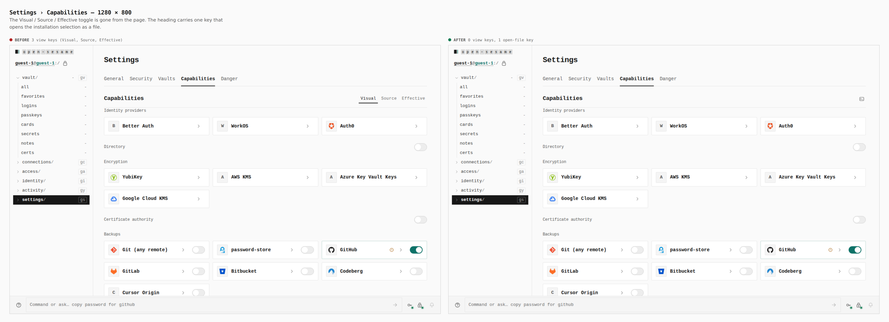
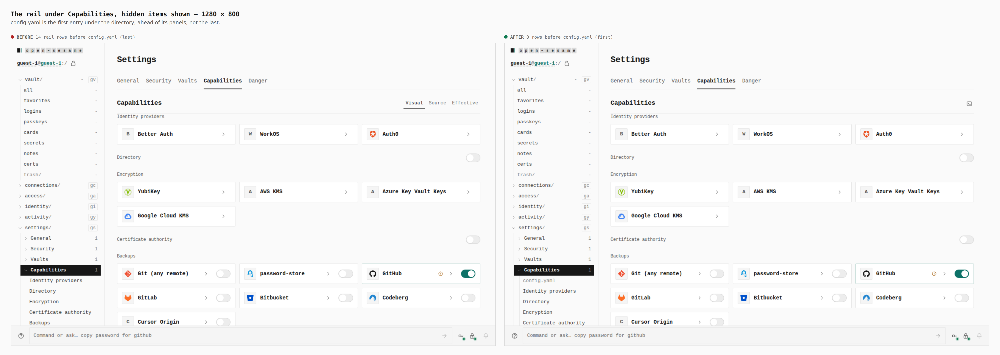
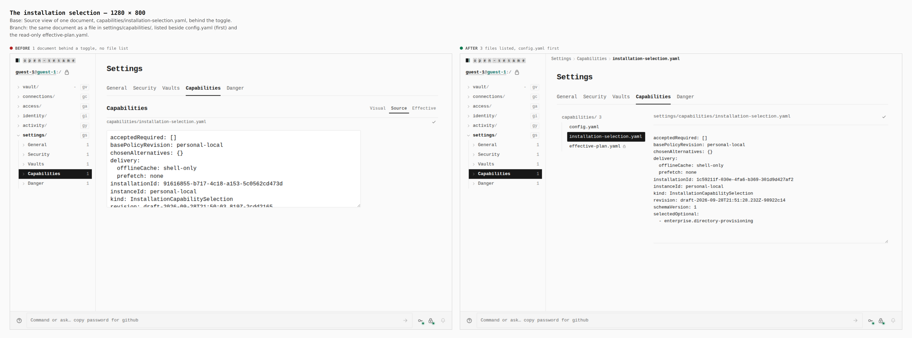
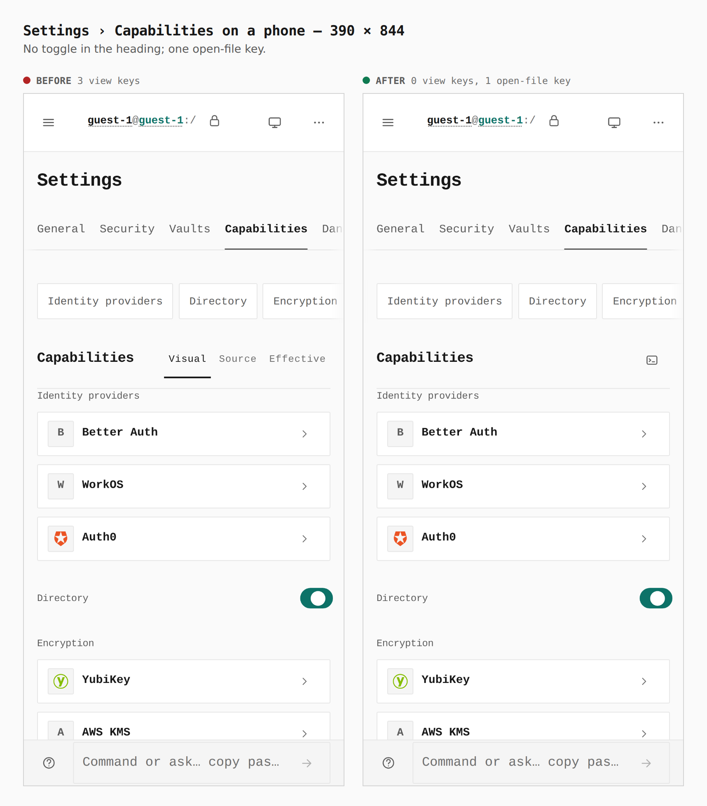
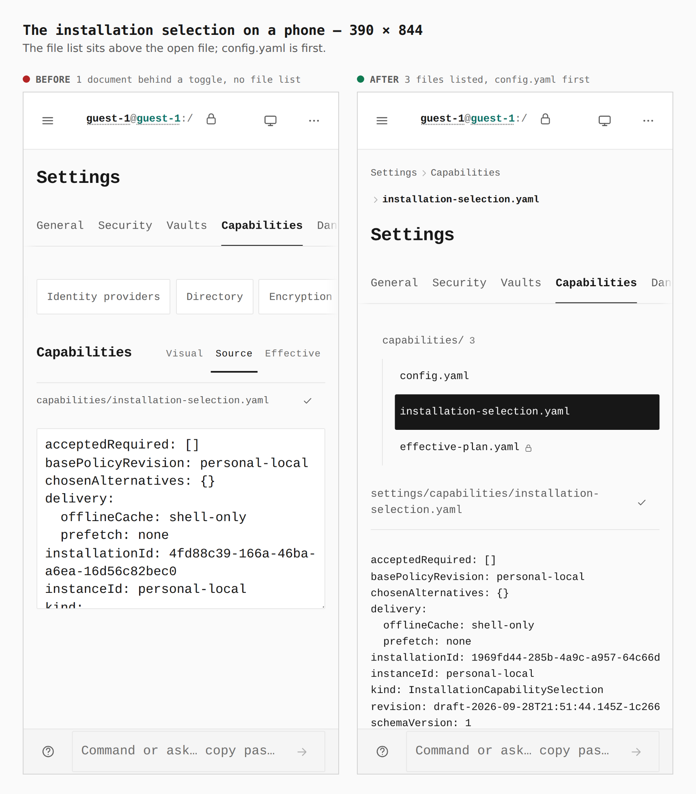
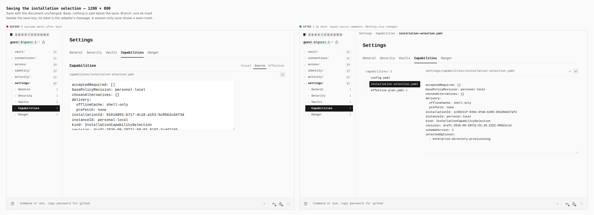
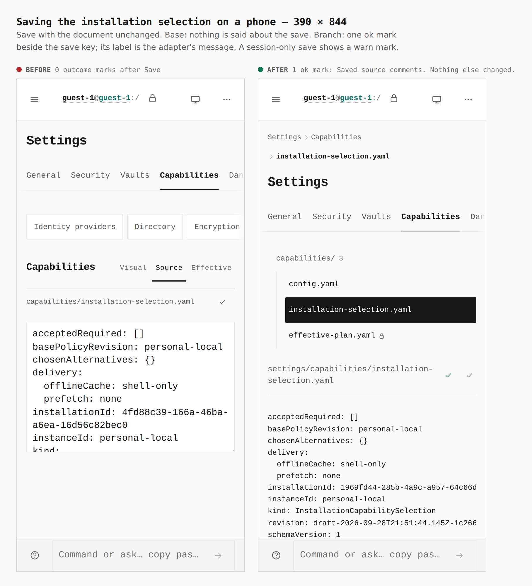

# Capabilities as files; `config.yaml` first

Before/after from two real builds (`main` at `d97827a` and this branch), walked by
`apps/pages/scripts/capture-evidence.mjs` with [`journey.json`](journey.json). Every
number is what the browser measured during that capture (the `facts` step).
Each journey commits a selection first (turning the Directory section on), so the
document shown is a real one.

## 1. Settings › Capabilities — 1280 × 800

`3 view keys → 0; 1 open-file key`

## 2. The rail under Capabilities, hidden items shown — 1280 × 800

`14 rail rows before config.yaml (last) → 0 (first)`

## 3. The installation selection — 1280 × 800

`1 document behind a toggle, no file list → 3 files listed, config.yaml first`
(`capabilities/installation-selection.yaml` → `settings/capabilities/installation-selection.yaml`,
beside `effective-plan.yaml`, read-only).

## 4. Settings › Capabilities on a phone — 390 × 844

`3 view keys → 0; 1 open-file key`

## 5. The installation selection on a phone — 390 × 844

`1 document behind a toggle → 3 files listed, config.yaml first`

The instance-policy file (`instance-policy.yaml`) is listed only to the operator of a
personal-local device in the personal tomb, so a guest capture does not show it; it is
covered by `capability-files.test.ts` and `CapabilitiesPanel.test.tsx`.

## 6. Saving the installation selection — 1280 × 800

Save with the text unchanged. `0 outcome marks after Save → 1 ok mark`, labelled
"Saved source comments. Nothing else changed." (a session-only save shows a warn mark,
covered by `capability-files-store.test.ts`).

## 7. Saving on a phone — 390 × 844

`0 outcome marks → 1 ok mark`, same label.

