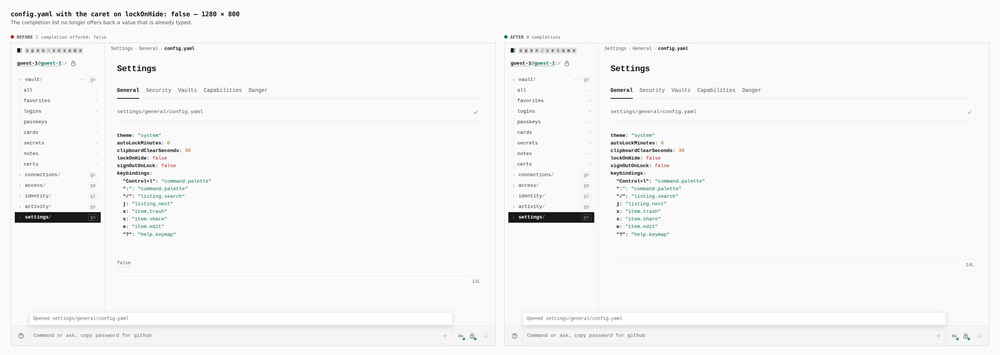
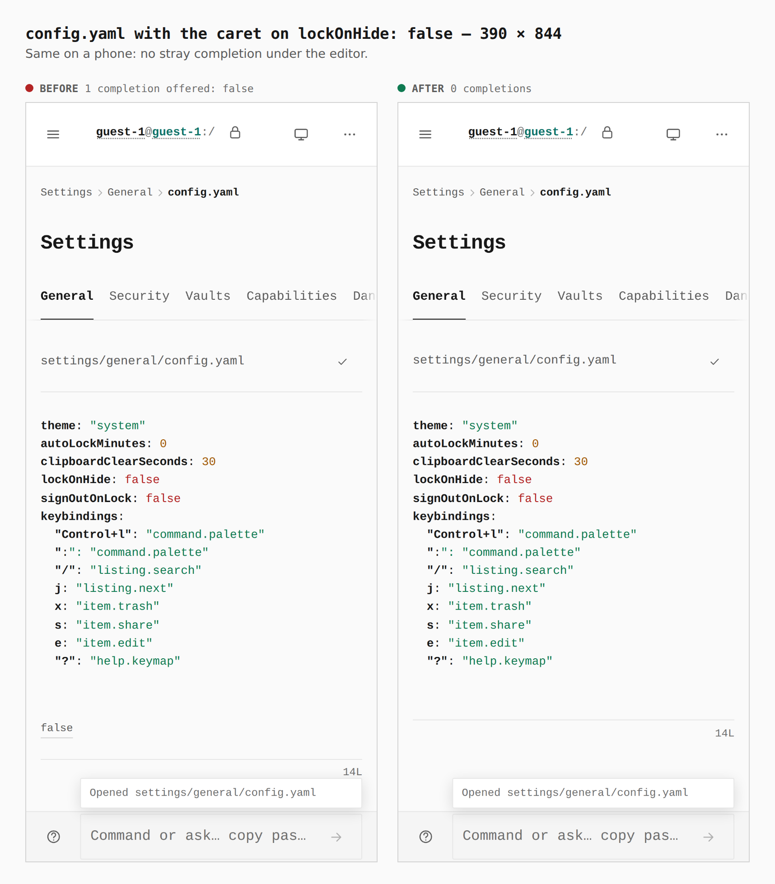

# The config.yaml editor no longer offers back what is typed

Before/after from two real builds (`main` at `bf83230` and this branch), walked by
`apps/pages/scripts/capture-evidence.mjs` with [`journey.json`](journey.json). The
numbers are what the browser measured (the `facts` step: the editor's completion
options).

With the caret on `lockOnHide: false`, the base offered `false` back as a completion
(the underlined word under the editor). The branch offers nothing; a partial value
(`lockOnHide: fa`) still offers `false`.

## 1. Desktop — 1280 × 800

`1 completion offered: false → 0 completions`

## 2. Phone — 390 × 844

`1 completion offered: false → 0 completions`

