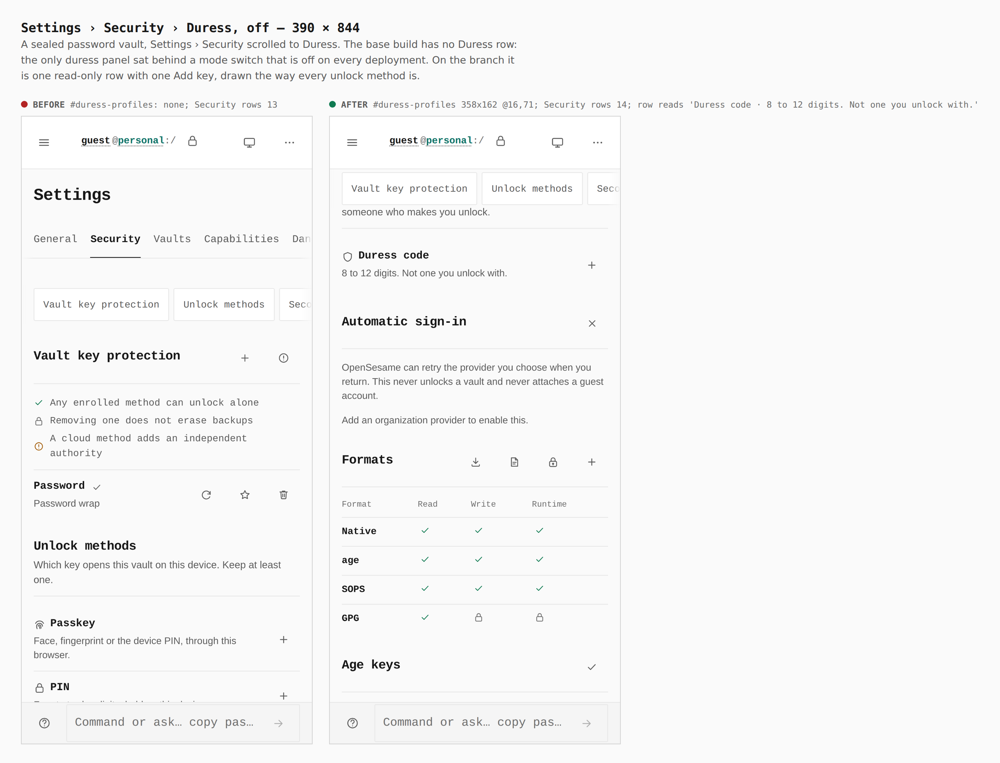
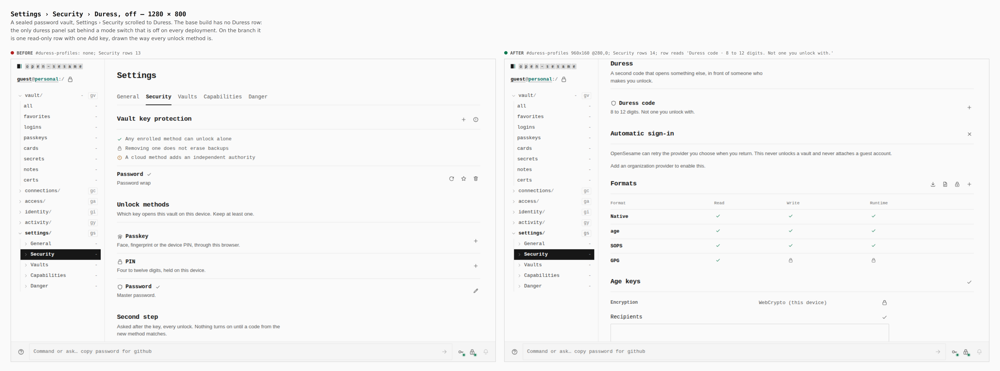
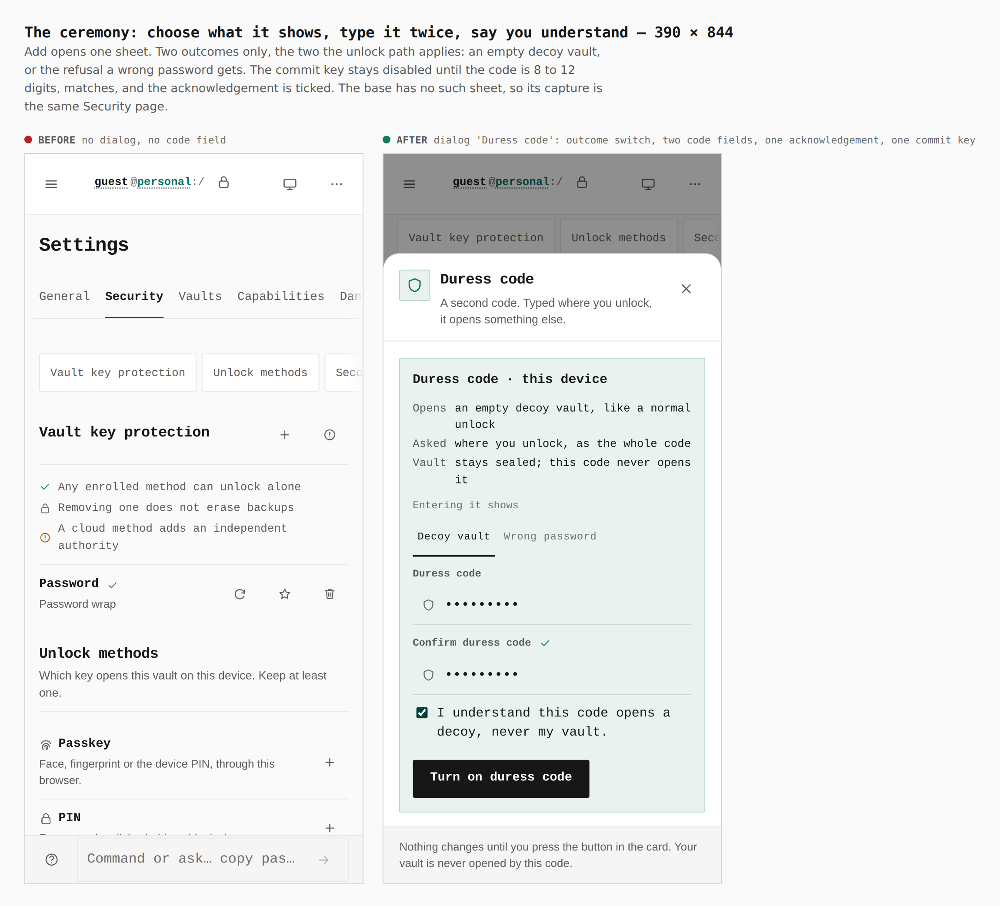
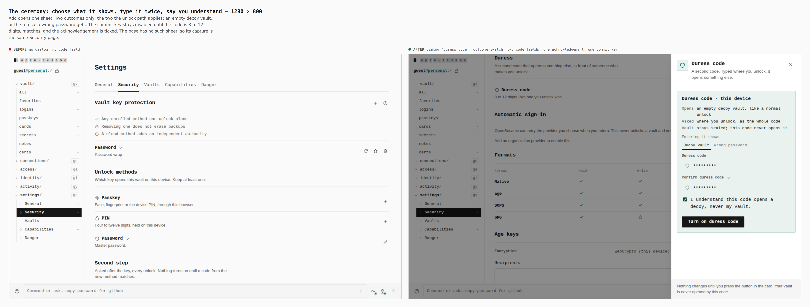
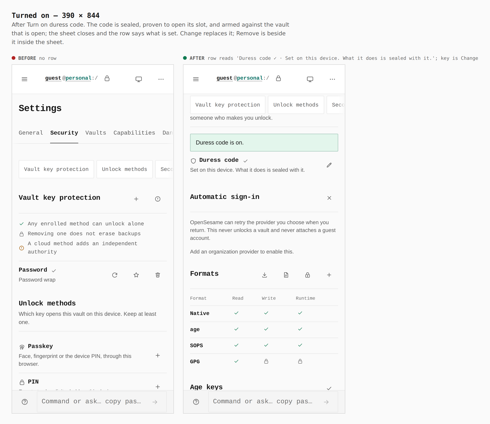
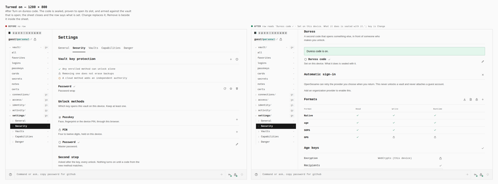

# Duress and travel, usable from Settings — visual evidence

Change: Settings › Security gains a **Duress** row and sheet
([ADR 0155](../../adr/0155-the-device-duress-code.md)). Until now the only duress
panel sat behind a mode switch that is off on every deployment.

Two real builds, walked the same way by `apps/pages/scripts/capture-evidence.mjs`
with [`journey.json`](journey.json):

- **before**: merge base `4b5db530` (`apps/pages/src` and `packages/app-core/src` reverted to it)
- **after**: branch `claude/great-albattani-9wnj75`

A password vault is sealed on an empty device, Settings › Security is opened,
and the duress code `246813579` is set through the sheet. The base build has no
Duress heading, so its pictures are the same Security page with nothing to press.

## The row — 390 × 844 and 1280 × 800

`#duress-profiles`: none → 358×162 @16,71 at 390; 960×160 @280,0 at 1280.
Security rows 13 → 14.

## The ceremony

One dialog: what it shows (decoy vault or wrong password), the code twice, one
acknowledgement, one commit key.

## Turned on

The row reads `Set on this device. What it does is sealed with it.` and the key
becomes Change.

## What these pictures do not show

The decoy session, the *Used* / *Clear* state, the remembered travel marks and the
front-door fix are behaviours across a lock, a reload or a second session, so a
still cannot show them. They are proved in the built app by the `J-DURESS` and
`J-TRAVEL` journeys in `apps/pages/scripts/verify-experience-journeys.mjs`, which
CI runs: a decoy with no Duress row, the owner back in the real vault with the
code marked used, cleared and changed; and mark safe → reload → pack → save the
bundle → depart → return from the file and code.
