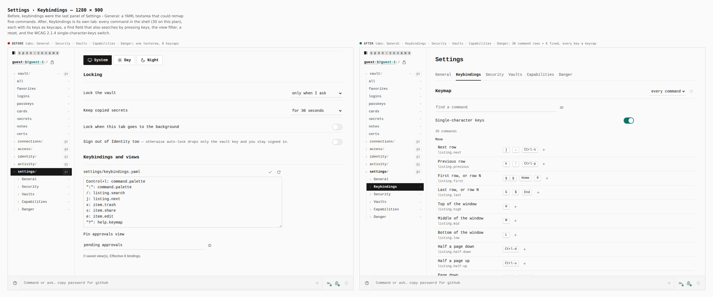
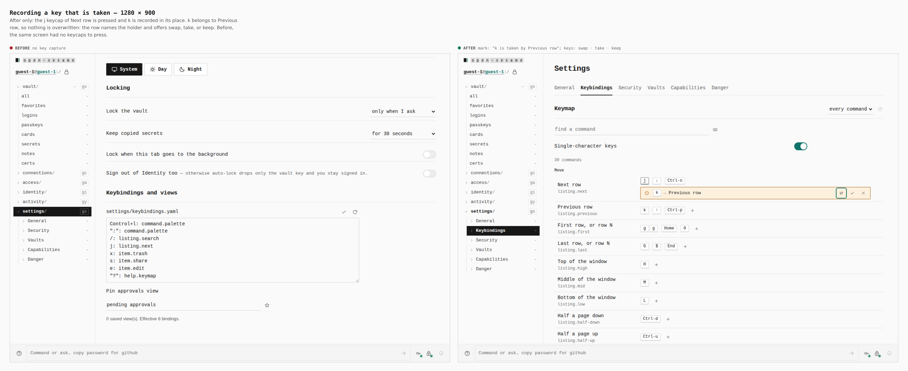
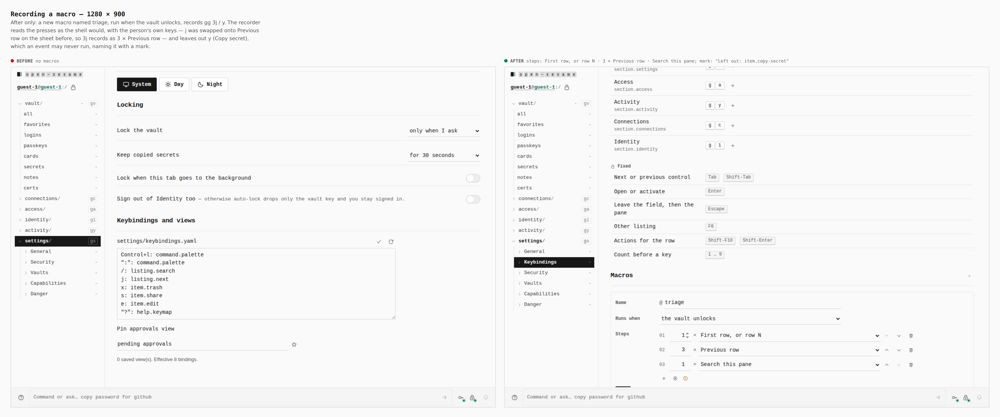
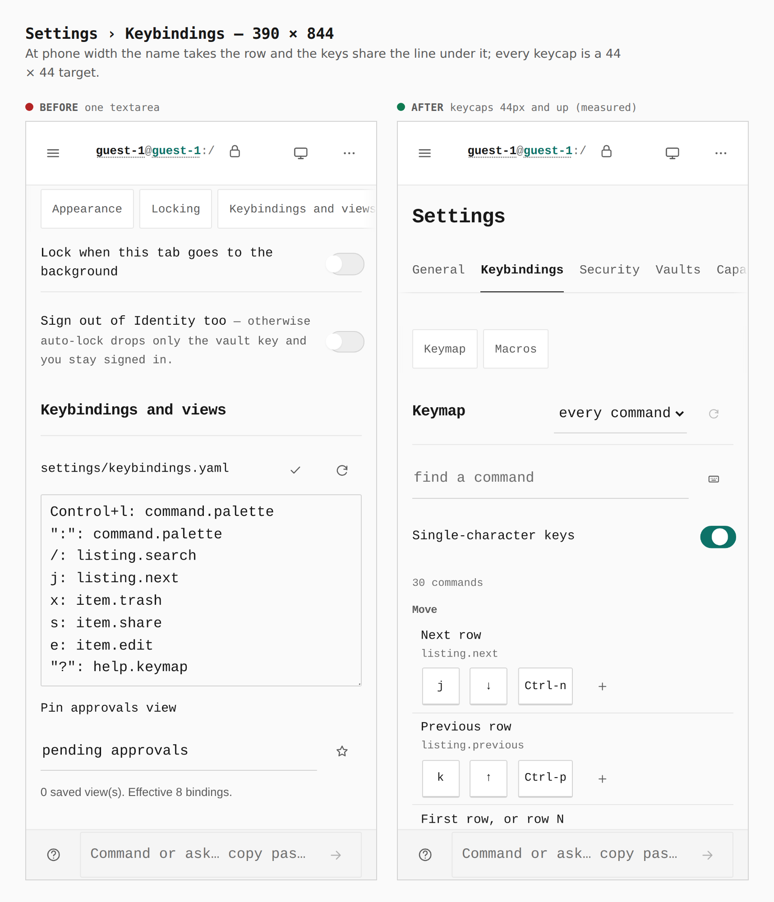

# Keybindings get their own Settings tab — 2026-09-28

Before/after sheets from two real builds of `apps/pages` (base: `main` at
`9ee047b8`; after: this branch), walked by `journey.json` with
`apps/pages/scripts/capture-evidence.mjs`. Every number below was printed by
the capture from the browser (`count`, `report`, `labels`, `measure`).
[ADR 0156](../../adr/0156-keybindings-and-macros.md) records the decision.

## Settings › Keybindings

Before, keybindings were the last panel of Settings › General: a YAML
textarea that could remap five commands. After, Keybindings is its own tab
with every command in the shell, its keys drawn as keycaps.

| | Before | After |
|---|---|---|
| Settings tabs (`.set__nav a`) | 5 — General · Security · Vaults · Capabilities · Danger | 6 — General · **Keybindings** · Security · Vaults · Capabilities · Danger |
| Keymap editor | 1 textarea (`#keybindings-source`) | 36 rows (30 commands + 6 fixed), 52 keycaps |

## Recording a key that is taken

The `j` keycap of Next row is pressed and `k` recorded in its place. `k` is
Previous row's, so nothing is overwritten. The row names the holder and
offers swap, take, or keep. The journey then swaps.

| | Before | After |
|---|---|---|
| Status mark | — | "k is taken by Previous row" |

## Recording a macro

A new macro, `triage`, is set to run when the vault unlocks, and records
`g g 3 j / y`. The recorder reads the presses the way the shell would, with
the person's own keys: `j` now belongs to Previous row after the swap, so
`3j` records as `3 × Previous row`. It leaves out `y` (Copy secret), which an
event may never run, and names it in a mark.

| | Before | After |
|---|---|---|
| Steps | — | First row, or row N · 3 × Previous row · Search this pane |
| Status mark | — | "Left out: item.copy-secret — not something this macro may run" |

## Phone

| | Before | After |
|---|---|---|
| Keycap targets (`measure .keycap-btn`) | — | 52 keycaps, every one ≥ 44 × 44 (44–103 px wide) |

## What these sheets cannot show

- **The keys working in the shell.** A remapped key, a `Space`-leader
  sequence, a macro with a count in front, and an `on: unlock` trigger are
  behaviour, not pixels. They are covered by `apps/pages/src/lib/keymap.remap.test.ts`,
  and `verify:keyboard` still passes unchanged against this build.
- **The hairline that drains while a key is recorded.** It is an animation
  over the keymap's 1 s timeout, and a still frame shows only a line.
