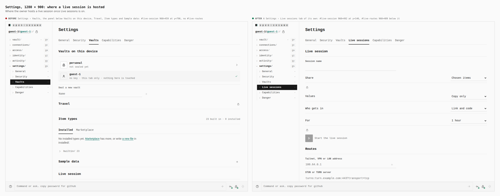
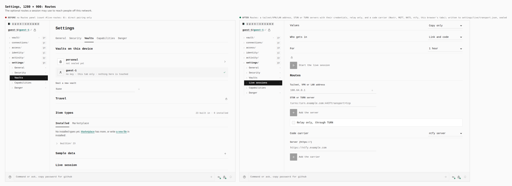
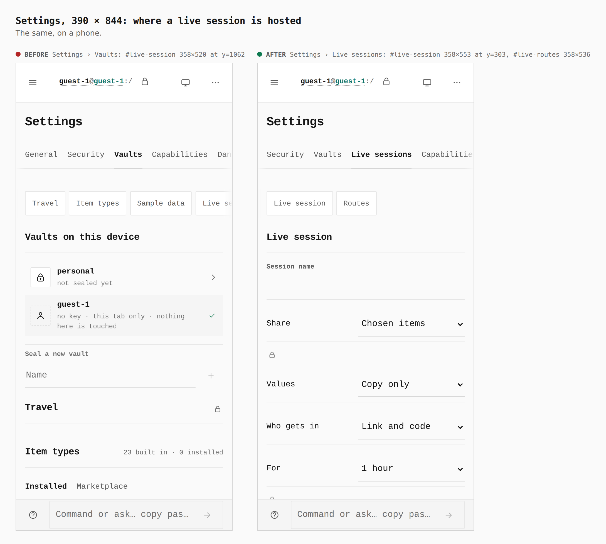
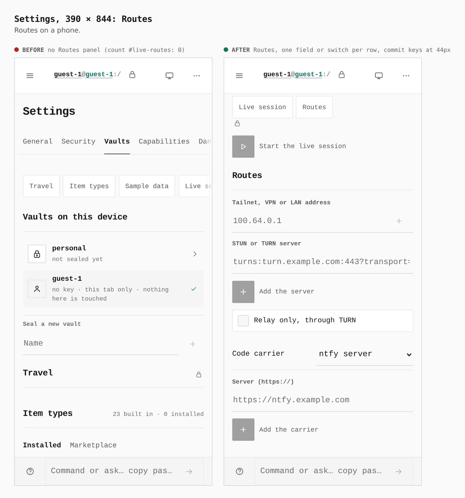
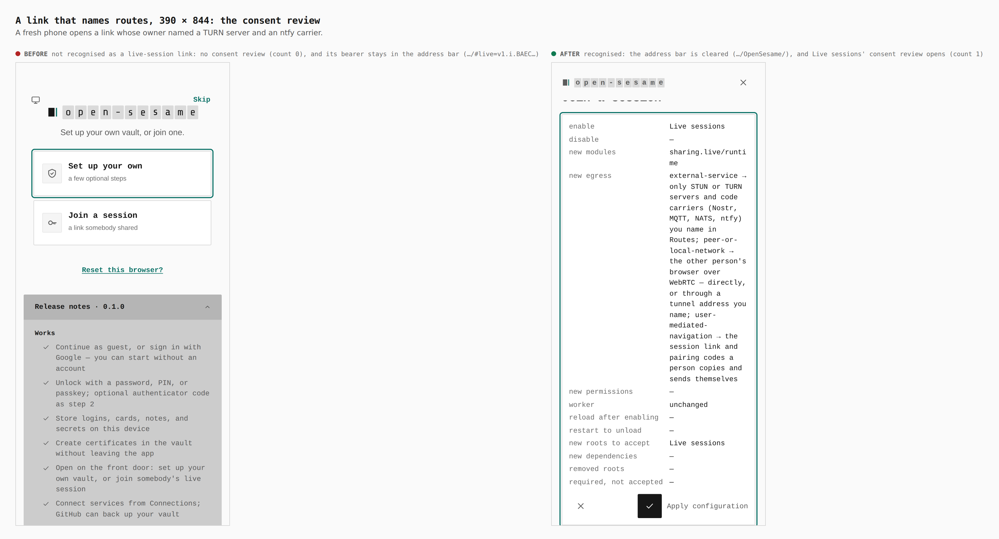
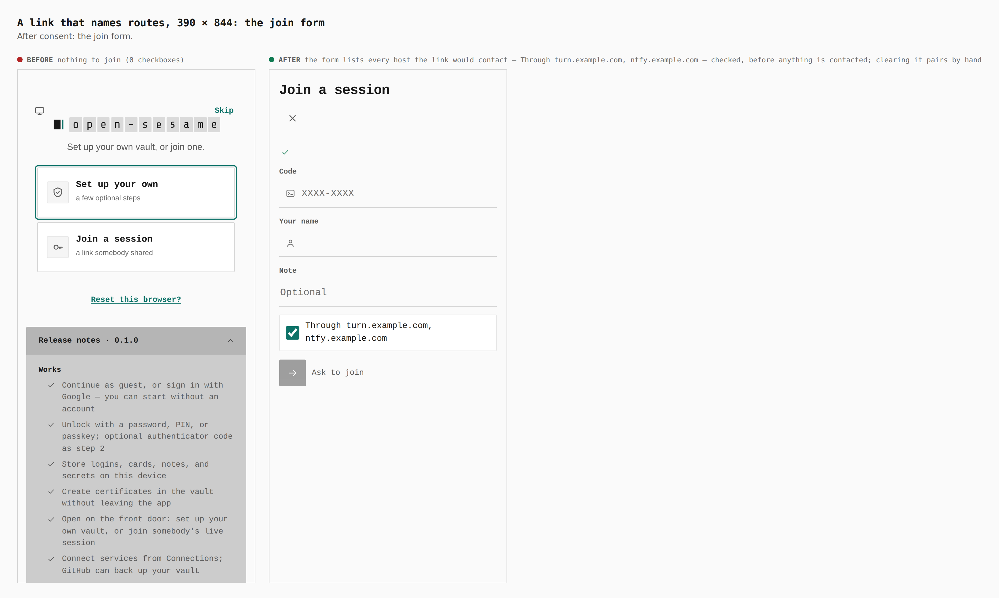
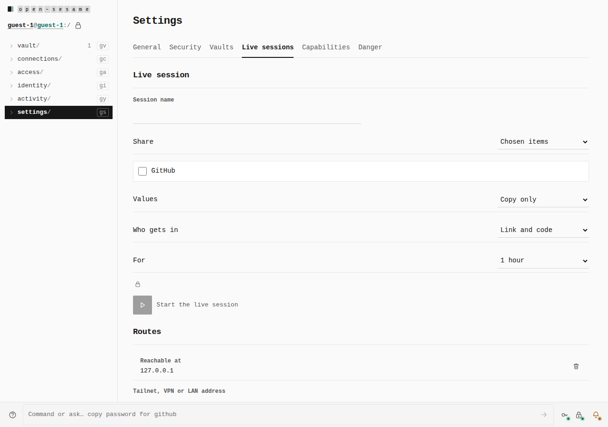
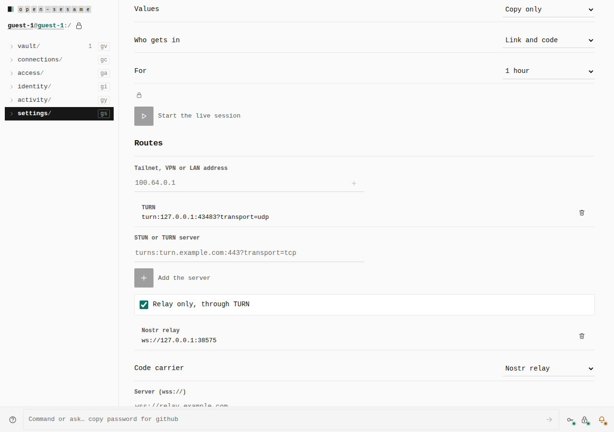
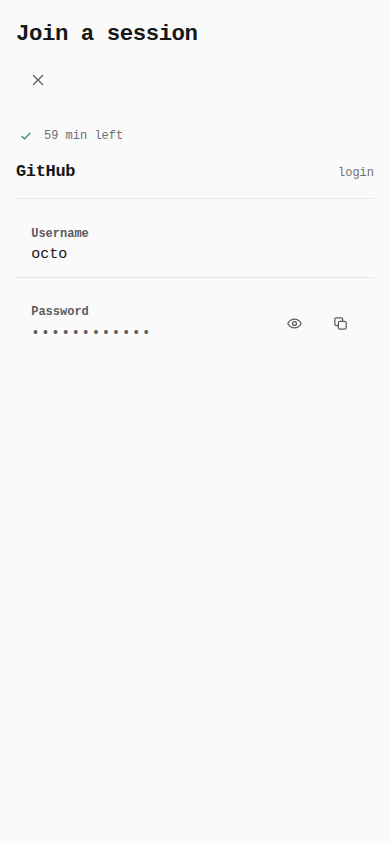

# Live sessions across networks: optional routes (ADR 0148 §6)

Before/after from two real builds: this branch's base at `43ad2a91` and this
branch. Both were served as the production origin
(`https://tyler-r-kendrick.github.io/OpenSesame/`) out of `dist/` and walked
with the same steps (`journey.json`). Every number below was read from the
browser by `capture-evidence.mjs` (`count`, `measure`, `address`).

## Where a live session is hosted, 1280 × 900

Before: Settings › Vaults, below Vaults on this device, Travel, Item types and
Sample data (`#live-session` 960×459 at y=796) · after: a Settings › Live
sessions tab of its own (`#live-session` 960×492 at y=146, with Routes below).

## Routes, 1280 × 900

Before: no Routes panel (`#live-routes`: 0), so direct pairing only · after:
Routes (`#live-routes` 960×489). It holds:

- a tailnet, VPN or LAN address;
- STUN or TURN servers, with the credentials a TURN URL asks for;
- relay only, which stays disabled until a TURN server is named;
- a code carrier: Nostr, MQTT, NATS, ntfy, or this browser's tabs.

The Form writes `settings/live/transport.json`, sealed in the vault. All of
it is optional; with none of it, a session contacts nothing.

## The same, 390 × 844

Before: `#live-session` 358×520 at y=1062 under Vaults · after: 358×553 at
y=303 on its own tab, and Routes 358×536 below it.

## A link that names routes, opened on a fresh phone

Before: not recognised as a live-session link. No consent review (count 0),
and the bearer stays in the address bar (`…/#live=v1.i.BAEC…`). After:
recognised. The address bar is cleared (`…/OpenSesame/`) and Live sessions'
consent review opens (count 1).

After consent, the form lists every host the link would contact, before any
is contacted: **Through turn.example.com, ntfy.example.com**, checked.
Clearing it pairs by hand, directly.

## New behaviour, over real WebRTC (`verify:live-join`, after only)

These come from the branch's `verify:live-join`, which has no base
equivalent. Each pair of numbers is what `RTCPeerConnection.getStats()`
reported for the nominated pair.

**Tunnel** (a tailnet played on one machine: mDNS hiding on, and only the
tunnel address routes):

- With no address named, the browsers never meet.
- With `127.0.0.1` named as the owner's tunnel address, the joiner connects
  over the pair `prflx → host 127.0.0.1`, with no ICE server on either side.

**Relay only** through a real TURN server (node-turn on loopback UDP), with a
Nostr carrier:

- Both peer connections are `iceTransportPolicy: "relay"`.
- Both select a `relay → relay` pair.
- Nobody pastes a code.

**Carriers.** Each pairs with nothing pasted either way:

| Carrier | Frames it passed |
|---|---|
| Nostr relay | 5 |
| MQTT (aedes) | 2 |
| real nats-server | 2 |
| real ntfy (v2.11.0, built from upstream source) | 2 |
| BroadcastChannel | — |

None of the recorded frames held the joiner's name, an SDP, a field, the
value, or the link secret. A joiner who declines the routes is never heard of
on the carrier.

51 checks passed in the full run.
