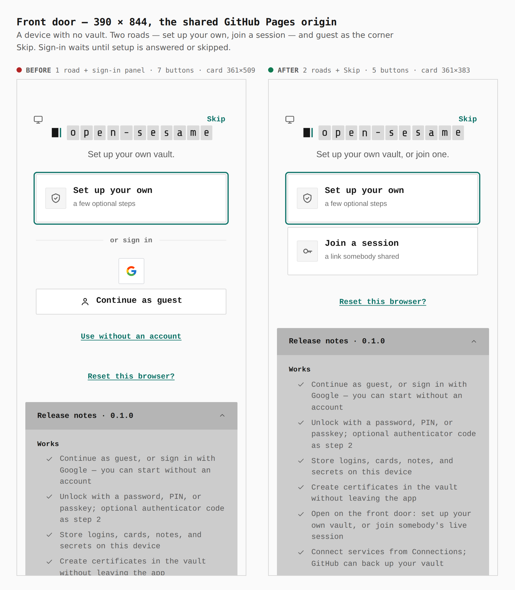
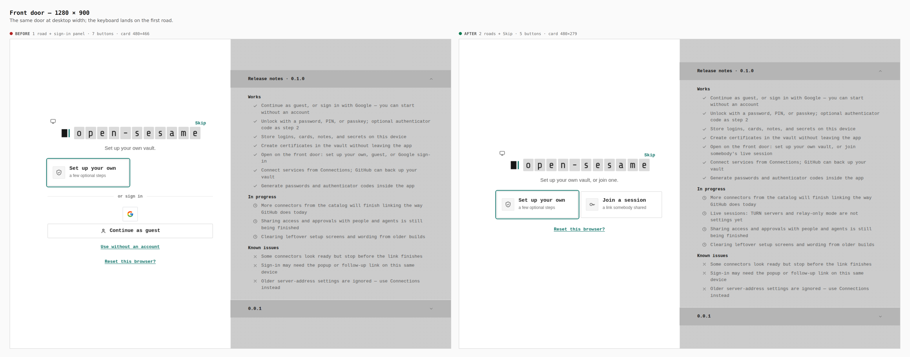
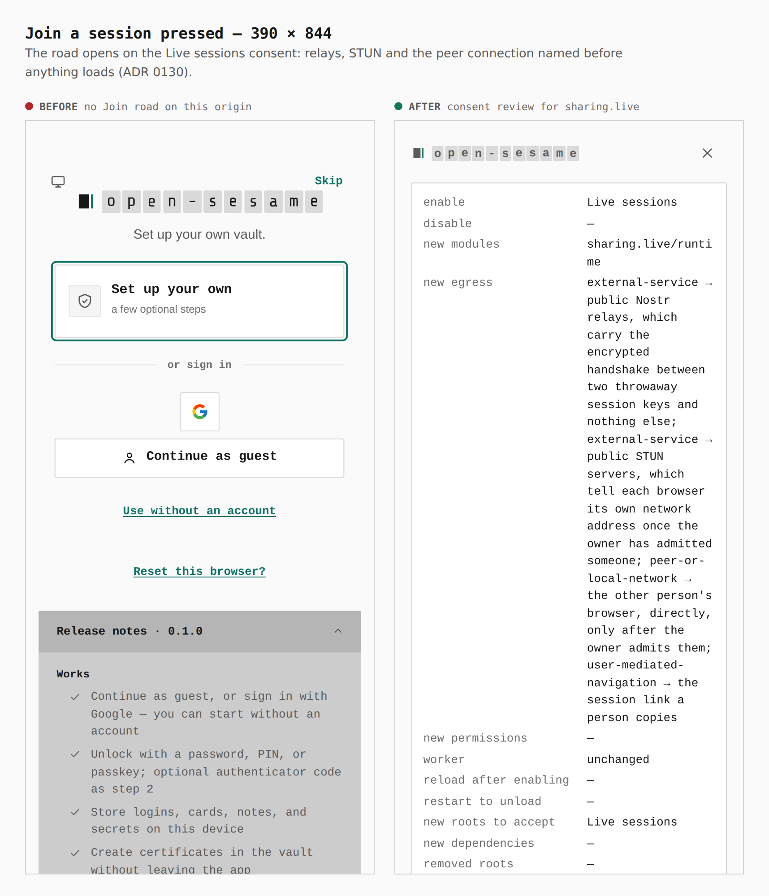
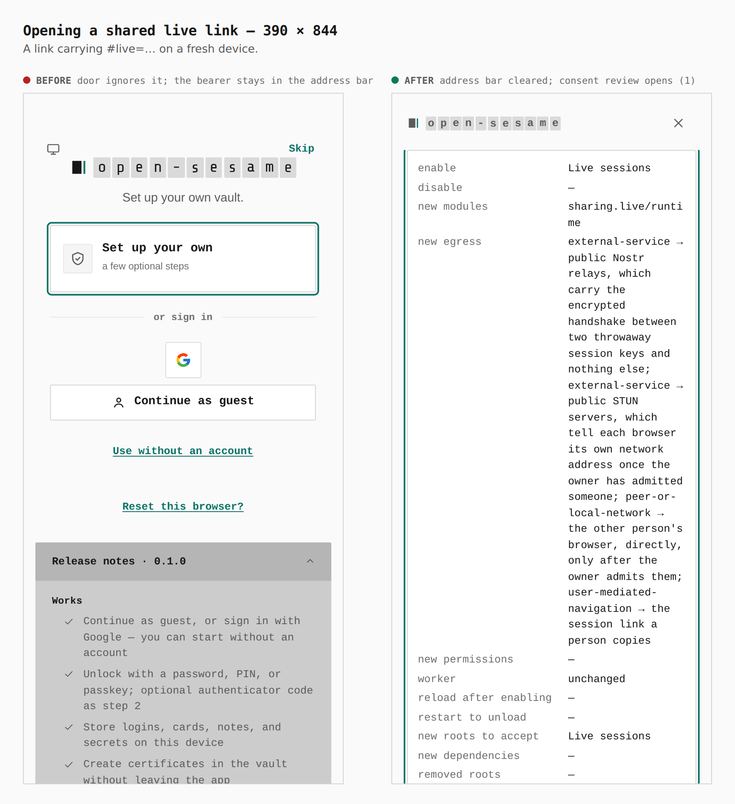
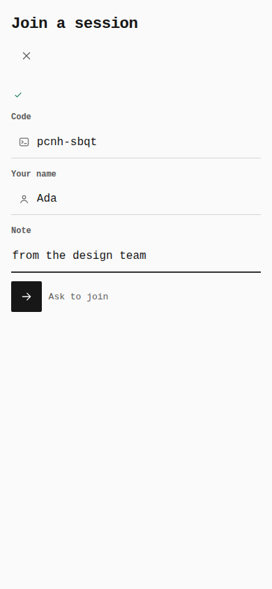
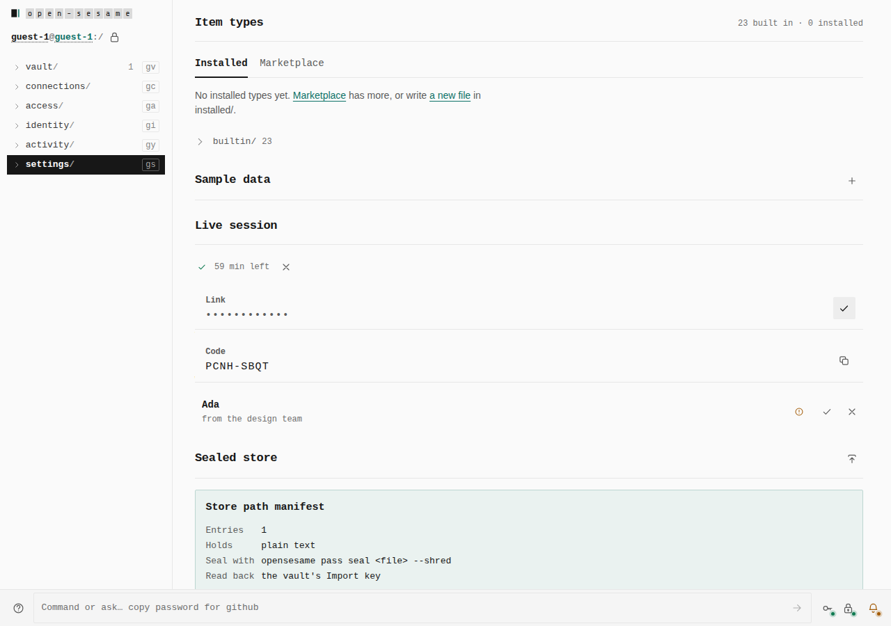
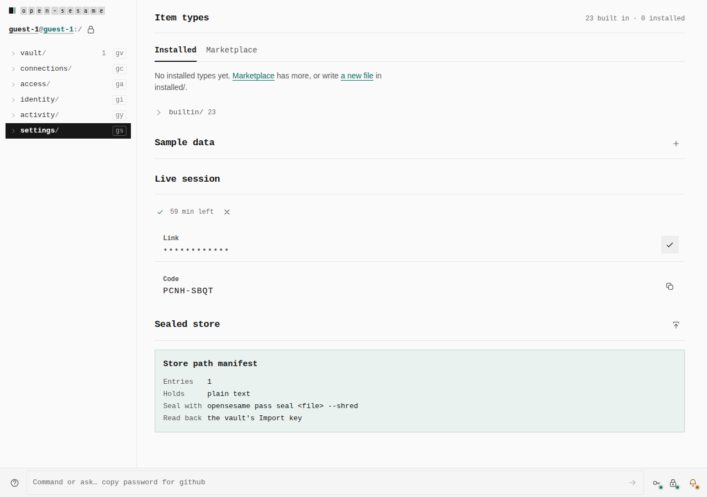
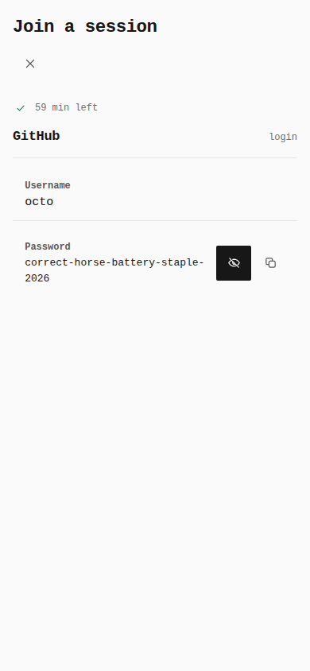
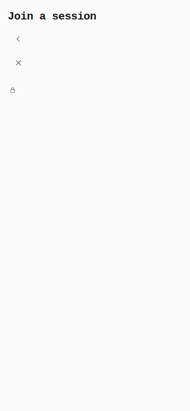

# Live sessions and the two-road front door (ADR 0148)

Before/after from two real builds: `main` at `0287bf9d` and this branch. Both
were served as the production origin (`https://tyler-r-kendrick.github.io/OpenSesame/`)
out of `dist/`, walked with the same steps (`journey.json`). Every number
below was read from the browser by `capture-evidence.mjs` (`count`, `measure`,
`address`).

## Front door, 390 × 844

Before: 1 road + the whole sign-in panel, 7 buttons, card 361×509 ·
after: 2 roads (Set up your own, Join a session) + the corner Skip,
5 buttons, card 361×383.

## Front door, 1280 × 900

Before: 1 road + sign-in panel, card 480×466 · after: 2 roads + Skip, card
480×279. The keyboard lands on Set up your own (verify:keyboard).

## Join a session pressed, 390 × 844

Before: no Join road on the shared origin, so nothing to press · after: the
Live sessions consent review — the relays, STUN and the peer connection are
named before any of it loads.

## Opening a shared live link, 390 × 844

Before: the door ignores `#live=…`, and the bearer stays in the address bar
(`…/OpenSesame/#live=v1.i.9f94…`) · after: the address bar is cleared
(`…/OpenSesame/`) and the consent review opens (1 review on screen).

## New screens: a live session end to end

These have no "before" — they did not exist. They are the captures
`pnpm --filter @opensesame/pages verify:live-join` took of this build: two
browser contexts, real WebRTC, and a relay in the test process that recorded
every frame (none contained the name, note, code, value or link secret).

| Step | Screen |
|---|---|
| The joiner, after consent, gives the code and a name |  |
| The owner's panel: link (masked), code, time left, Ada asking |  |
| The owner's panel once live (link copied) |  |
| The joiner revealed one password, on request |  |
| The owner ended it: the joiner holds nothing |  |
