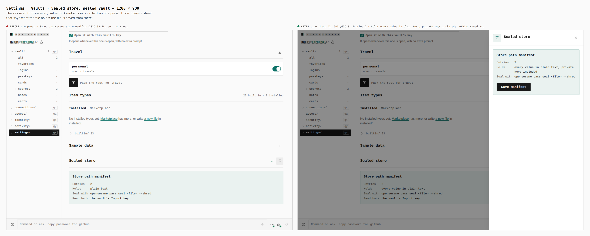
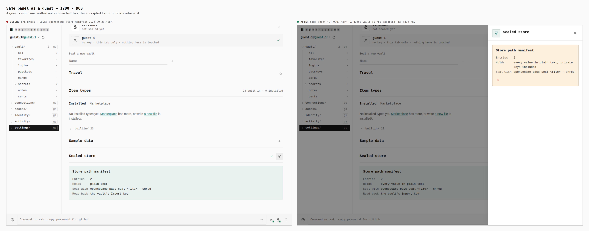
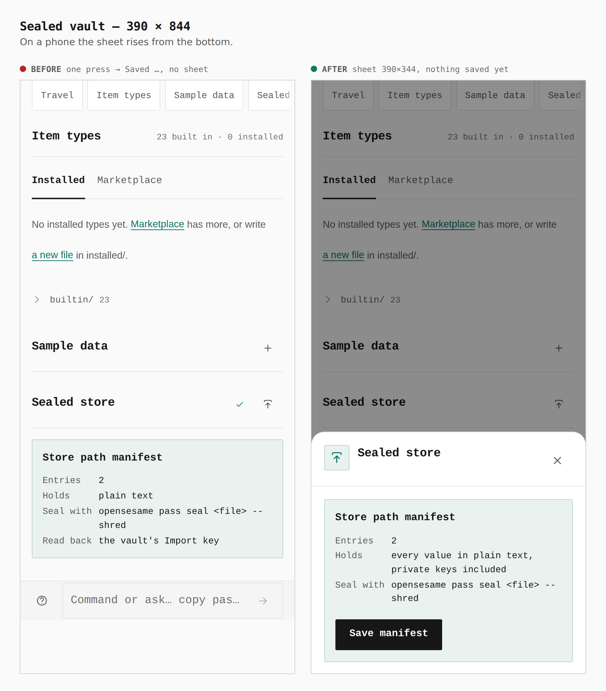
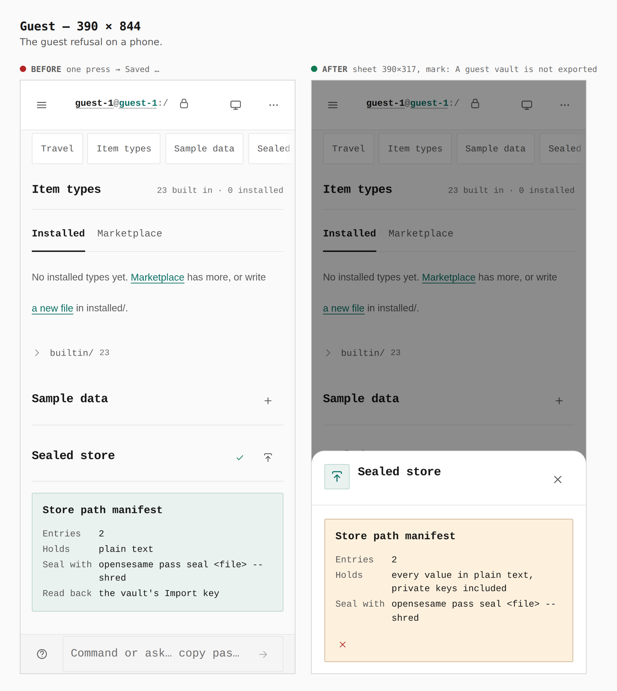

# The sealed-store manifest is saved from a sheet, and never for a guest

Before/after captures from two real builds, `main` and this branch, walked the
same way with `apps/pages/scripts/capture-evidence.mjs` and
[`journey.json`](journey.json). Each walk seals a vault (or continues as a
guest), imports the two made-up secrets in [`app.env`](app.env), opens
Settings › Vaults and presses the Sealed store key. Every measurement was read
from the browser during the capture.

The store path manifest is the vault in plain text — passwords, card codes and
private keys — for `opensesame pass seal <file> --shred`. On `main` one press
of the panel's key wrote it to Downloads, a guest's vault included, while the
encrypted Export already refused a guest. Now the key opens a sheet that says
what the file holds and saves only from there, and a guest or locked vault is
refused with the encrypted Export's own words (`manifestRefusal` in
`sections/vault/import/store-manifest.ts`).

## Sealed vault — 1280 × 900

Before: one press, `Saved opensesame-store-manifest-2026-09-28.json`, no sheet.
After: side sheet `424×900 @856,0` — Entries 2 · Holds every value in plain
text, private keys included · Seal with …; nothing saved until its key.

## Guest — 1280 × 900

Before: one press saved the guest's vault in plain text. After: the sheet's
mark reads `A guest vault is not exported`, and it offers no save key.

## Sealed vault — 390 × 844

After: bottom sheet `390×344`, nothing saved yet.

## Guest — 390 × 844

After: bottom sheet `390×317`, mark `A guest vault is not exported`.
