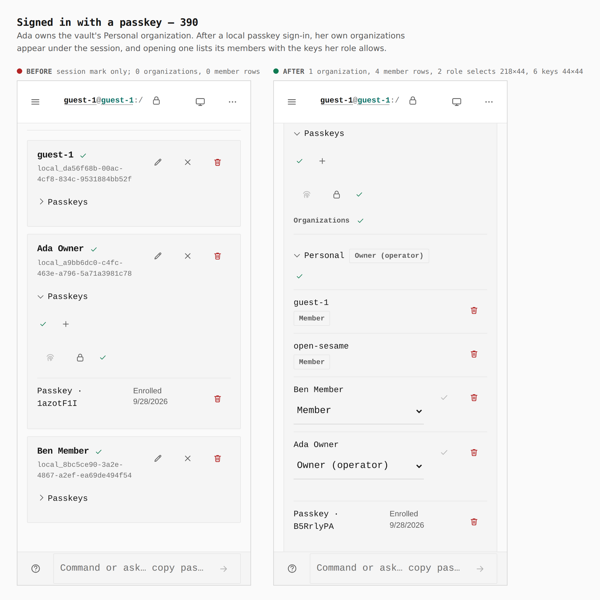
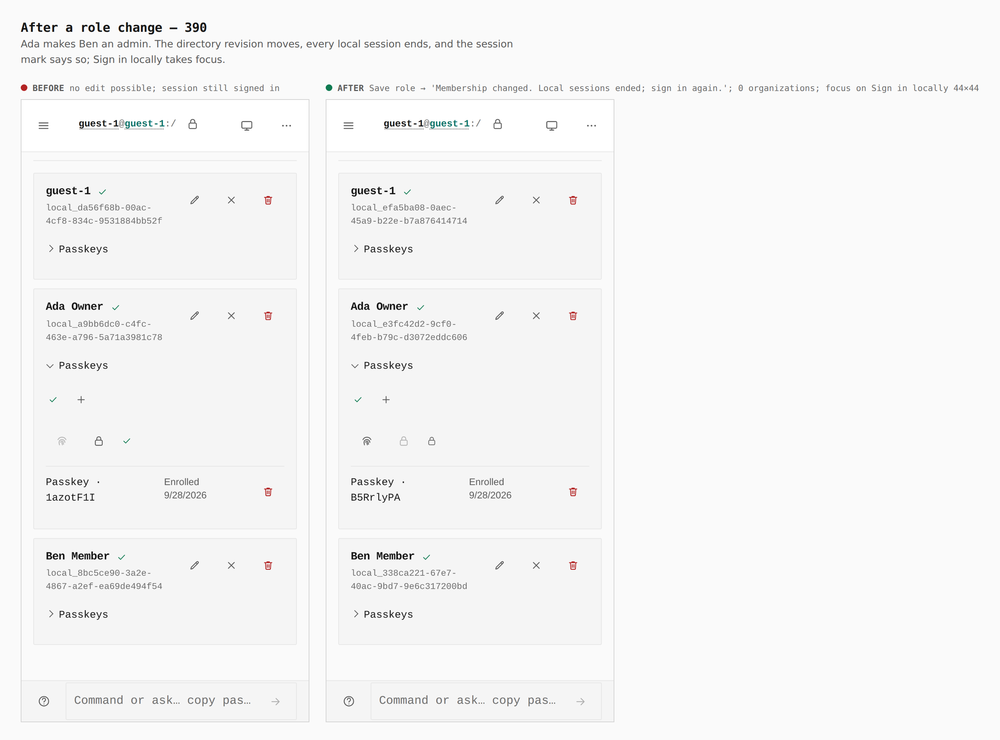
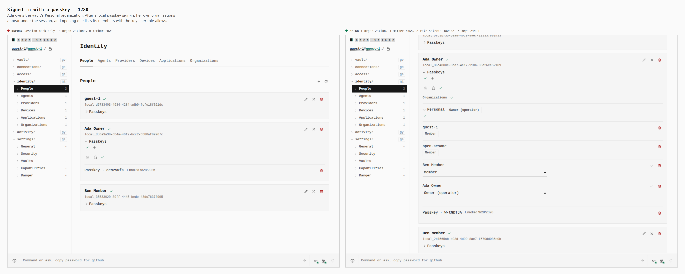
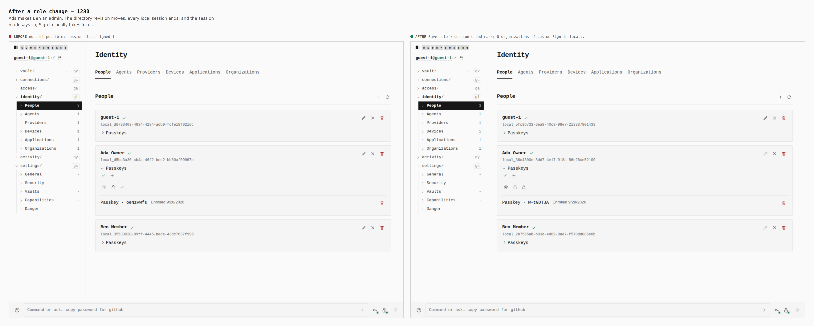

# The signed-in member's organizations — 2026-09-28

Two real builds of `apps/pages` — base `0287bf9d` (built in its own worktree,
captured with `EVIDENCE_DIST`) and this branch — walked by
[`journey.json`](journey.json) with `apps/pages/scripts/capture-evidence.mjs`,
as a guest, no Host, no Identity API. Chromium's virtual authenticator stands
in for a platform passkey (`authenticator` step); enrollment and sign-in are
real WebAuthn ceremonies verified by the vault.

The walk: create Ada Owner and Ben Member; in the vault's Personal
organization the guest custodian adds Ben as a member, then Ada as owner (the
guest is demoted, as ADR 0105 requires); Ada enrolls a passkey and signs in
locally; then Ada's own organizations are read through her session.

| Sheet | Before | After |
|-------|--------|-------|
| [Signed in, 390](390-member-view.png) | session mark only; 0 organizations, 0 member rows | 1 organization, 4 member rows, 2 role selects 218×44, 6 keys 44×44 |
| [After a role change, 390](390-after-edit.png) | no edit possible; session still signed in | Save role → mark "Membership changed. Local sessions ended; sign in again."; 0 organizations; focus on Sign in locally (44×44) |
| [Signed in, 1280](1280-member-view.png) | session mark only; 0 organizations | 1 organization, 4 member rows, 2 role selects 480×32, 6 keys 24×24 |
| [After a role change, 1280](1280-after-edit.png) | no edit possible | session ended mark; 0 organizations; focus on Sign in locally |

## Signed in, 390

## After a role change, 390

## Signed in, 1280

## After a role change, 1280

Measurements are the `count`, `measure`, `marks` and `focused` lines the
harness printed from the browser. The session-ended state is observed, not
asserted: the edit advanced the directory revision and the view's own
revalidation (`currentLocalIdentitySession`) found no session.
