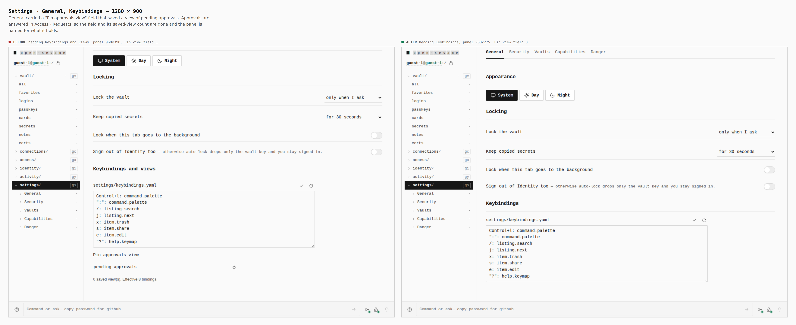
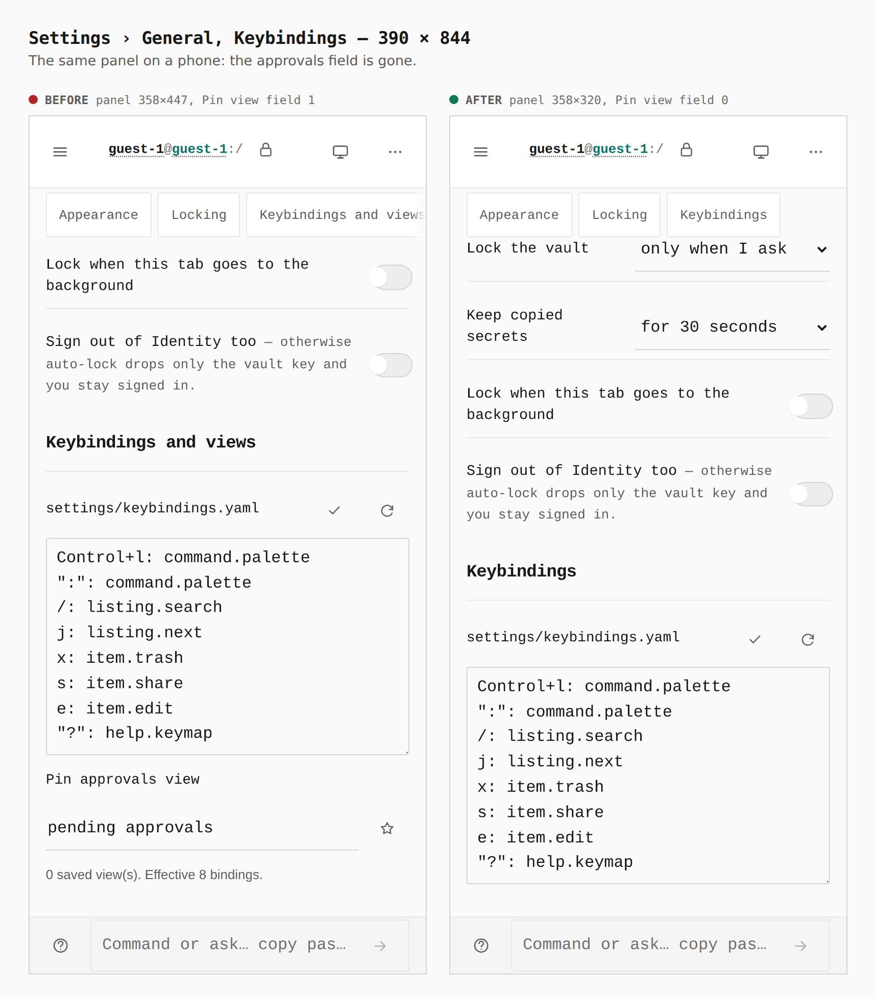

# Settings › General: no approvals view

Pending approvals are answered in Access › Requests. Settings › General
carried a "Pin approvals view" field (and a saved-view count) under the
keybindings editor; it is gone, and the panel is named for what it holds.

Before is `main` at `9ee047b8`, after is this branch; both are real
`VITE_BASE=/OpenSesame/` builds walked by `journey.json` with
`apps/pages/scripts/capture-evidence.mjs`.

## Desktop, 1280 × 900

Heading `Keybindings and views` → `Keybindings`; panel 960×390 → 960×275;
`#view-name` / `Pin view` count 1 → 0.

## Phone, 390 × 844

Panel 358×447 → 358×320; `Pin view` count 1 → 0. The page-index strip's last
chip no longer clips (`Keybindings and view…` → `Keybindings`).

