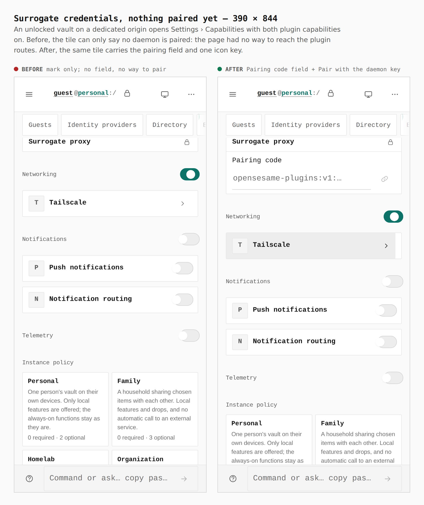
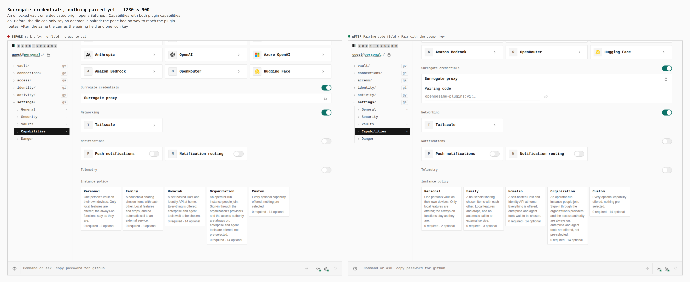
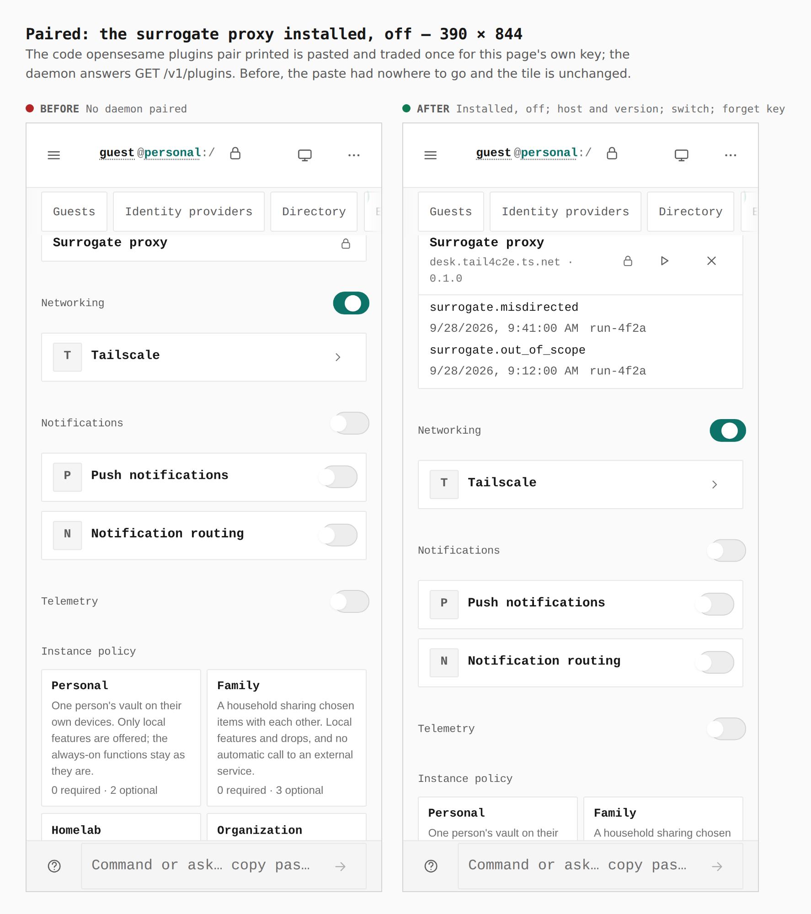
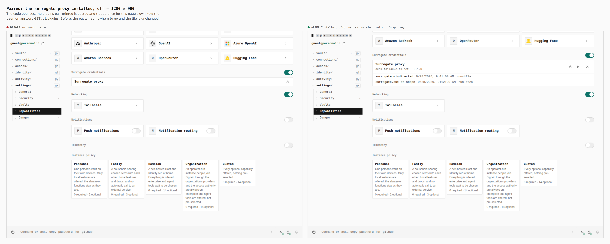
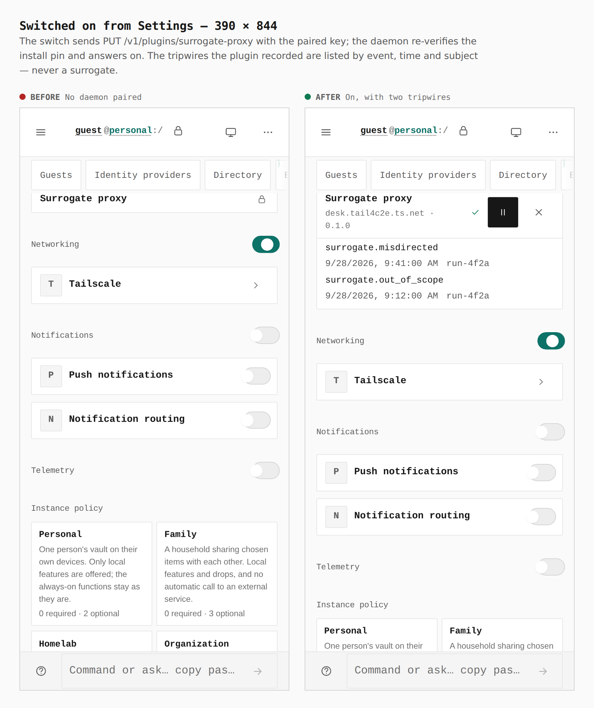
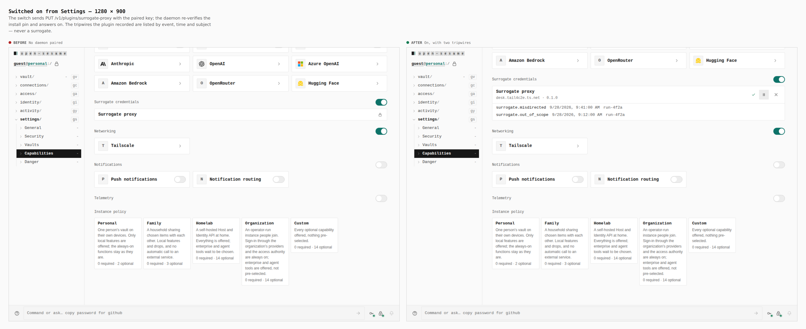
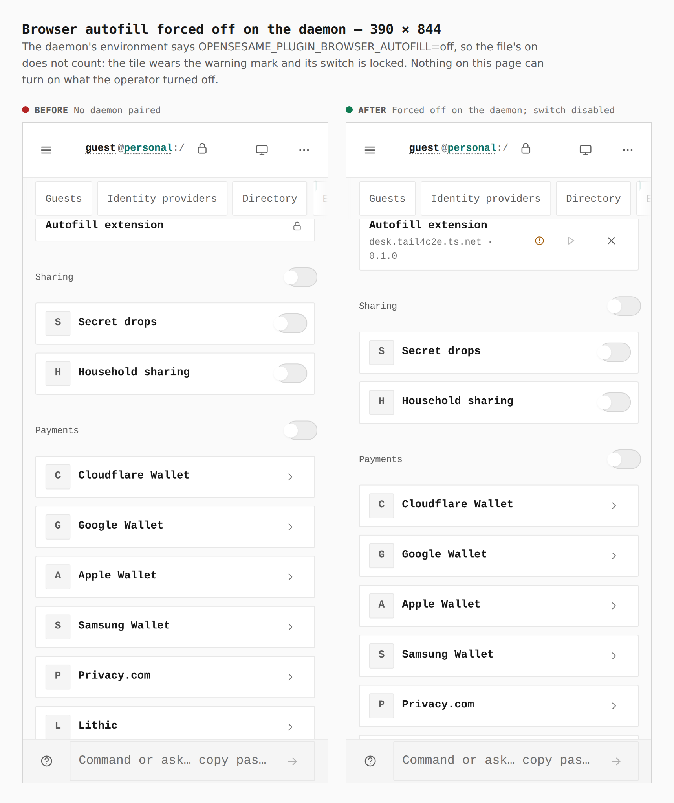
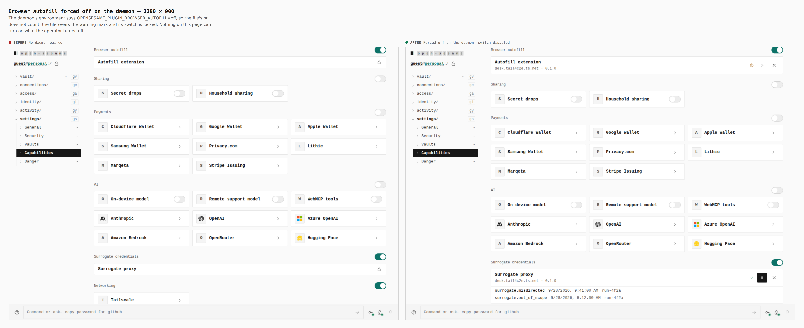
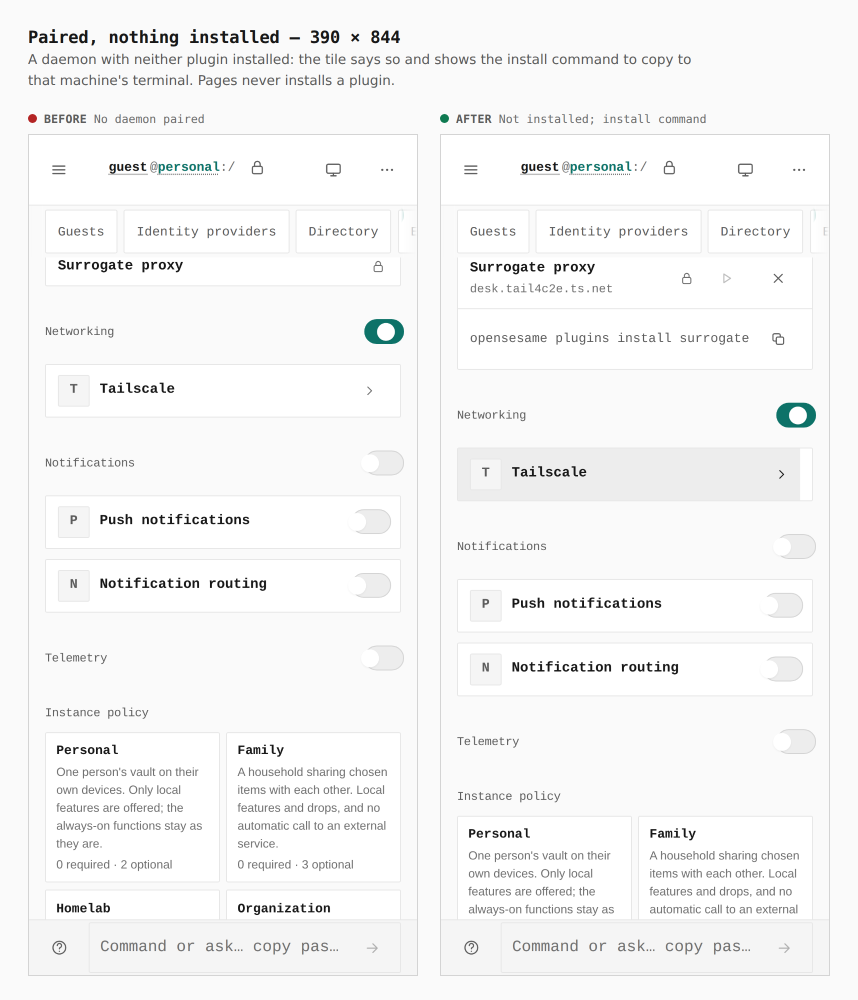
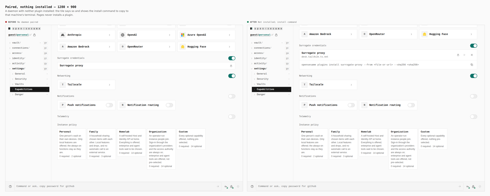

# Plugin settings pairing — Settings reaches the daemon's plugin routes (ADR 0150 §7)

Before/after from two real builds of `apps/pages` — the base (`9277f79c`) and
this branch — walked the same way by `apps/pages/scripts/capture-evidence.mjs`
with [`journey.json`](journey.json). Measurements are read from the browser by
the journey's `count` and `measure` steps (`#plugin-surrogate-proxy` and
`#plugin-browser-autofill` are the tiles; sizes are `width x height`).

Both builds are stamped as a **dedicated deployment**
(`PAGES_DEPLOYMENT_PROFILE=dedicated_origin`, origin
`https://vault.example.org`, `PAGES_HEADER_SECURITY=1`) and served from that
origin (`EVIDENCE_ORIGIN`): on the shared GitHub Pages origin a page may not
hold local authority, so the pairing field is deliberately disabled there.
Each walk seals a password vault, turns on the two plugin capabilities,
reloads and unlocks, and opens Settings › Capabilities.

The daemon is **a stub the journey serves** (`daemonStub`,
`apps/pages/scripts/lib/capture-plugin-steps.mjs`) through Playwright route
interception at `https://desk.tail4c2e.ts.net`. It answers the routes the way
`crates/daemon` does: CORS for the page's own origin only, one pairing code
traded once for a key, the plugin routes only with that key, and a switch
refused for a plugin that is not installed. The route contract itself is proven
against the real daemon by `crates/daemon/src/plugin_pairing*_tests.rs`, not by
this stub. The pairing code and key in the journey are made-up examples that
open nothing.

The base has no way to reach the daemon from a browser: its daemon port sent a
tailnet drive key, which the daemon's plugin routes never accepted from a page.

## Nothing paired — 390 × 844

Before the tile can only say `No daemon paired`. After it carries the pairing
field for the code `opensesame plugins pair --origin …` prints, and one icon
key (`Pair with the daemon`).

**Before:** `field 0, key 0 · tile 358×39` → **after:** `tile 358×125 · field
282×44 · key 44×44`

## Nothing paired — 1280 × 900

**Before:** `tile 960×39` → **after:** `tile 960×113 · field 442×32 · key 32×32`

## Installed, off — 390 × 844

The code is pasted and the key pressed: one `POST /v1/plugins/pairing`, then
`GET /v1/plugins` with the traded key. The tile now reads `Installed, off` with
the daemon's host and the plugin's version, a switch and a key that forgets the
pairing. The other plugin, which the daemon holds forced off, reads
`Forced off on the daemon`.

**Before:** `Installed, off: 0 · Forced off: 0 · tile 358×39` → **after:**
`Installed, off: 1 · Forced off: 1 · tile 358×179 · switch 44×44 · forget 44×44`

## Installed, off — 1280 × 900

**Before:** `tile 960×39` → **after:** `tile 960×114 · switch 32×32 · forget 32×32`

## On, with tripwires — 390 × 844

The switch sends `PUT /v1/plugins/surrogate-proxy` with the paired key; the
daemon re-verifies the install pin and answers on. Its two recorded tripwires
are listed by event, time and subject, never a surrogate.

**Before:** `On: 0 · tripwires 0 · tile 358×39` → **after:** `On: 1 ·
tripwires 2 · tile 358×179 · list 356×103`

## On, with tripwires — 1280 × 900

**Before:** `tile 960×39` → **after:** `tile 960×114 · list 958×56`

## Forced off on the daemon — 390 × 844

`OPENSESAME_PLUGIN_<ID>=off` on the daemon shows as `Forced off on the daemon`;
the switch is disabled because the page cannot override it.

**Before:** `Forced off: 0 · tile 358×39` → **after:** `Forced off: 1 · tile
358×76 · keys 44×44`

## Forced off on the daemon — 1280 × 900

**Before:** `tile 960×39` → **after:** `tile 960×58 · keys 32×32`

## Not installed — 390 × 844

A daemon with neither plugin installed: the tile says `Not installed` and shows
the terminal command; the page offers no install and no switch.

**Before:** `Not installed: 0 · command 0 · tile 358×39` → **after:** `Not
installed: 1 · command 2 · tile 358×123 · command 356×61`

## Not installed — 1280 × 900

**Before:** `tile 960×39` → **after:** `tile 960×107 · command 958×49`

