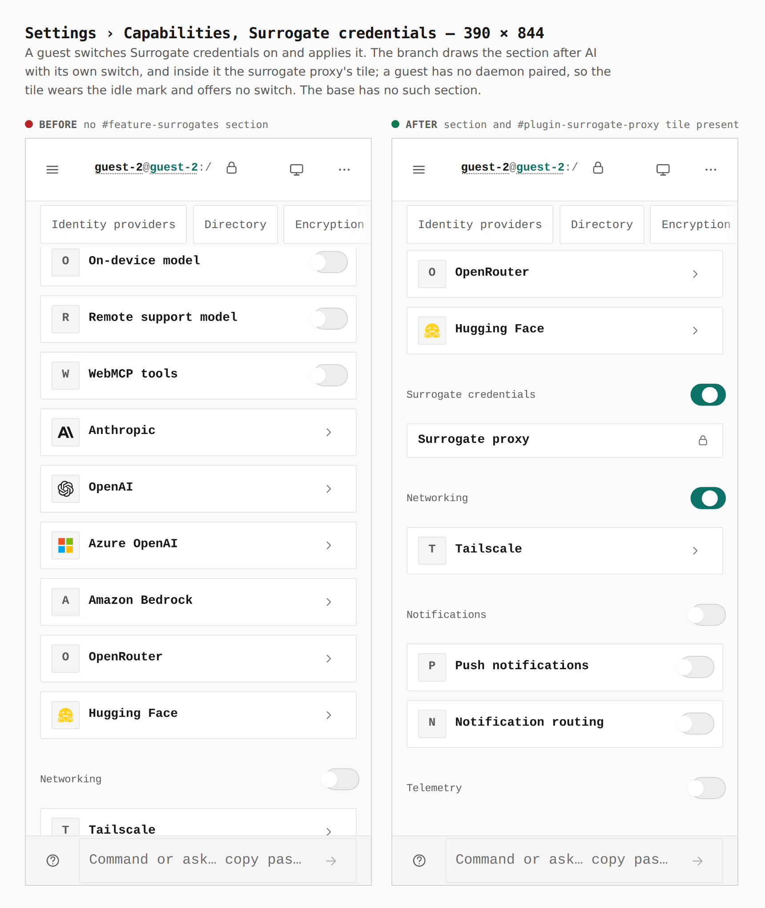
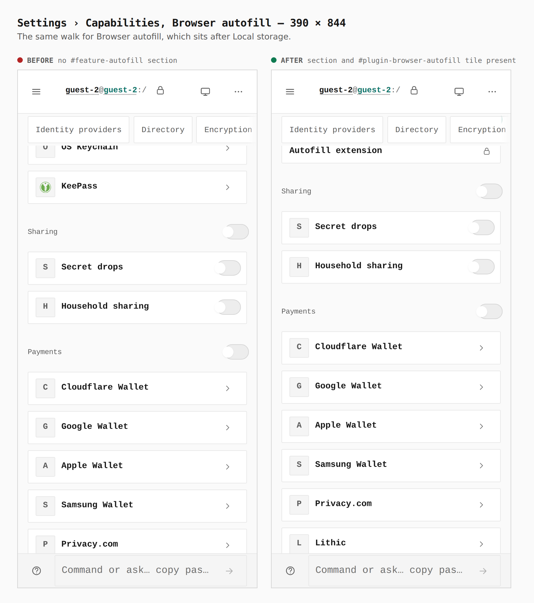
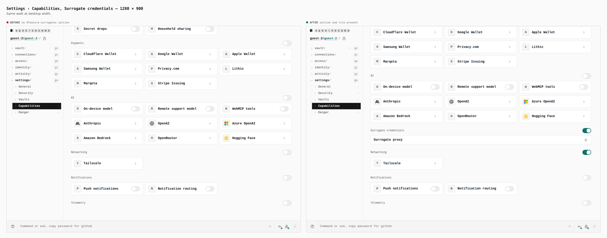
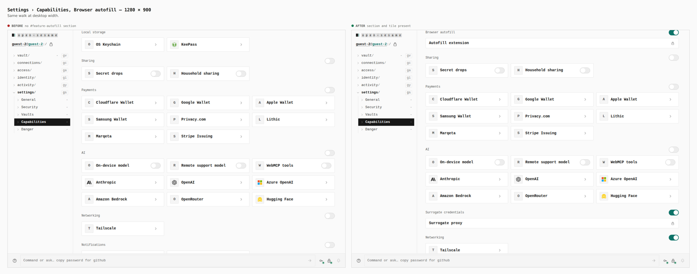

# Surrogate credentials and Browser autofill in Settings › Capabilities

Before/after from two real builds: the base (`claude/funny-babbage-q5a4aq`
at `24b64e8e`) and `adr0148/pages-capability`. Both builds were walked the
same way (`journey.json`, `apps/pages/scripts/capture-evidence.mjs`): a guest
opens Settings › Capabilities, switches **Surrogate credentials** and
**Browser autofill** on where the build has them, applies, reloads, and
scrolls to each section.

The two capabilities are optional and default off (ADR 0130, ADR 0150 §7).
Switching one on loads its module — nothing of the plugin itself, which is a
separately installed binary or browser extension. Each section's tile shows
what the paired daemon says about its plugin. A guest has no daemon paired
(tailnet sync never runs for a guest), so the tile wears the idle mark
("No daemon paired") and offers no switch. That state is what these captures
show.

## Surrogate credentials — 390 × 844

Measured in the browser:

| | before | after |
|---|---|---|
| `#feature-surrogates` | 0 | 1, 358×93 at y 268 |
| section switch | none | 44×44 |
| `#plugin-surrogate-proxy` tile | none | 358×39 |
| tile mark | none | 44×44 (touch target) |
| Networking switch on (the dependency) | 0 | 1 |

## Browser autofill — 390 × 844

| | before | after |
|---|---|---|
| `#feature-autofill` | 0 | 1, 358×93 |
| `.plugin-tile` on the page | 0 | 2 |

## Surrogate credentials — 1280 × 900

| | before | after |
|---|---|---|
| `#feature-surrogates` | 0 | 1, 960×71 |
| section switch | none | 38×22 |
| tile / mark | none | 960×39 / 20×20 |

## Browser autofill — 1280 × 900

| | before | after |
|---|---|---|
| `#feature-autofill` | 0 | 1, 960×71 |

## Not captured, and what was verified instead

A tile talking to a real daemon (installed, on, forced off, the tripwire
list, the copyable install command) needs a paired tailnet drive and a
daemon serving `/v1/plugins`, which this static harness does not have. Those
states are covered by `apps/pages/src/sections/settings/plugins/PluginPanel.test.tsx`,
which renders every standing against a fake daemon: the not-installed mark
with the install command, a forced-off plugin that cannot be switched on, the
icon-key switch (`aria-pressed`) sending `PUT /v1/plugins/surrogate-proxy`,
and tripwires drawn by event, time and subject with no surrogate and no
summary on the page.
