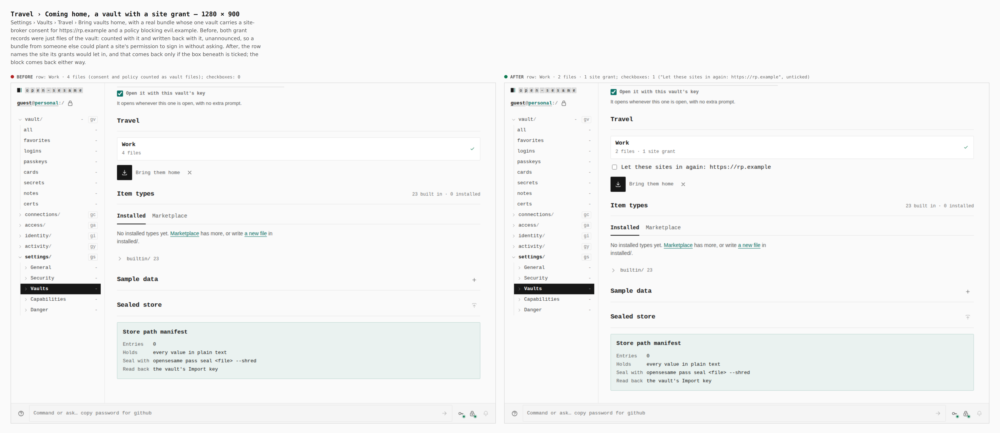
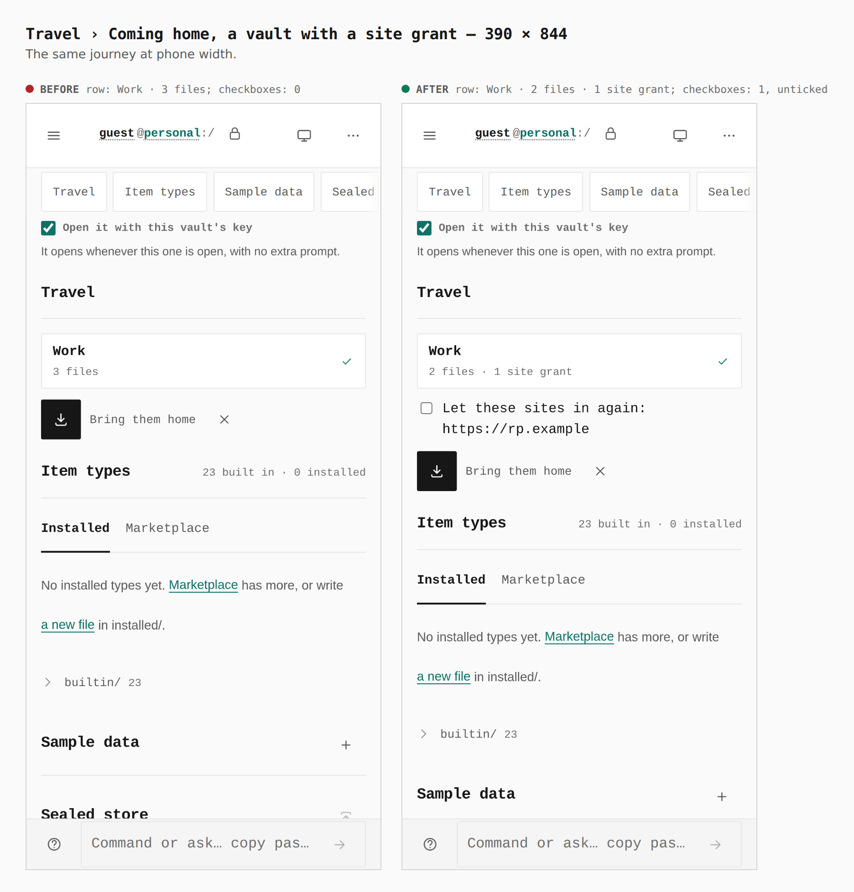

# Travel: site grants on the way home — 2026-09-28

Before/after sheets from two real builds of `apps/pages` (base: `main`;
after: this branch), walked by `journey.json` with
`apps/pages/scripts/capture-evidence.mjs`.

`evidence.travel.json` is a real travel bundle, sealed by app-core's own
`sealTravelBundle` under the return code in `return-code.txt`. It carries one
vault (`prj_evidence`, named "Work") with a header, a body and a site-broker
consent for `https://rp.example`. The vault's files are placeholders: the
capture stops at the preview and never brings it home.

## The return preview

Settings › Vaults › Travel › Bring vaults home: the return code is entered,
the bundle is chosen, and Open the bundle is pressed.

MEASUREMENTS

## What these sheets cannot show

- **Leftovers of a departure.** The panel lists files a cut-short departure
  left with no header, with a key to clear them. That state needs OPFS to
  refuse `removeEntry`, which a real build cannot be made to do honestly. It
  is covered in jsdom by `TravelReturnPanel.test.tsx` ("offers to clear what
  a cut-short departure left") and in app-core by `travel-grants.test.ts`.
