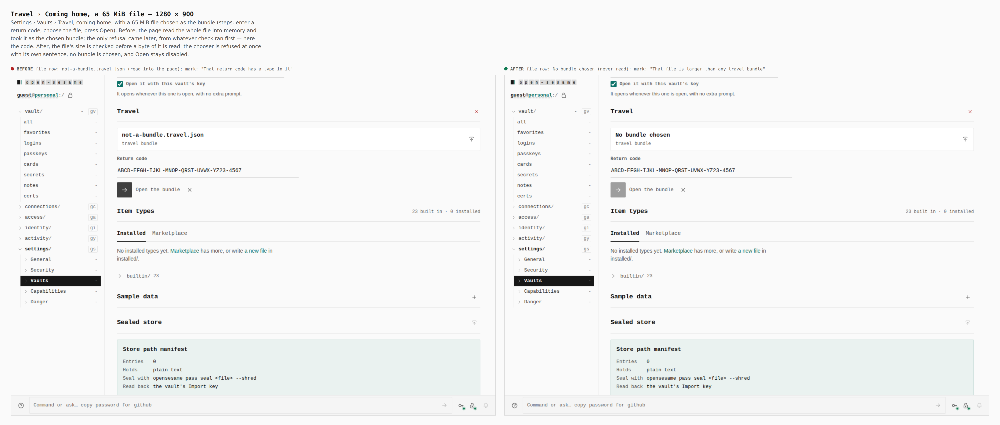
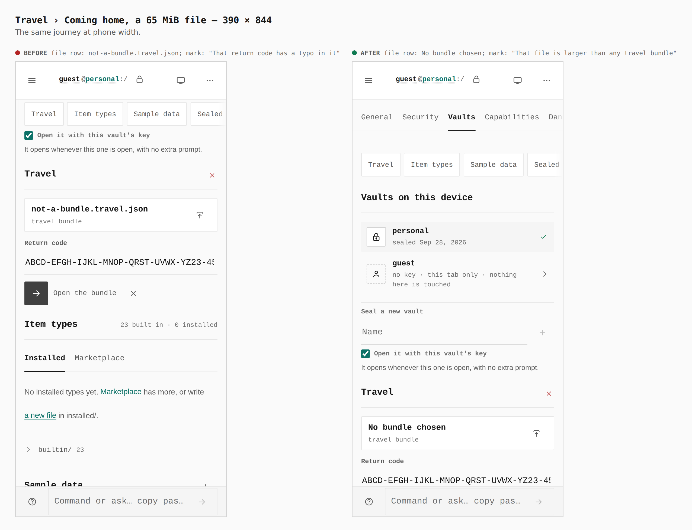

# Travel mode hardening — 2026-09-28

Before/after sheets from two real builds of `apps/pages` (base: `main`; after:
this branch), walked by `journey.json` with
`apps/pages/scripts/capture-evidence.mjs`. Each pair's measurement is printed
by the capture from the browser (`labels` reads the status mark's sentence,
`report` the bundle row).

## A file too large to be a bundle

Settings › Vaults › Travel › Bring vaults home. A return code is entered, a
65 MiB file is chosen as the bundle, and Open is pressed.

| | Before | After |
|---|---|---|
| Bundle row | `not-a-bundle.travel.json` — the whole file was read into the page | `No bundle chosen` — refused by `File.size`, never read |
| Status mark | "That return code has a typo in it" | "That file is larger than any travel bundle" |
| Open | enabled | disabled |

## What these sheets cannot show

- **A departure cut short.** The travel panel now keeps the packed bundle when
  the browser refuses to delete a file, so the same key finishes the removal.
  That state only arises when OPFS rejects `removeEntry`, which a real build
  cannot be made to do honestly. It is covered in jsdom by
  `TravelPanel.test.tsx` ("keeps the package after a removal cut short") and
  in app-core by `travel-hardening.test.ts`.
- **The safe-for-travel switch** drops `aria-pressed` (invalid on
  `role="switch"`); it draws identically, and `aria-checked` is unchanged.
