# Settings › Vaults as ceremonies — visual evidence

Change: Settings › Vaults stops drawing ceremonies as form fields on the page.

- **Seal a new vault** and **Delete a vault** are ceremonies in a sheet.
- **Travel** is two rows — turn travel mode on, turn it off — each opening its
  ceremony ([ADR 0143](../../adr/0143-travel-mode.md), amended). A guest sees
  both rows disabled, with the reason on each, instead of a bare lock.
- **Sealed store** is one row with its count and one key; the card lives in
  the sheet the key opens. **Tailnet sync** pairing is a sheet, too (it is
  behind the Networking capability, which the default install leaves off, so
  it is captured separately, with the capability switched on through
  Settings › Capabilities; see [Tailnet sync](#tailnet-sync-pairing)).
- **Sample data** is removed: the panel, the load/remove key, the
  `vault.sample_data` capability, the synthetic badges and the item flag.

Two real builds, walked the same way by
`apps/pages/scripts/capture-evidence.mjs` with [`journey.json`](journey.json):
the base commit `9ee047b8` (built from a stash of this branch) and this branch.
A password vault is sealed, then a second vault, Work, is sealed with the same
key. A guest run covers the disabled state.

## Vaults page, top — 1280 × 800

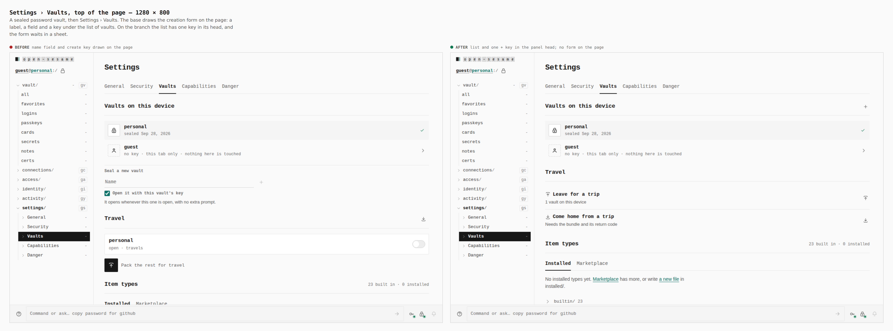

Text fields on the panel `1 → 0`, `.found` cards `1 → 0`, Safe-for-travel
switches on the page `1 → 0`. The list keeps one `+` key in its head.

## Sealing a new vault — 1280 × 800

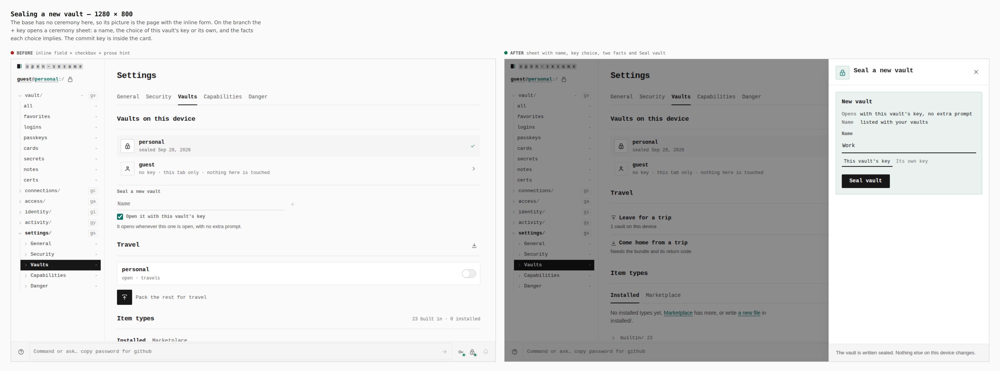

The name, the choice of this vault's key or its own, and the two facts each
choice implies, in one card; the commit is inside it.

## Travel — 1280 × 800

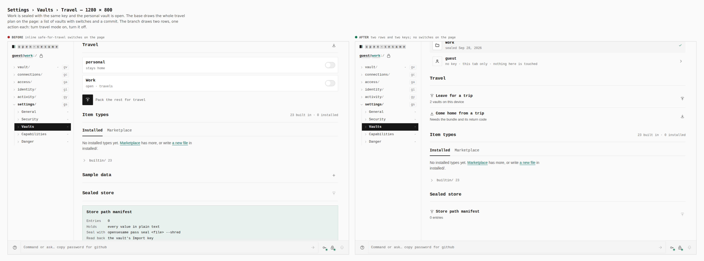

`.travel__row` `2 → 0`, Safe-for-travel switches on the page `2 → 0`, rows
`0 → 2`.

## Turning travel mode on / off — 1280 × 800

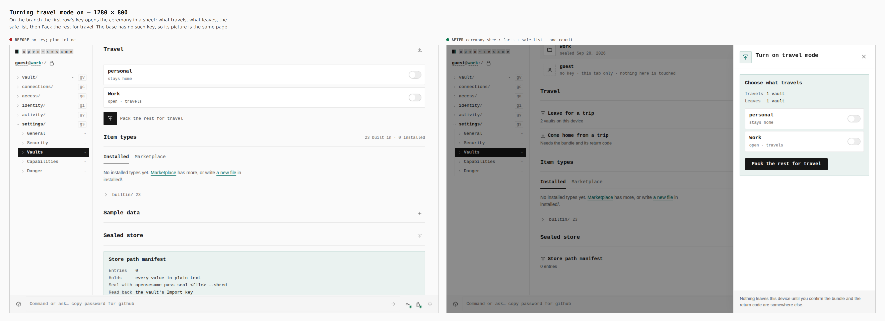

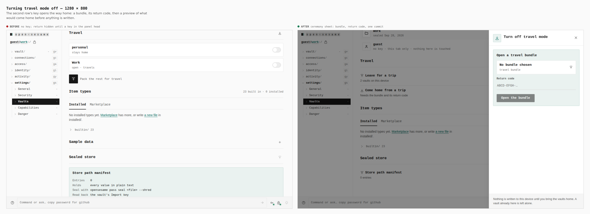

Choose what travels, pack, take off the device; or open a bundle with its
return code and preview before anything is written. The base has no such key
(its captures are the inline plan).

## Item types and what follows — 1280 × 800

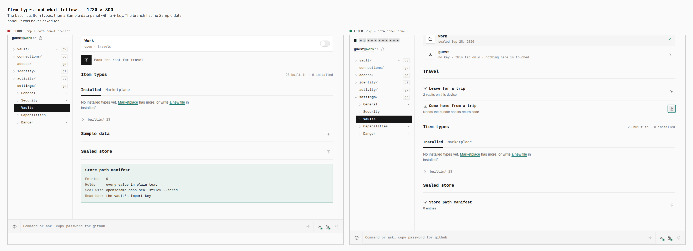

`#sample-data` `1 → 0`.

## Sealed store — 1280 × 800

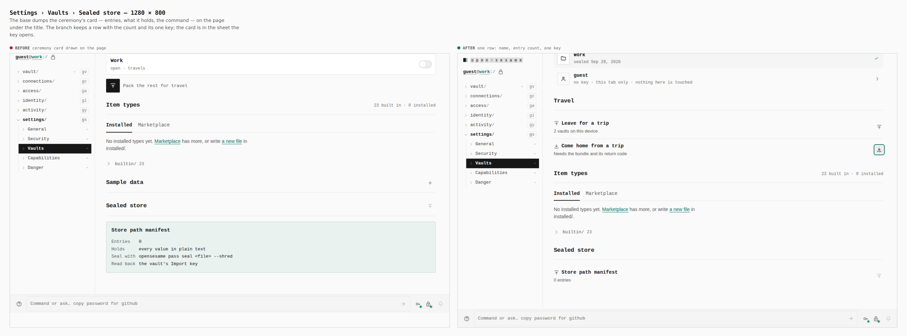

`.found` cards on the page `1 → 0`, `#sealed-store .sw` rows `0 → 1`.

## Travel as a guest — 1280 × 800

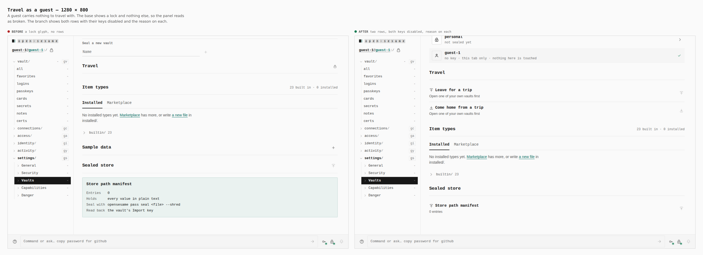

Rows `0 → 2`, disabled keys `0 → 2`, with "Open one of your own vaults
first" on each.

## Phone — 390 × 844

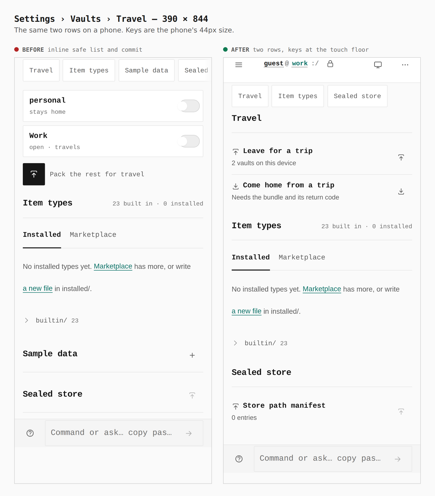

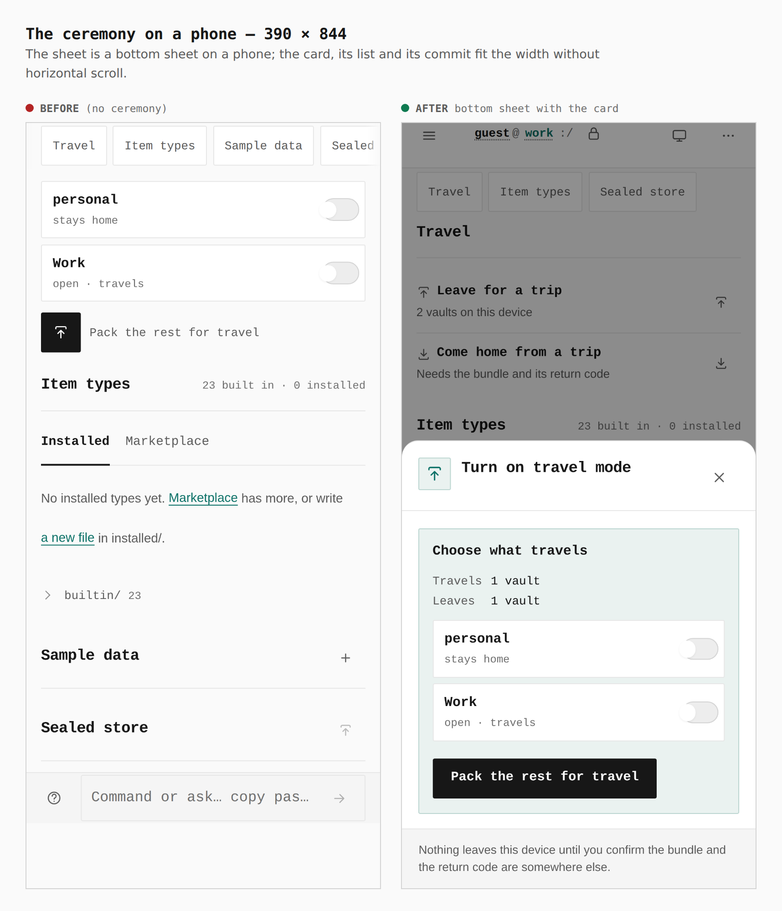

Keys in the Travel panel measure `44×44` before and after. On the branch the
sheet's toggles are `44×44` and the commit is `248×44`.

## Tailnet sync pairing

Walked by [`tailnet-journey.json`](tailnet-journey.json) against the same two
builds. A password vault is sealed, Networking is switched on in Settings ›
Capabilities (Apply), the page is reloaded and unlocked, then Settings ›
Vaults › Tailnet sync. Numbers below are read from the browser.

### Panel — 1280 × 800

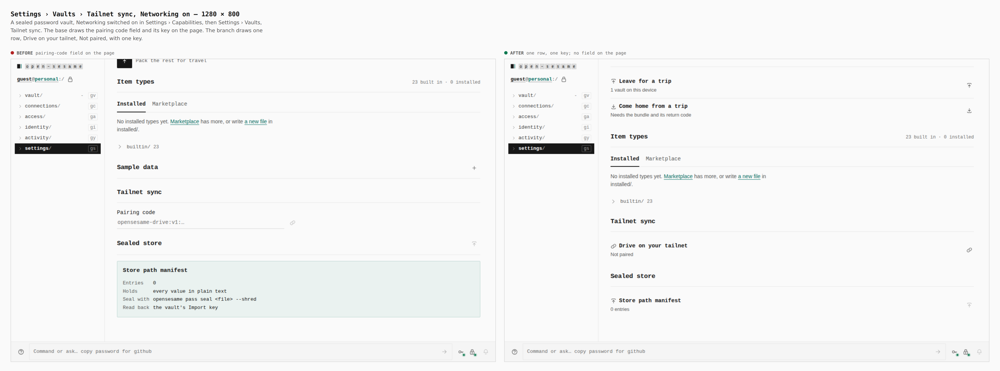

`#tailnet-sync-code` fields on the page `1 → 0`; keys named "Pair with a
drive" `0 → 1`. The base's field measures `442×32` beside a `32×32` key; the
branch's row has one `24×24` key.

### The ceremony — 1280 × 800

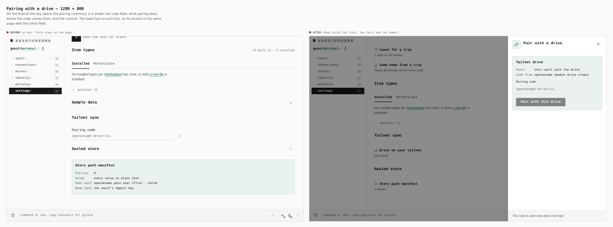

Pressing the key: `.sheet` `0 → 1`, `#tailnet-sync-code` inside the sheet
`0 → 1` (on the page `1 → 0`). The base has no such key, so its picture is the
same page. In the sheet the field is `355×34` and the commit `213×36`.

### Phone — 390 × 844

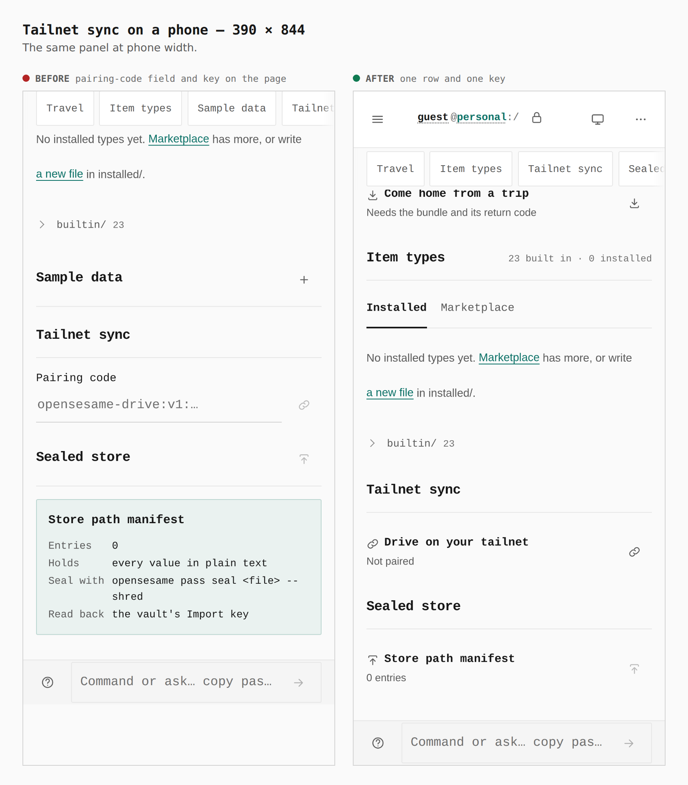

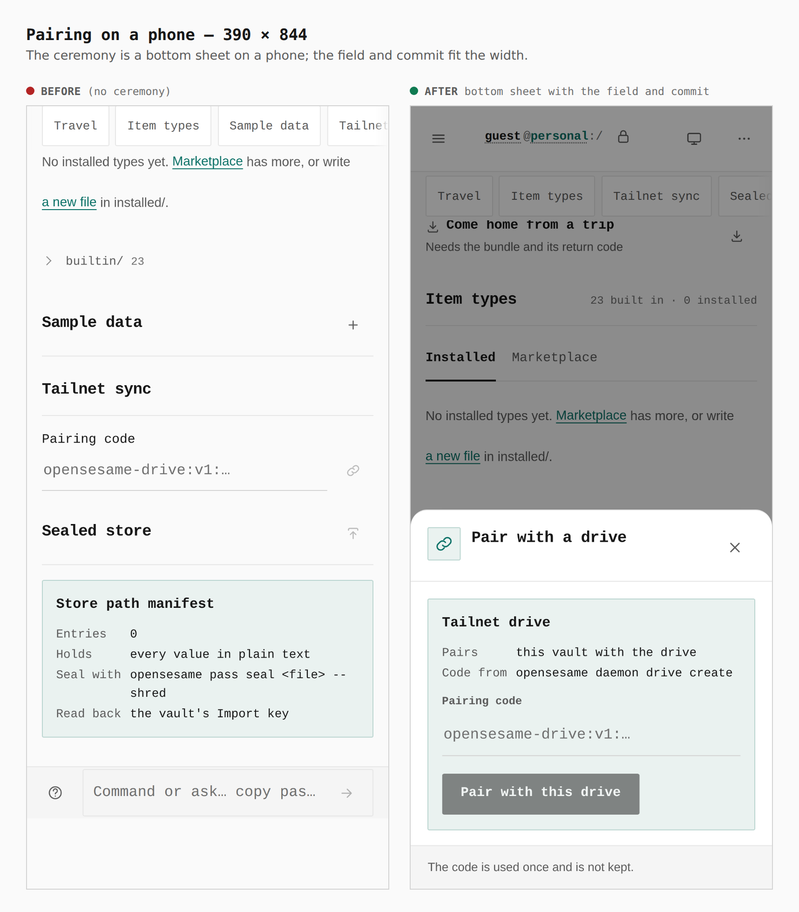

Base: field `308×44` and key `44×44` on the page. Branch: one row with a
`44×44` key; the bottom sheet's field is `322×44` and the commit `213×44`,
within the width.
