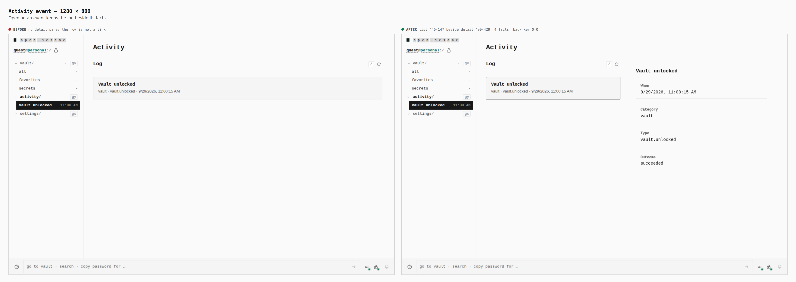
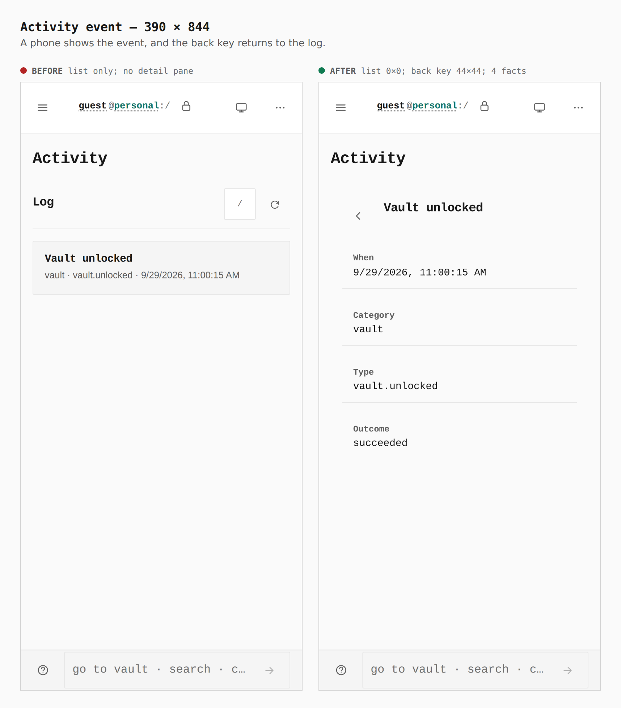

# An activity row opens that event

Before/after from two real Pages builds (`VITE_BASE=/OpenSesame/`), walked the
same way (`journey.json`): `main` at `ffe39fa6`, then this branch. A sealed
vault is unlocked, Activity is opened, and "Vault unlocked" is followed. The
numbers are the capture's `measure` and `count` output.

| screen | before | after |
|---|---|---|
| Desktop, 1280 × 800 | no detail pane; the row is not a link (`a.identity-row__main` 0) | list 446×147 beside a detail pane 490×429; 4 facts; back key 0×0 |
| Phone, 390 × 844 | list only; no detail pane | list 0×0; back key 44×44; 4 facts (When, Category, Type, Outcome) |

## Activity event, 1280 × 800

The log stays beside the event. The rail row and the page row both name it.
The back key is hidden at this width (0×0).

## Activity event, 390 × 844

The list is hidden (0×0). The back key is 44×44 and returns to the log.
