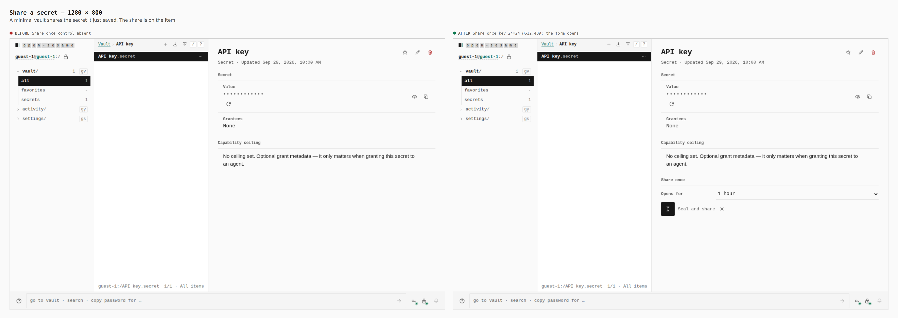
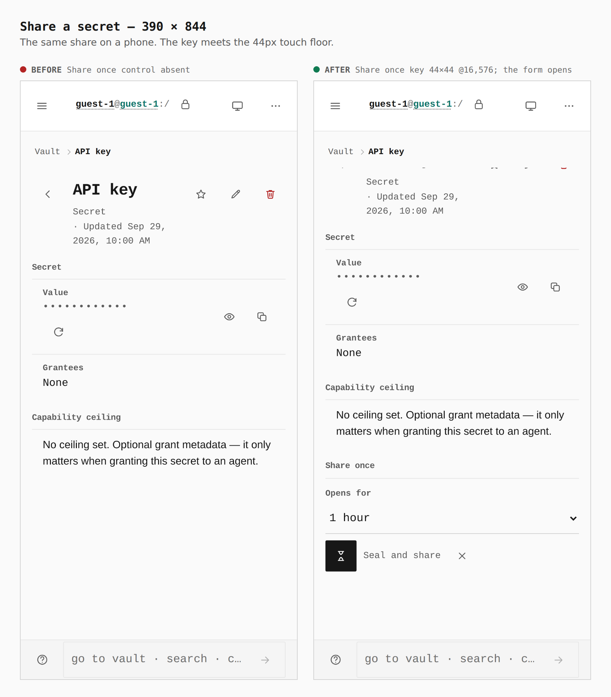
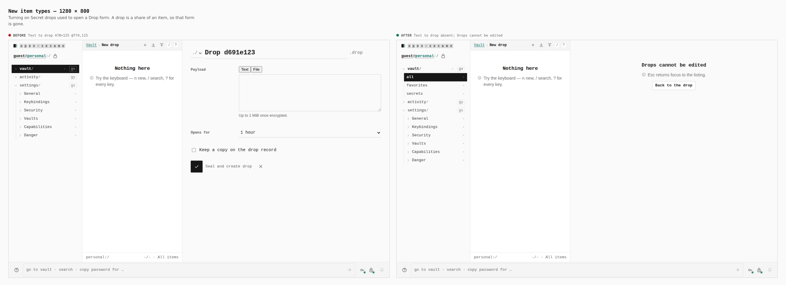
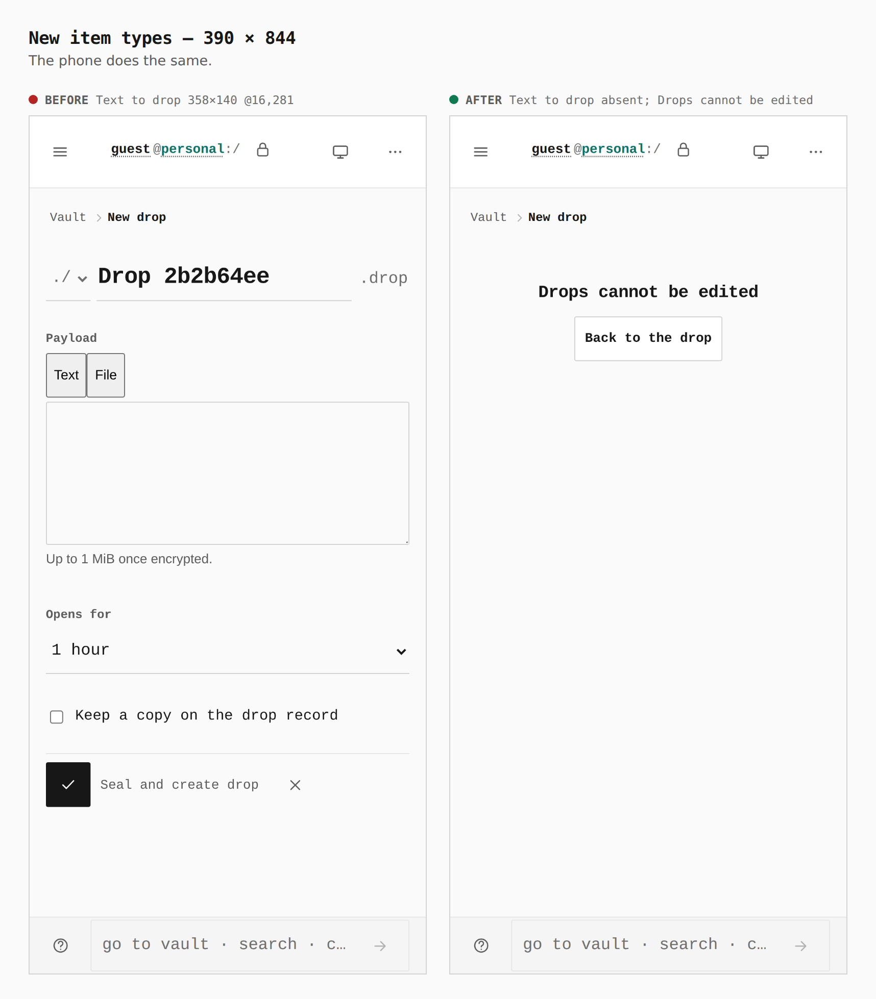

# A drop is a share of an item

Before/after from two real production builds of Pages. The before is `main` at `ffe39fa6f029c65eebf4830a0415c6f48425c693`. Both walks use `journey.json`. Measurements are the capture log's `measure` lines.

A minimal vault can share a secret it just saved. The share is a control on that item. Turning Secret drops on used to open a Drop form of its own. That form is gone: a drop is not an item type.

## Share a secret — 1280 × 800

The guest vault saves an API key. On `main` the detail has no share control. On this branch the same detail has a Share once key, and opening it asks how long the share lasts.

**Before:** Share once control absent. **After:** Share once key 24×24 at 612,409; the form opens.

## Share a secret — 390 × 844

The same item on a phone. The key is 44×44.

**Before:** Share once control absent. **After:** Share once key 44×44 at 16,576; the form opens.

## New drop — 1280 × 800

With Secret drops switched on, `main` opens a Drop form: a payload field, a lifetime, and a copy kept on a drop record. This branch opens that route and says the drop cannot be edited. The share lives on the item that holds the secret.

**Before:** Text to drop 478×125 at 774,115. **After:** Text to drop absent; heading "Drops cannot be edited".

## New drop — 390 × 844

The phone shows the same replacement.

**Before:** Text to drop 358×140 at 16,281. **After:** Text to drop absent; heading "Drops cannot be edited".

