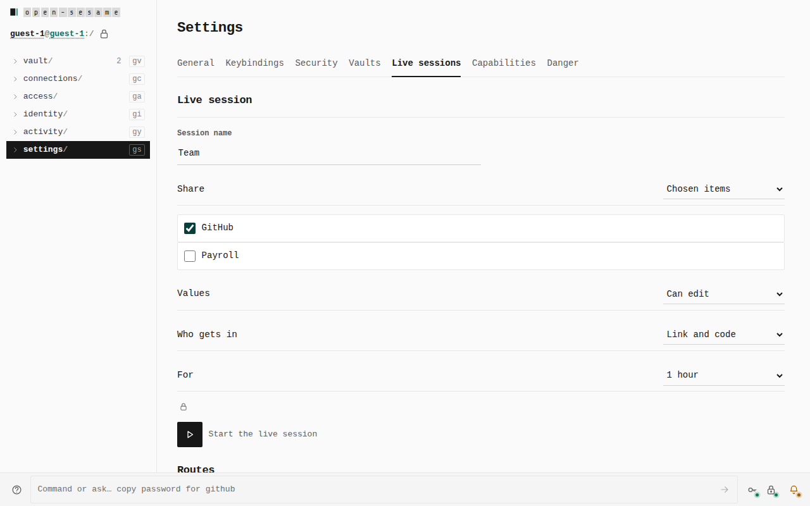
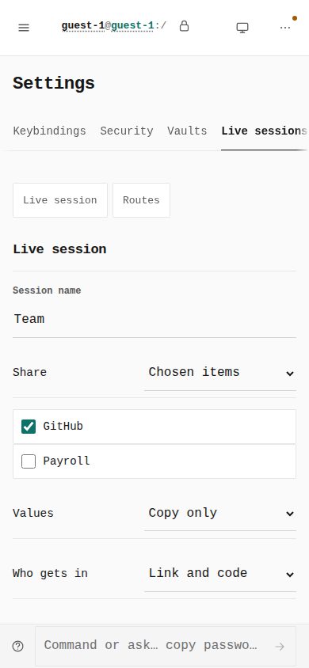
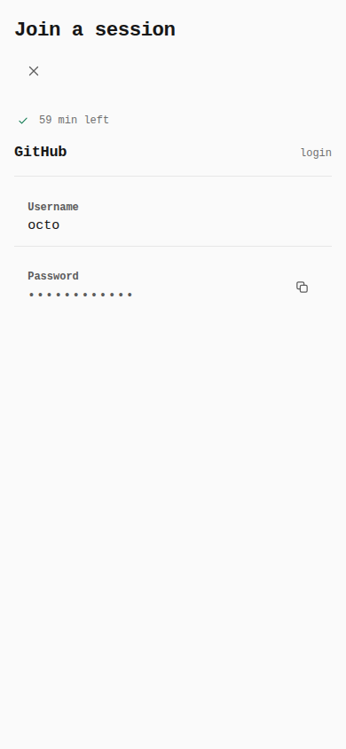
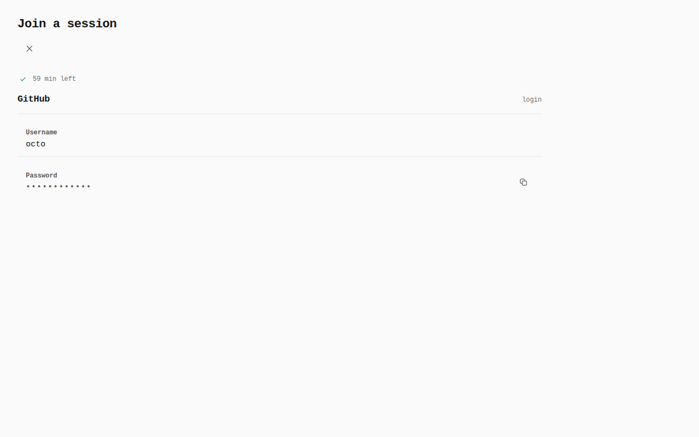
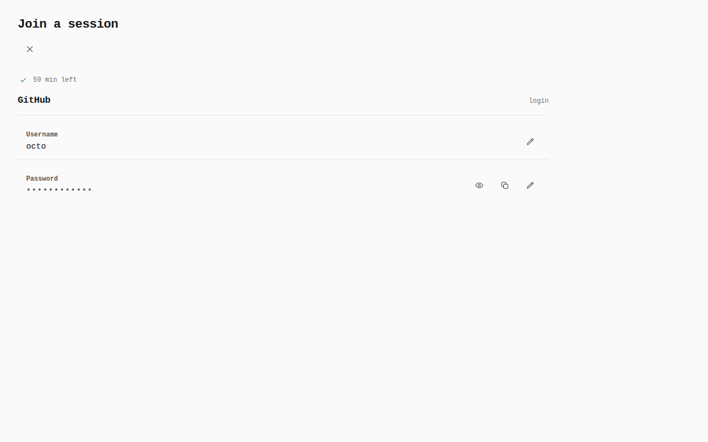
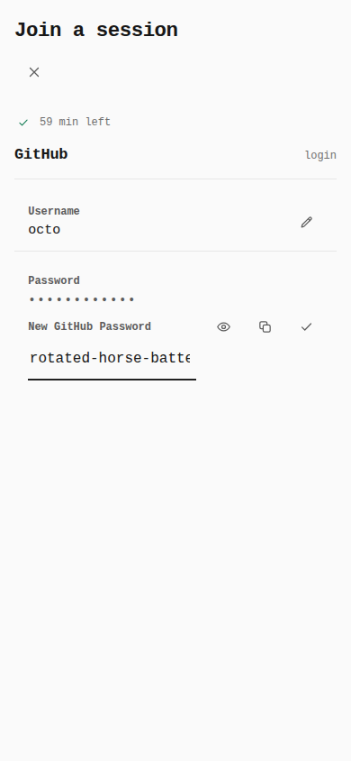
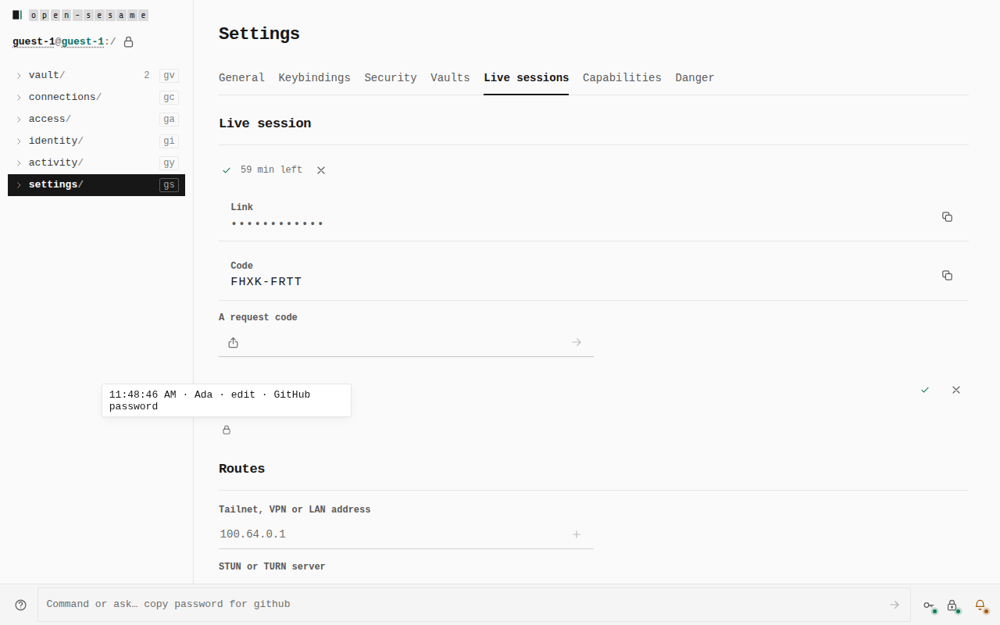
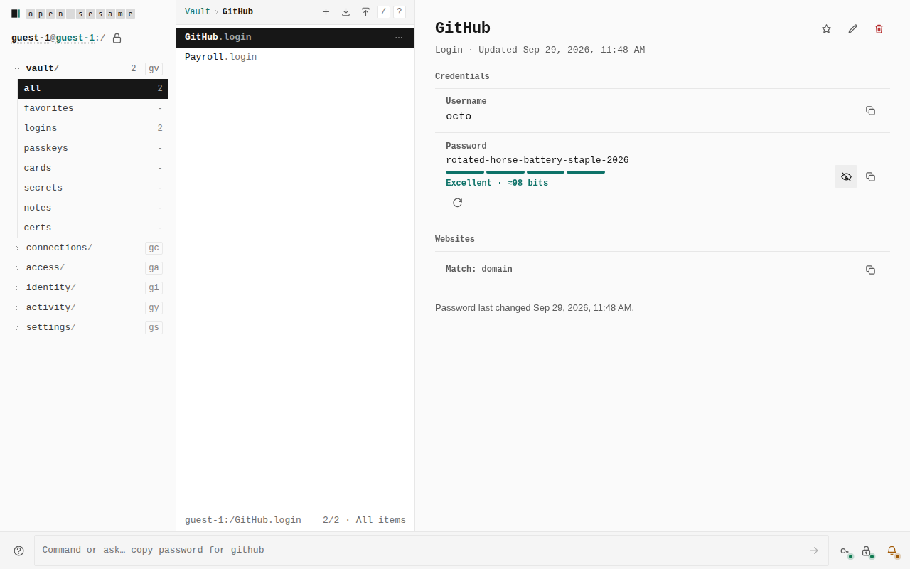
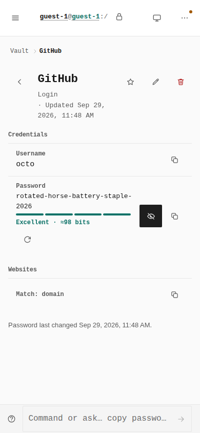

# Authorized edit on a live session

Before/after from two real Pages builds of the same walk. Before is `origin/main`
at `53113ca6`. After is this branch. Both were served as
`https://tyler-r-kendrick.github.io/OpenSesame/` from `dist/`. Option text,
the selected value, and control boxes were read from the browser
(`before-measures.json`, `after-measures.json`).

The before build has two Values choices, Show values and Copy only. The walk
leaves the default, Copy only (`use`). The after build adds Can edit. The
walk selects it, and the joiner replaces the shared GitHub password.

## Values, 1280 × 800

Before: selected value `use`, label Copy only, option texts `Show values`,
`Copy only`. After: selected value `edit`, label Can edit, option texts
`Show values`, `Copy only`, `Can edit`. GitHub is checked. Payroll is not.

## Values, 390 × 844

The Values select is 192×44 on both builds. Before shows Copy only. After
shows Can edit.

## Joiner catalog, 390 × 844

Edit GitHub Password button: count 0 on main, count 1 after, box 44×44.
Payroll is not on the joiner.

## Joiner catalog, 1280 × 800

Same count: 0 on main, 1 after, box 44×44.

## Joiner replaces the password, 390 × 844

The field label is New GitHub Password. Save GitHub Password is 44×44.
This screen has no before: main has no edit control to open.

## Owner's session log, 1280 × 800

The handed-out mark's sentence, read from the open status bubble:
`11:48:46 AM · Ada · edit · GitHub password`.

## Owner's vault item after the save

The open GitHub login shows `rotated-horse-battery-staple-2026`. Payroll
stays in the owner's vault and was not offered to the joiner.
