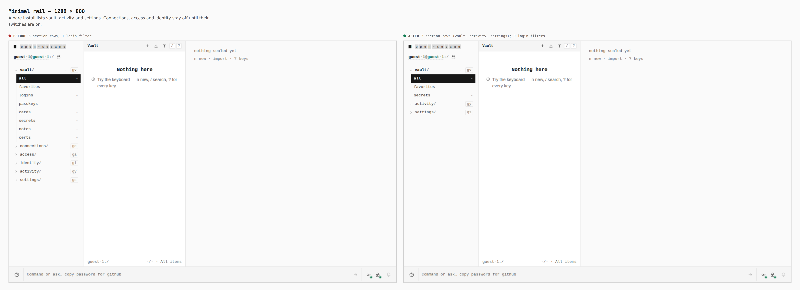
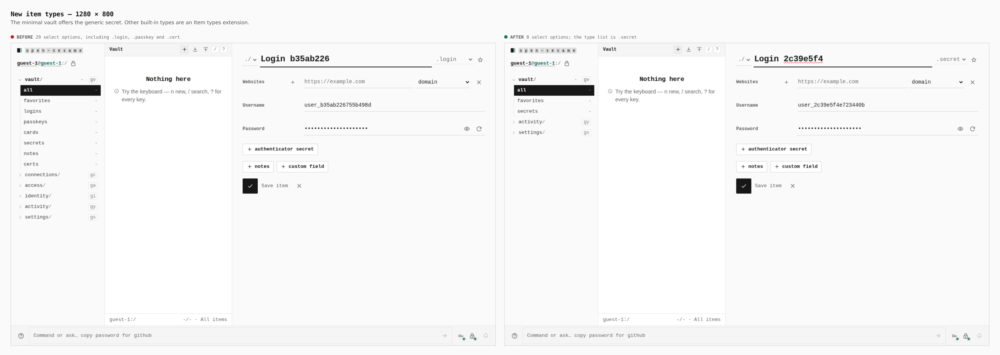
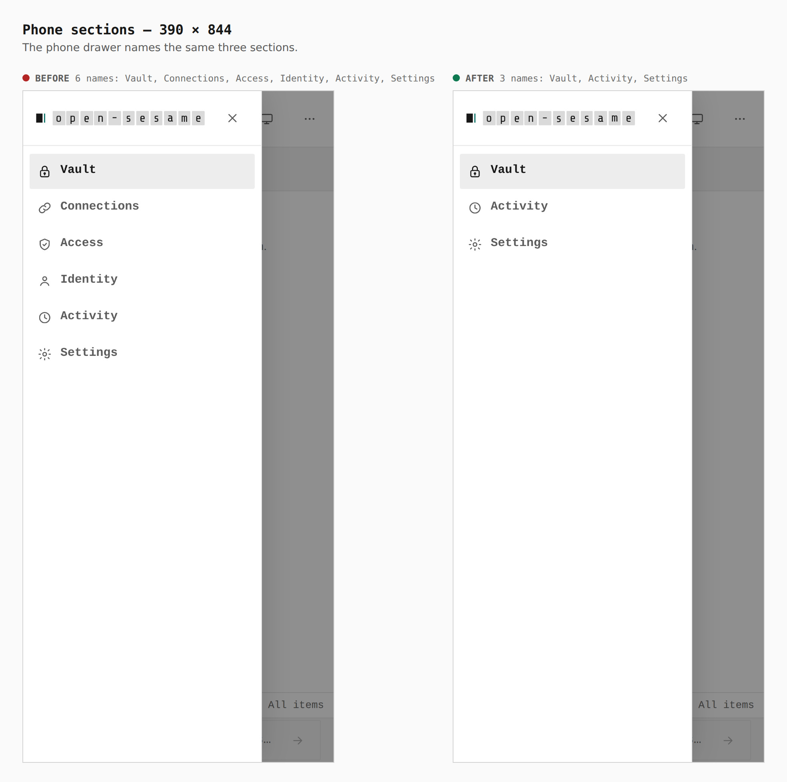

# Minimal PWA sections

Before is `main`. After is this branch. Both are production builds of
`apps/pages`, walked the same way: continue as guest, then the desktop rail,
the new-item editor, and the phone's section drawer.

## Minimal rail — 1280 × 800

Top-level rail rows: 6 → 3. Login filter links: 1 → 0. The secret filter
stays.

## New item types — 1280 × 800

Select options: 29 → 8. The type list on the branch is `.secret`. The other
seven options are the path and match fields, present on both builds.

## Phone sections — 390 × 844

Drawer names: Vault, Connections, Access, Identity, Activity, Settings →
Vault, Activity, Settings.

