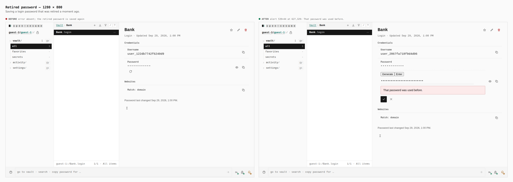
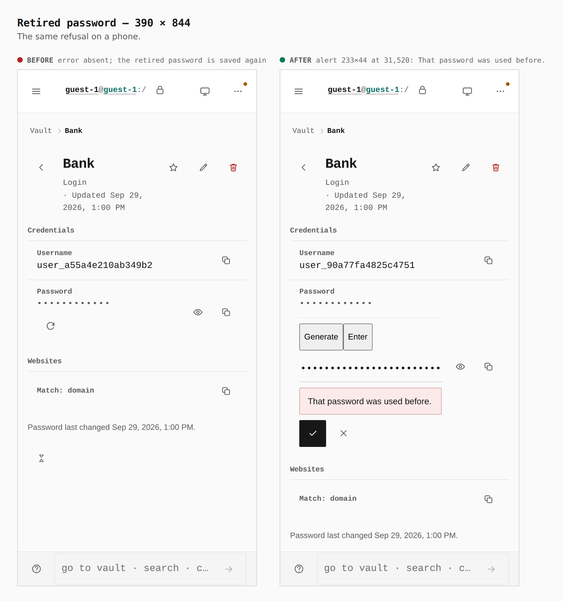

# Retired passwords stay retired

Before/after from two real production builds of Pages. The before is `main` at `6d6bf972eaac2e6e90cf7813017c294a303ace40`. Both walks use `journey.json`. Measurements are the capture log's `measure` lines.

A guest saves a login, replaces its password, then tries to put the first password back. With no backup configured, the browser keeps a sealed digest of the retired password and refuses the reuse. The password itself is not on screen as text, and the current password stays the replacement.

## Retired password — 1280 × 800

**Before:** the error is absent and the retired password is saved again. **After:** alert 539×44 at 627,329, “That password was used before.”

## Retired password — 390 × 844

**Before:** the error is absent and the retired password is saved again. **After:** alert 233×44 at 31,520, “That password was used before.”

