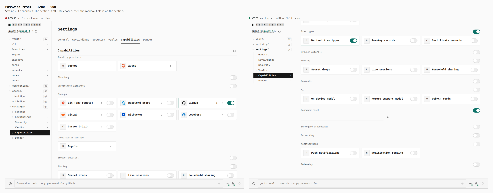
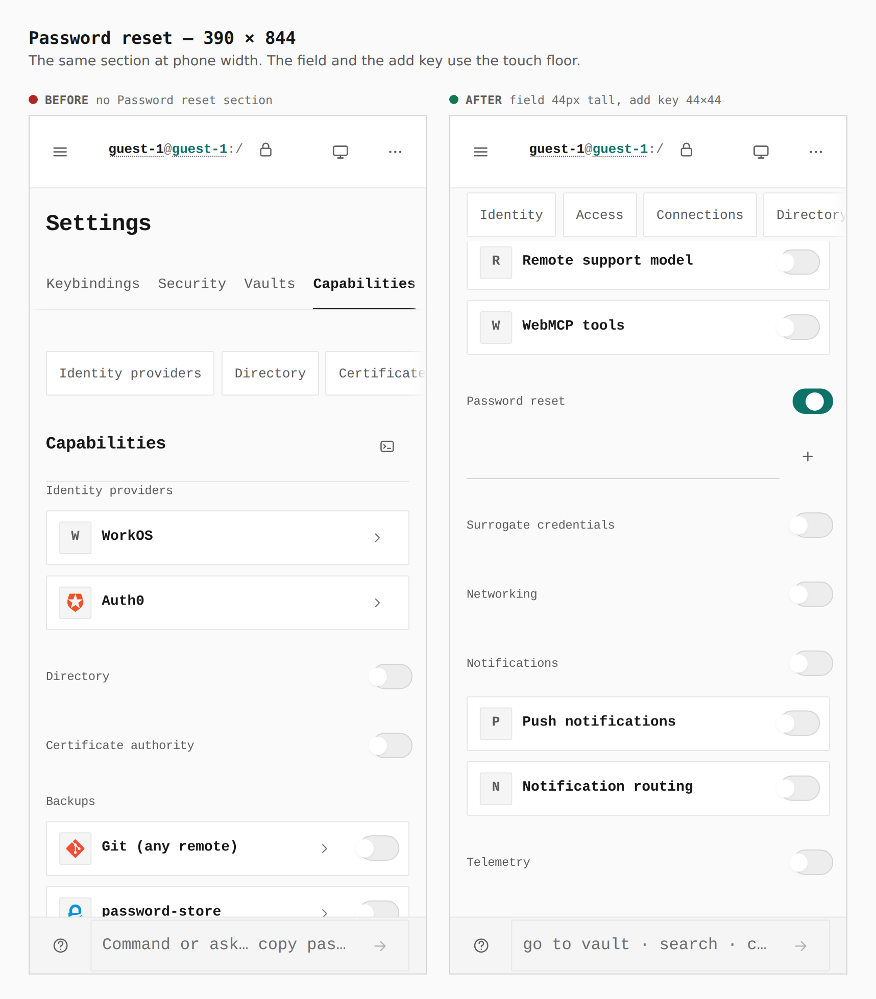

# Password reset mailboxes

Before is `main` (`978ad185`). After is this branch. Same guest, Settings › Capabilities, both builds.

## Desktop, 1280 × 900

`#feature-password-reset` is 0 on the before build and 1 after. Turning the section on shows the mailbox field and turns on Derived item types, the login item type it depends on.

## Phone, 390 × 844

The email field measures 308×44. The add key measures 44×44.
