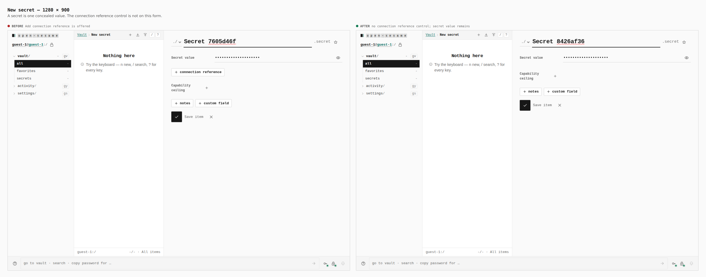
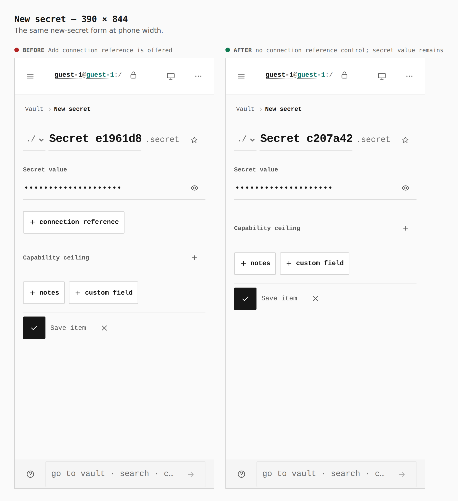
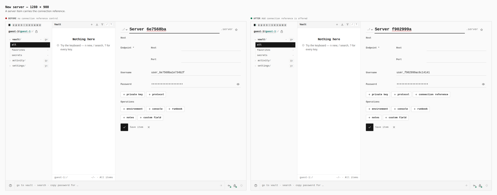
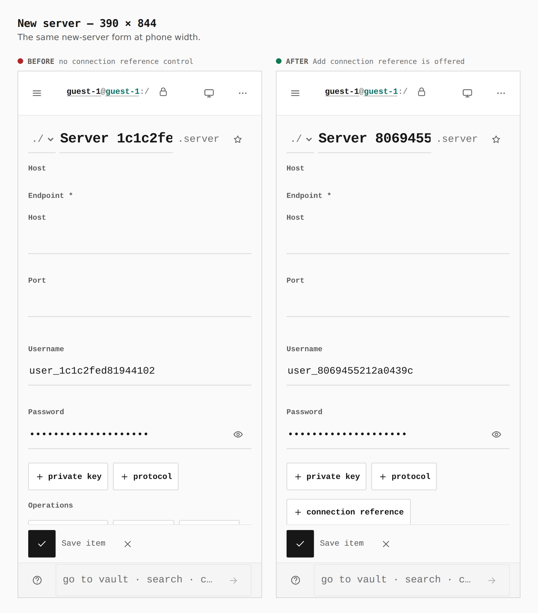

# Secret is one concealed value

Before is `main` (`79b8166c`). After is this branch (`434d6a93`). Same guest, same new-item routes, both builds.

## New secret, 1280 × 900

`button[aria-label='Add connection reference']` is 199×30 on the before build and absent after. `#secret-value` stays 446×32.

## New secret, 390 × 844

The add control is 199×44 before and absent after. `#secret-value` stays 314×44.

## New server, 1280 × 900

The connection-reference control is absent before. After it is 199×30.

## New server, 390 × 844

The connection-reference control is absent before. After it is 199×44.
