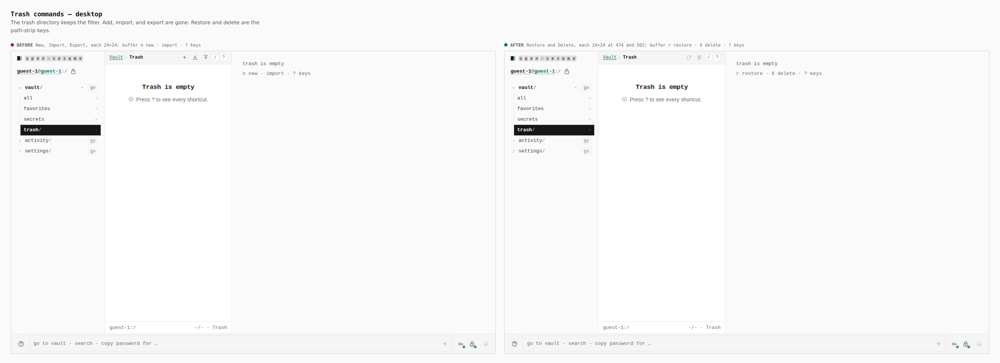
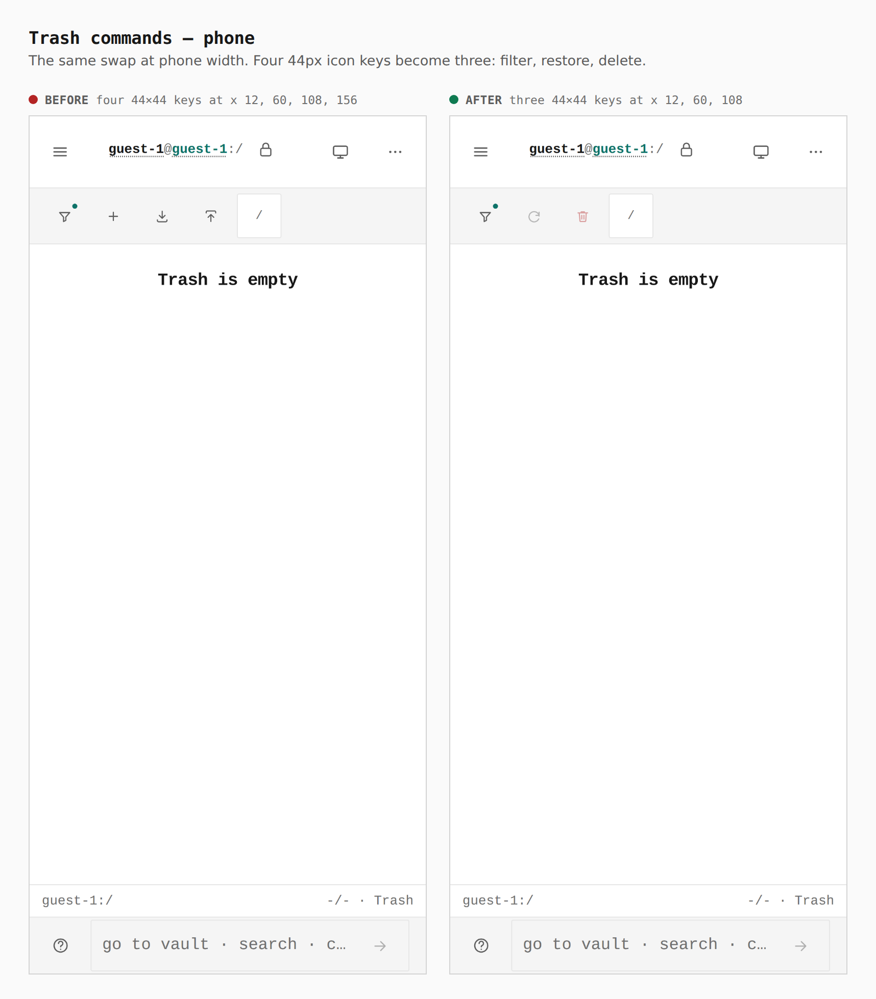

# Trash commands

Empty trash, guest vault, two production builds of `apps/pages`. The left of
each sheet is `main`. The right is this branch. Same route: `/vault?f=trash`.

## Desktop

Path-strip icon keys are 24×24. Before: New, Import, and Export, with the
buffer `n new · import · ? keys`. After: Restore at x 474 and Delete
permanently at x 502, with the buffer `r restore · X delete · ? keys`.

## Phone

Touch targets are 44×44. Before: four icon keys at x 12, 60, 108, and 156
(filter, new, import, export). After: three at x 12, 60, and 108 (filter,
restore, delete).
