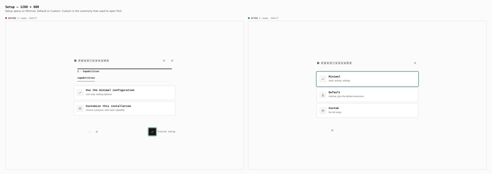
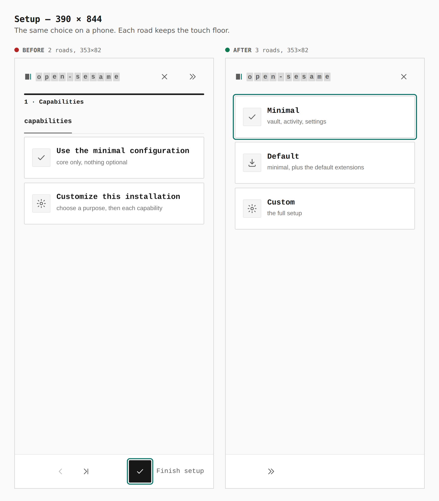

# Setup configuration choice

Before is current main: Set up your own opens the capabilities tab, two
roads. After is this branch: the same press opens Minimal, Default and
Custom. Both captures are production builds of `apps/pages`, walked the
same way.

## Desktop, 1280 × 800

Two ceremony roads, each 544×77, become three configuration choices, each
544×77.

## Phone, 390 × 844

Two ceremony roads, each 353×82, become three configuration choices, each
353×82. The touch floor holds.

