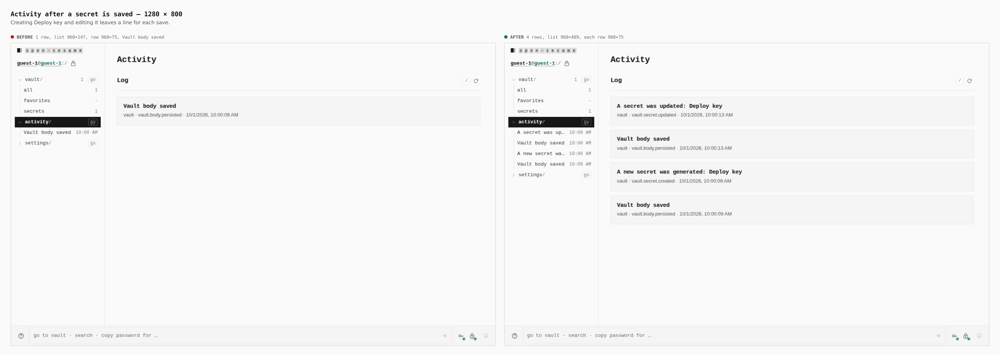
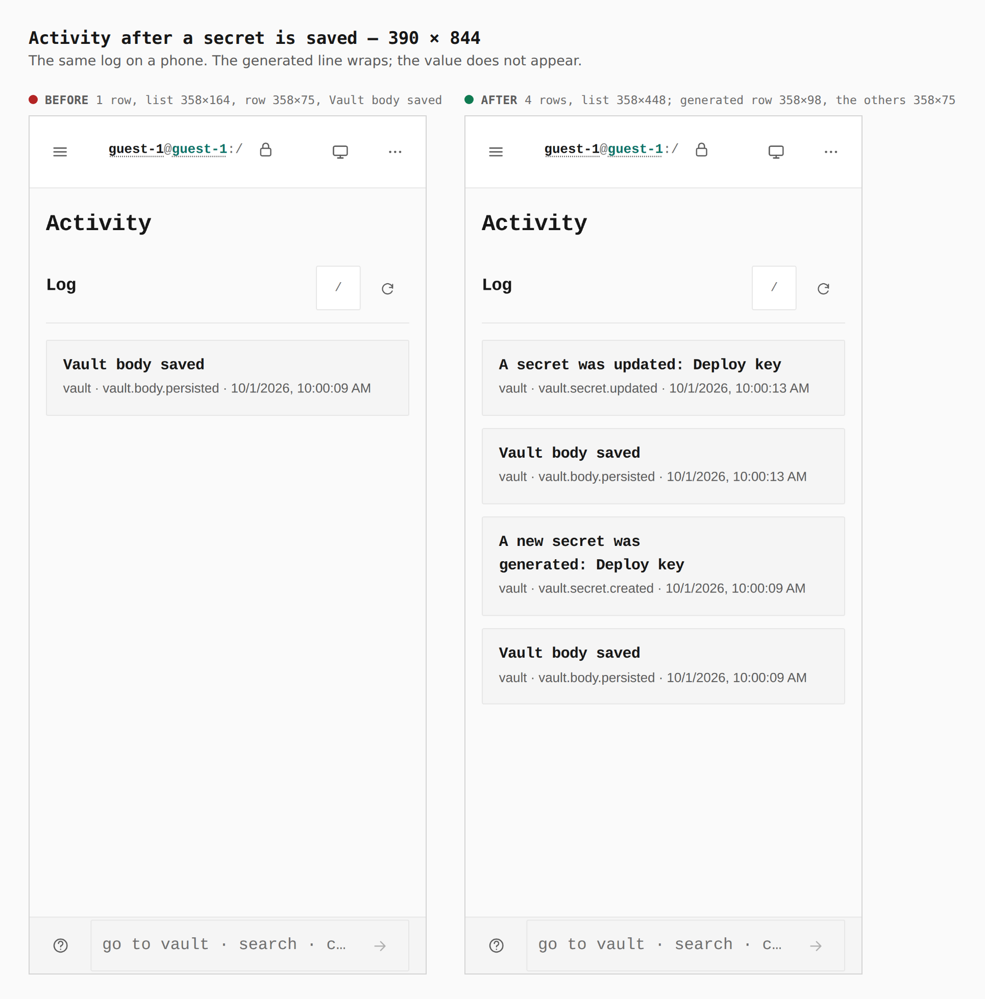

# A secret save names what happened

Before/after from two real Pages builds (`VITE_BASE=/OpenSesame/`), walked the
same way (`journey.json`): `main` at `fa0dde40`, then this branch. A guest
creates a secret named Deploy key, edits it, and opens Activity. The numbers
are the capture's `measure` and `count` output. The secret value is not in
the log.

| screen | before | after |
|---|---|---|
| Desktop, 1280 × 800 | 1 row, list 960×147, row 960×75, "Vault body saved" | 4 rows, list 960×409, each row 960×75 |
| Phone, 390 × 844 | 1 row, list 358×164, row 358×75, "Vault body saved" | 4 rows, list 358×448; the generated row wraps to 358×98, the others stay 358×75 |

## Activity, 1280 × 800

Creating the secret and editing it were one "Vault body saved" line. They are
now "A new secret was generated: Deploy key" (`vault.secret.created`) and
"A secret was updated: Deploy key" (`vault.secret.updated`), each beside the
body-saved line for that seal.

## Activity, 390 × 844

The same four lines. The generated summary wraps to a 358×98 row. The value
typed into the secret is not on the screen.
