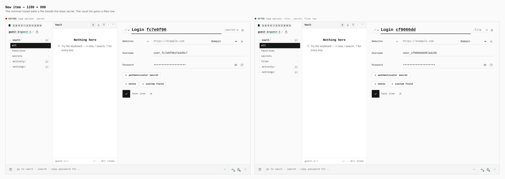
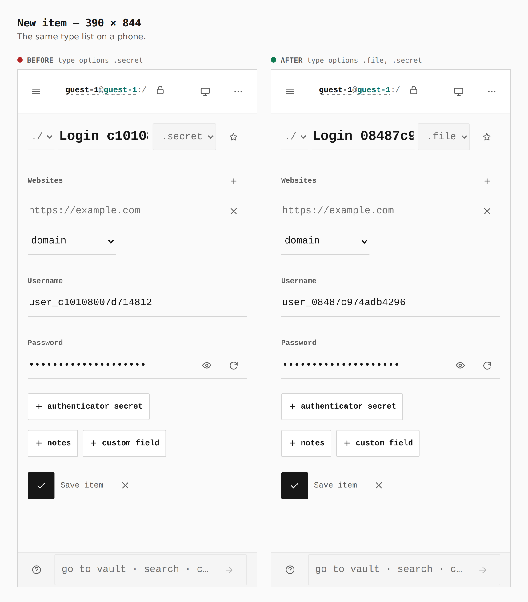
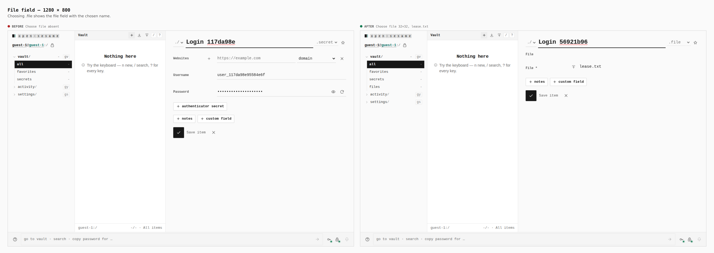
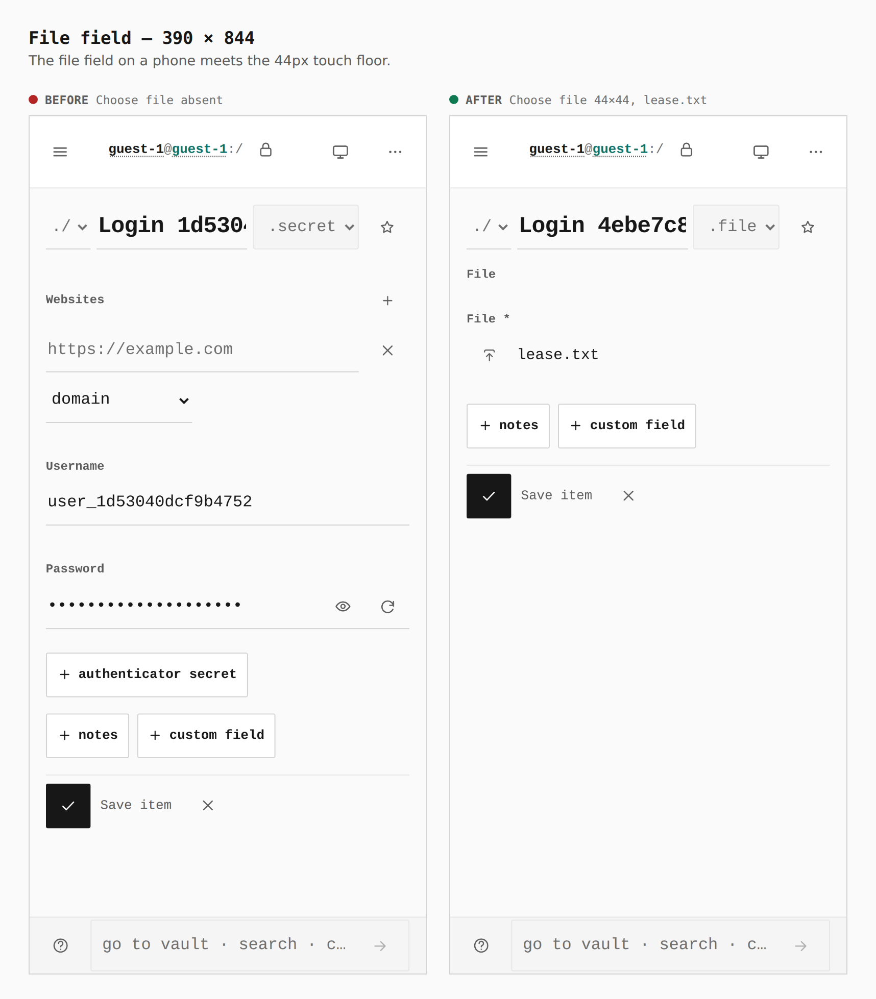

# File item in the minimal install

Before and after from two production builds of Pages: base `6edbd801` and this branch. A guest opens New item on both. The file sheets then choose `.file` where that option exists.

## New item — 1280 × 800

Type options `.secret` → `.file`, `.secret`. The vault list gains a files row.

## New item — 390 × 844

Type options `.secret` → `.file`, `.secret`.

## File field — 1280 × 800

Choose file absent → Choose file 32×32, with `lease.txt` beside it.

## File field — 390 × 844

Choose file absent → Choose file 44×44, with `lease.txt` beside it.
