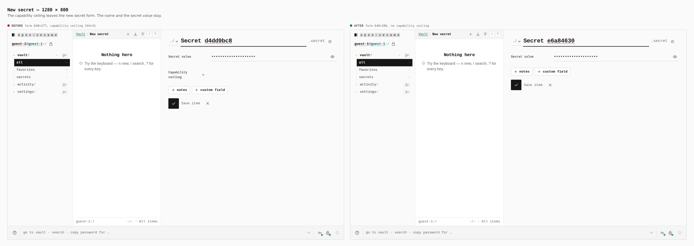
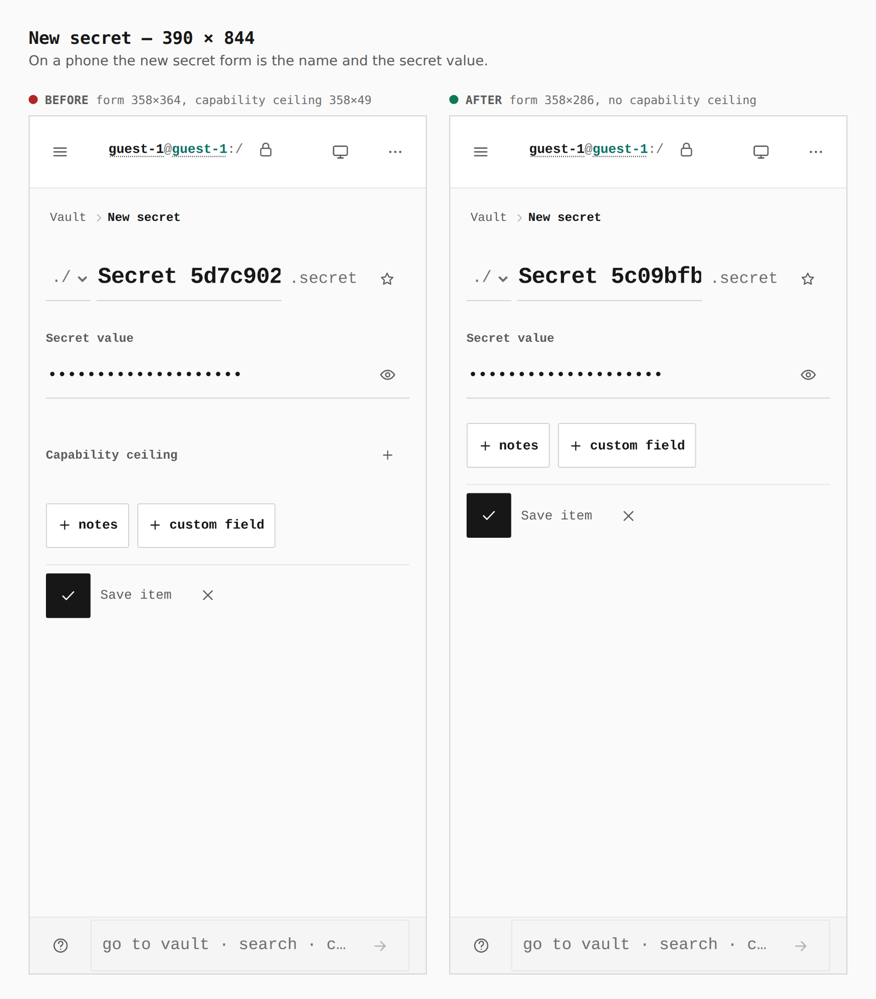
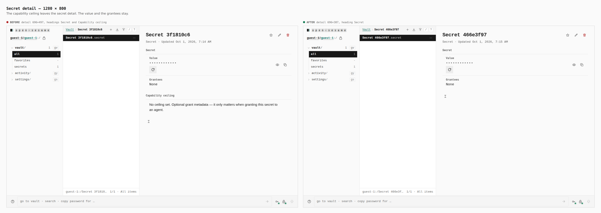
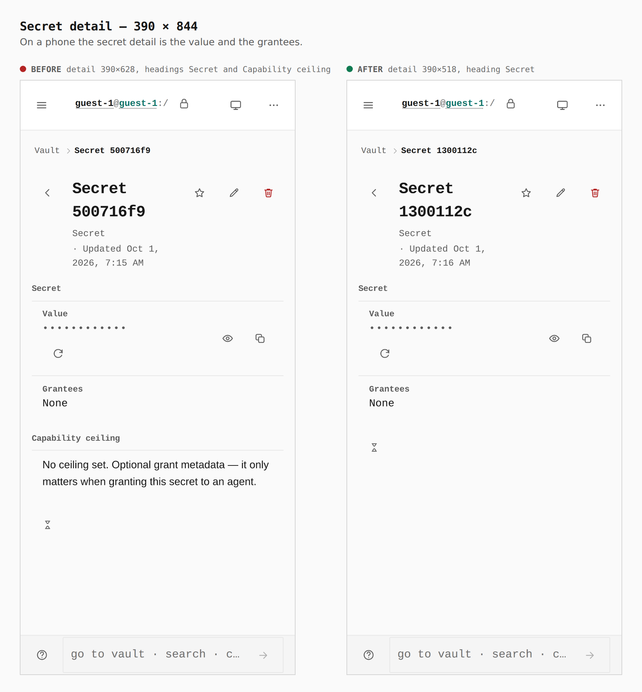
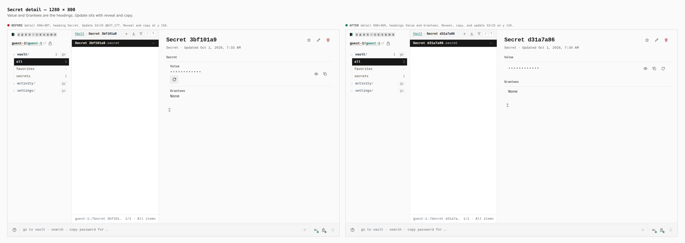
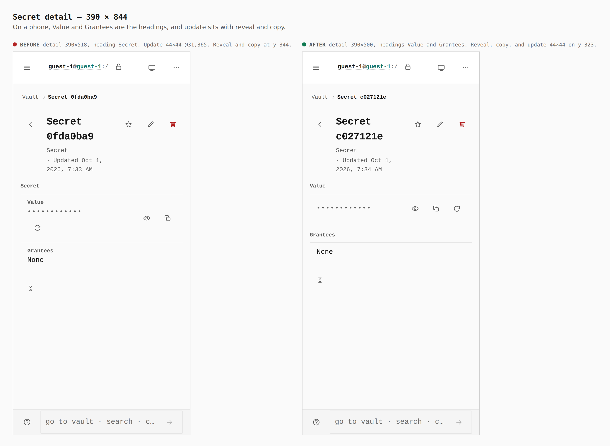
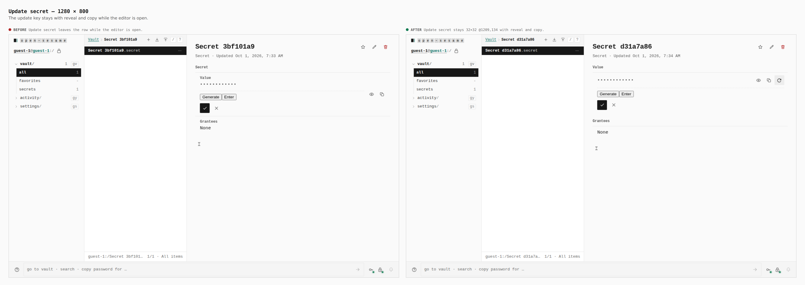
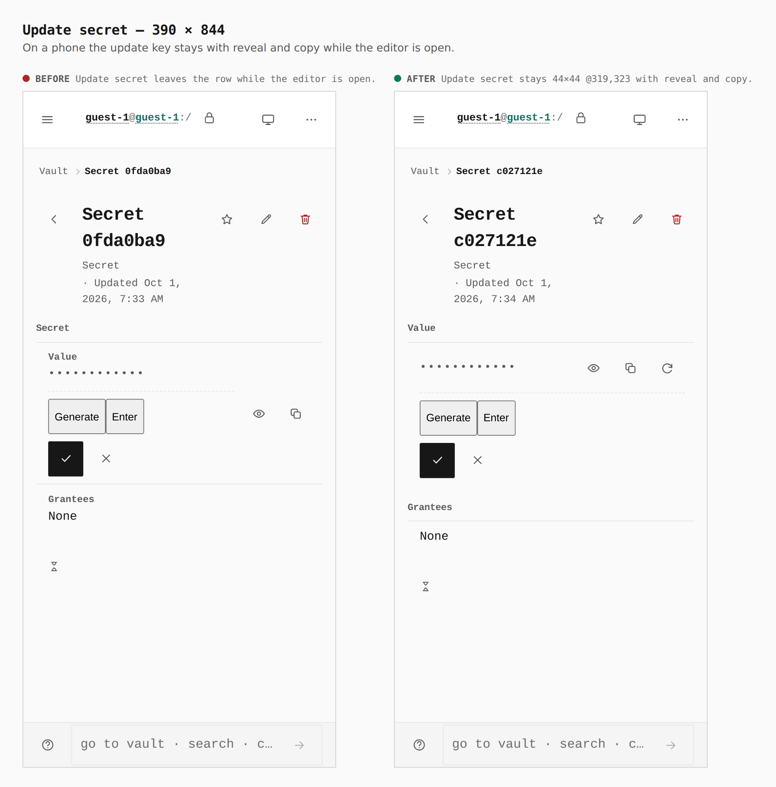

# Secret without the capability ceiling

The capability ceiling leaves the new secret form and the saved secret. The name, the value, and the grantees stay.

The same guest vault, two builds.

## New secret, desktop, 1280 × 800

Before: form 640×277, capability ceiling 144×41. After: form 640×206, no capability ceiling.

## New secret, phone, 390 × 844

Before: form 358×364, capability ceiling 358×49. After: form 358×286, no capability ceiling.

## Secret detail, desktop, 1280 × 800

Before: detail 696×497, headings Secret and Capability ceiling. After: detail 696×387, heading Secret.

## Secret detail, phone, 390 × 844

Before: detail 390×628, headings Secret and Capability ceiling. After: detail 390×518, heading Secret.

## Secret detail headings, desktop, 1280 × 800

Before: detail 696×387, heading Secret. Update 32×32 @627,177. Reveal and copy at y 156. After: detail 696×369, headings Value and Grantees. Reveal, copy, and update 32×32 on y 134.

## Secret detail headings, phone, 390 × 844

Before: detail 390×518, heading Secret. Update 44×44 @31,365. Reveal and copy at y 344. After: detail 390×500, headings Value and Grantees. Reveal, copy, and update 44×44 on y 323.

## Update open, desktop, 1280 × 800

Before: Update secret leaves the row while the editor is open. After: Update secret stays 32×32 @1209,134 with reveal and copy.

## Update open, phone, 390 × 844

Before: Update secret leaves the row while the editor is open. After: Update secret stays 44×44 @319,323 with reveal and copy.

