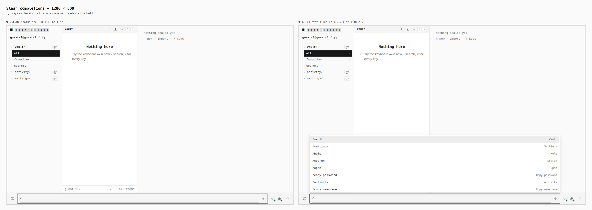
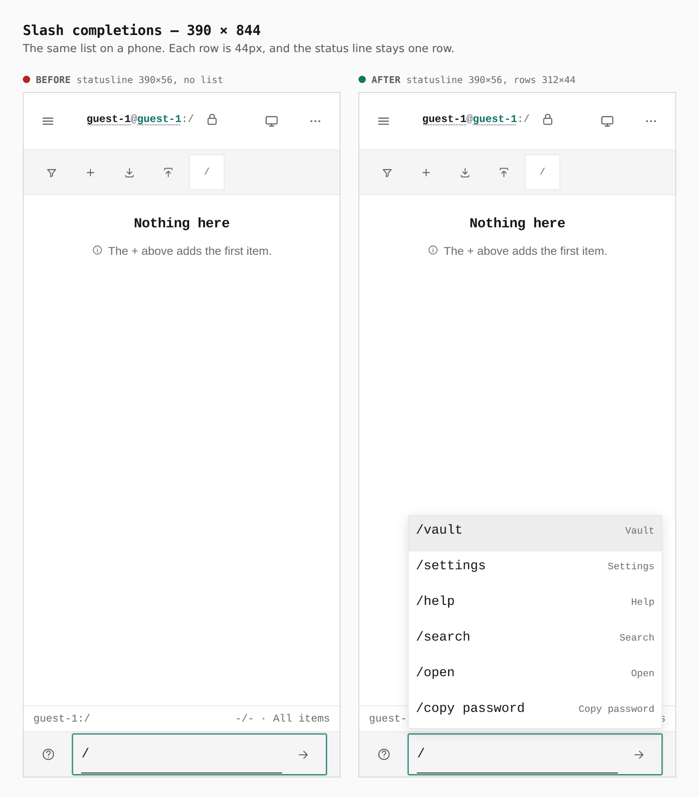

# Slash completions in the status line

Typing `/` in the status-line command field lists the commands that field can run. Arrow keys move through the list. Enter accepts the highlighted row. Escape closes it.

The same guest vault, the same `/`, two builds.

## Desktop, 1280 × 800

Status line stays one row. The list floats above the field.

Before: statusline 1280×53, no list. After: statusline 1280×53, list 1118×256.

## Phone, 390 × 844

Each completion is 44px tall. The status line stays one row.

Before: statusline 390×56, no list. After: statusline 390×56, rows 312×44.

