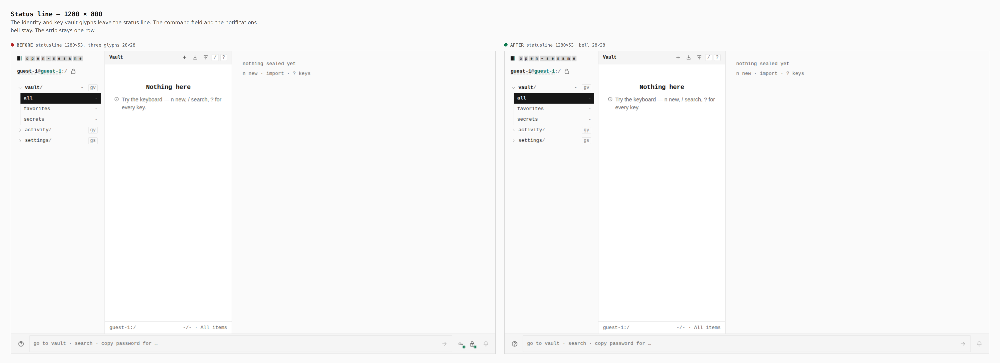
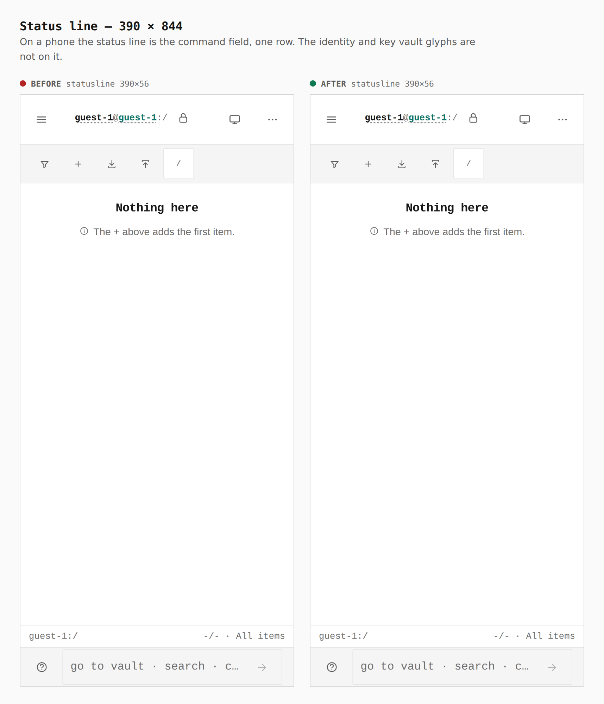

# Status line without the identity and key vault glyphs

The identity glyph and the key vault glyph leave the status line. The command field and the notifications bell stay. The strip stays one row.

The same guest vault, two builds.

## Desktop, 1280 × 800

Before: statusline 1280×53, three glyphs 28×28. After: statusline 1280×53, bell 28×28.

## Phone, 390 × 844

The status line is the command field. Those glyphs are not on it.

Before: statusline 390×56. After: statusline 390×56.

