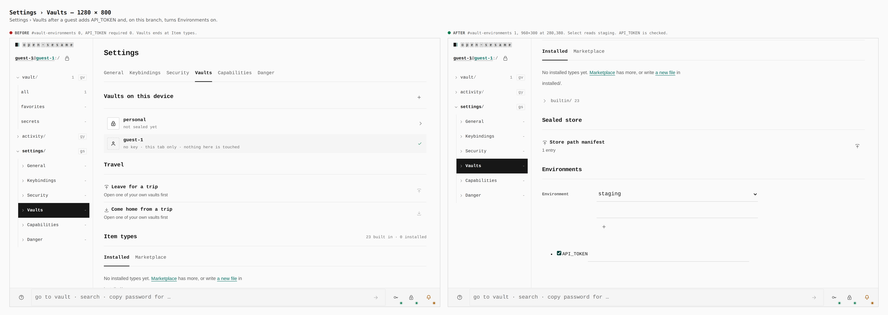
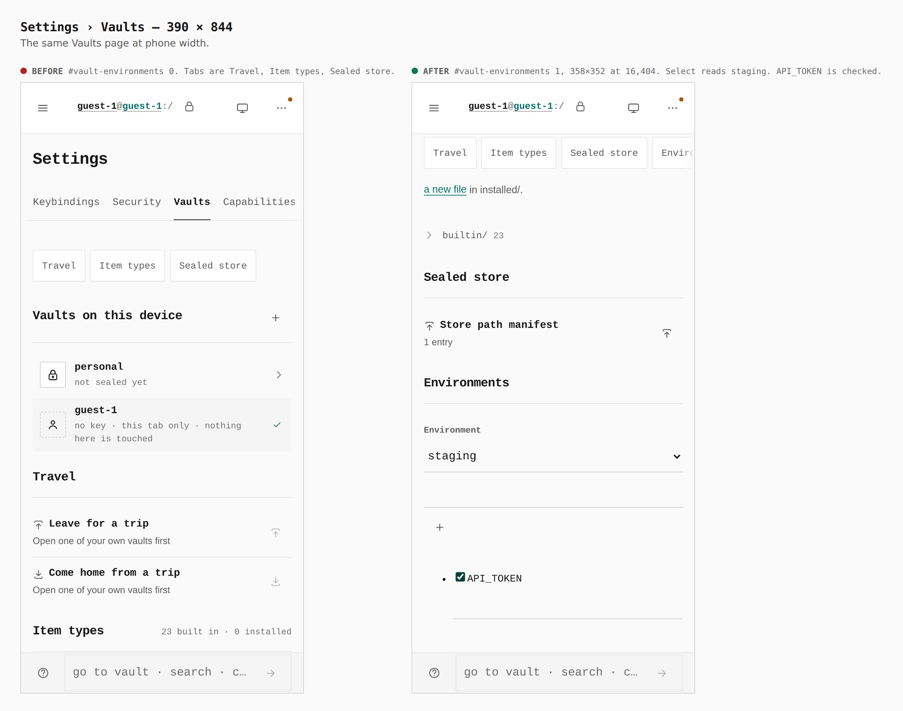
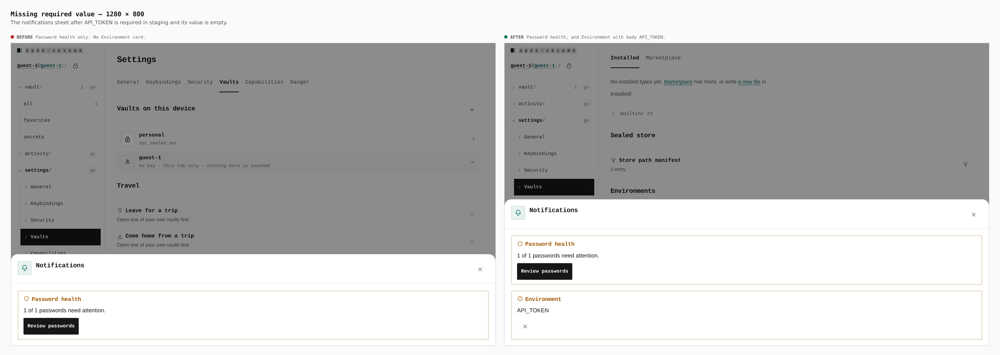

# Vault environments

Before/after from two real builds — `main` (`6edbd801`) and this branch — same
journey (`journey.json`): continue as guest, add an item named `API_TOKEN`,
turn Environments on when that switch exists, open Settings › Vaults, add
`staging`, mark `API_TOKEN` required, then open Notifications. Counts and
boxes were read from the browser.

## Settings › Vaults at desktop width

`#vault-environments 0, API_TOKEN required 0. Vaults ends at Item types.` →
`#vault-environments 1, 960×300 at 280,380. Select reads staging. API_TOKEN is checked.`

## Settings › Vaults at phone width

`#vault-environments 0. Tabs are Travel, Item types, Sealed store.` →
`#vault-environments 1, 358×352 at 16,404. Select reads staging. API_TOKEN is checked.`

## Missing required value

`Password health only. No Environment card.` →
`Password health, and Environment with body API_TOKEN.`

The phone width keeps the bell in the overflow, so this pair is the desktop sheet.

