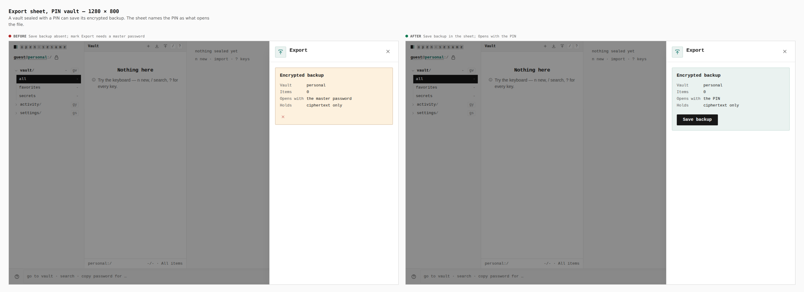
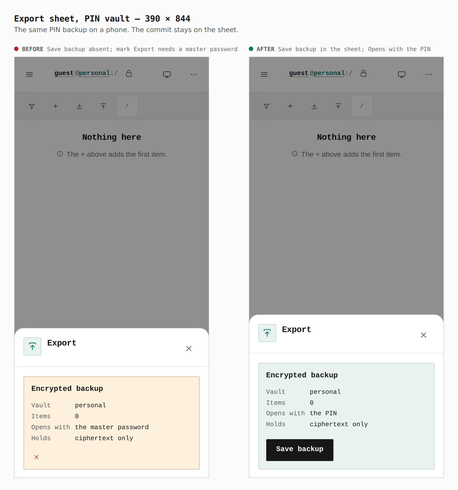

# Vault export for a PIN seal

Before/after for the export sheet on a vault sealed with a PIN.

Every pair is the same screen from two real builds — `main` at `fa0dde40` for
the before, this branch for the after — walked the same way. Nothing is staged
or cropped. The walk is in [`journey.json`](journey.json).

The sheet is the measurement. On both widths the before dialog reads
`Opens with the master password` and its error mark is
`Export needs a master password`; `Save backup` is absent. The after dialog
reads `Opens with the PIN` and its text includes `Save backup`. The vault is
empty in both walks (`Items 0`); the button is what changed.

## Export sheet, PIN vault — 1280 × 800

**`Opens with the master password`, mark `Export needs a master password`, Save backup absent → `Opens with the PIN`, Save backup in the sheet**

## Export sheet, PIN vault — 390 × 844

**`Opens with the master password`, mark `Export needs a master password`, Save backup absent → `Opens with the PIN`, Save backup in the sheet**

