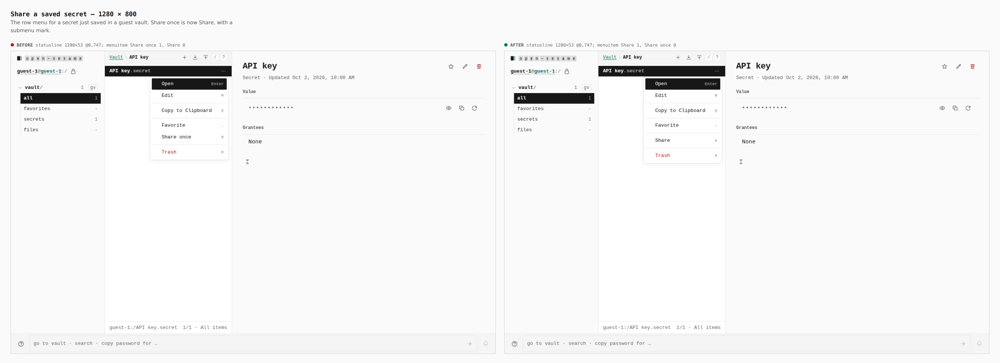
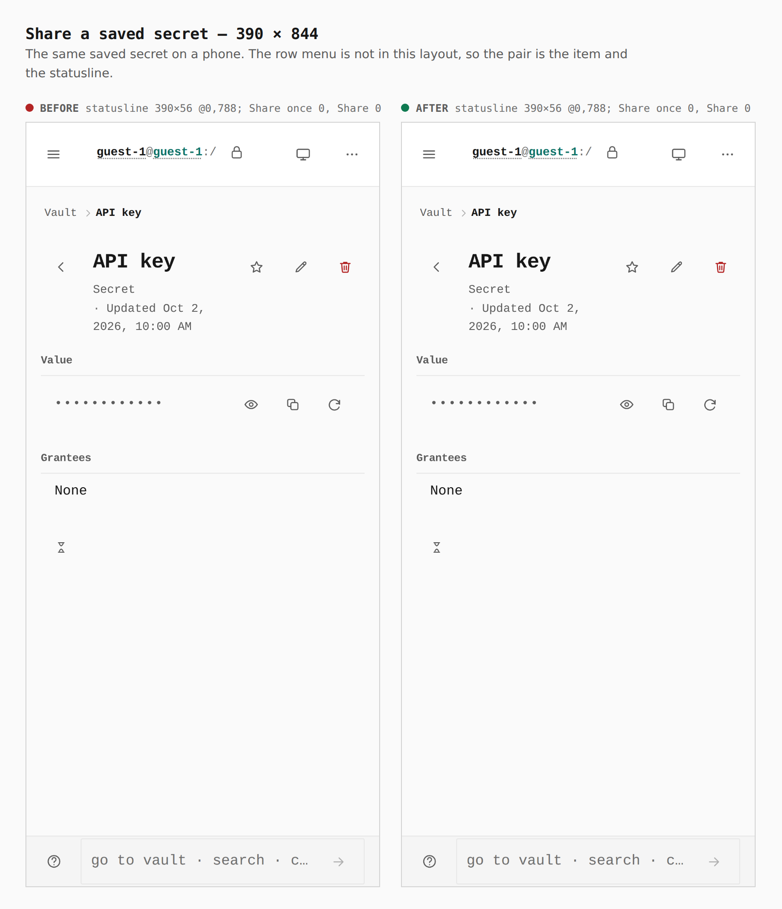
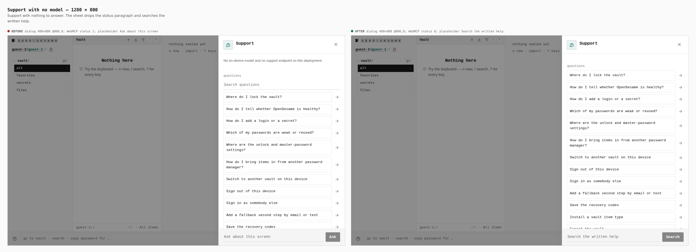
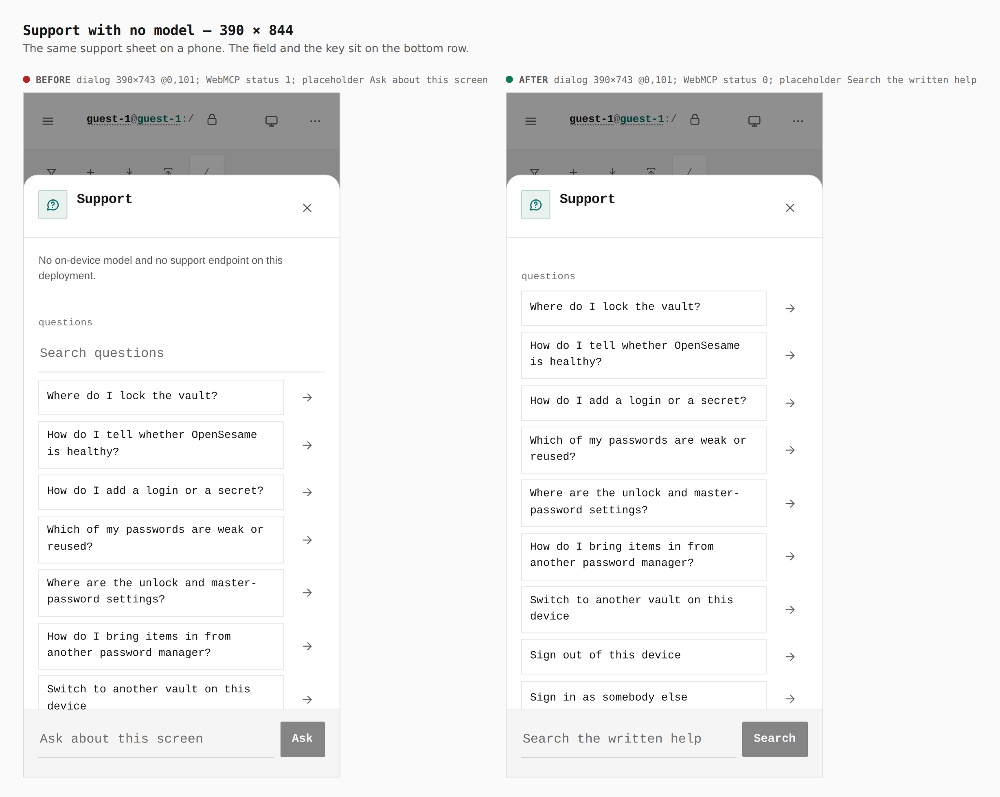
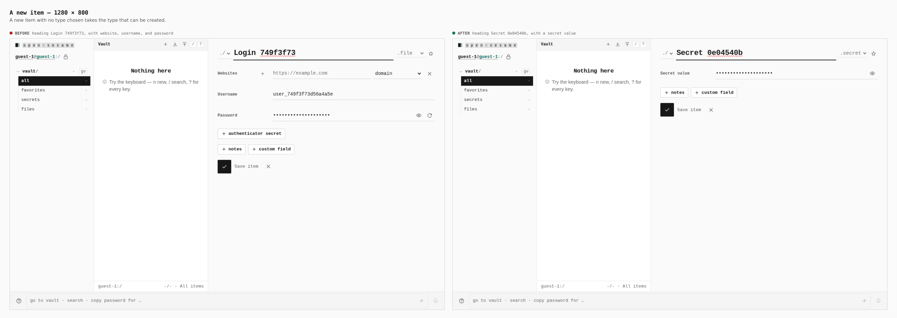
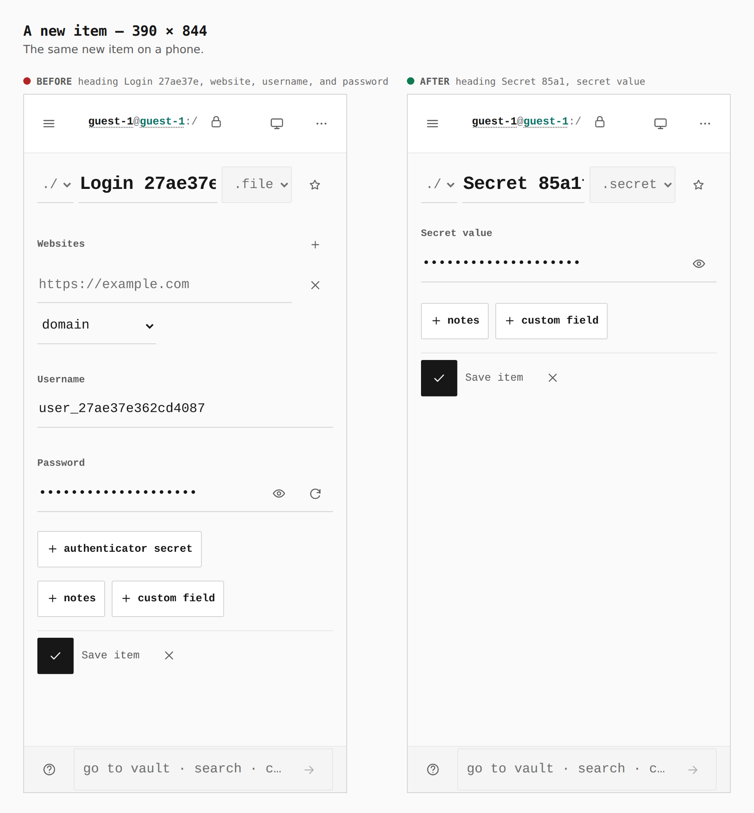

# Vault share, support, and a new item

Before and after from two production builds of Pages. The base is `20b7ffc73b7ba01faee8cdcb4f209796e6fa9723`. The branch build is the tree that contains this gallery. Same guest, same steps, phone and desktop.

## Share a saved secret — 1280 × 800

The row menu for a secret named API key.

- Before: statusline 1280×53 @0,747. One menuitem named Share once. None named Share.
- After: statusline 1280×53 @0,747. One menuitem named Share, with a submenu mark. None named Share once.

## Share a saved secret — 390 × 844

The actions key is not in this phone layout, so the menu counts are zero on both sides. The statusline stays one row.

- Before: statusline 390×56 @0,788.
- After: statusline 390×56 @0,788.

## Support with no model — 1280 × 800

- Before: dialog 480×800 @800,0. One WebMCP status paragraph. The field placeholder is Ask about this screen.
- After: dialog 480×800 @800,0. No WebMCP status. The field placeholder is Search the written help, and the key says Search.

## Support with no model — 390 × 844

- Before: dialog 390×743 @0,101. One WebMCP status paragraph. Placeholder Ask about this screen.
- After: dialog 390×743 @0,101. No WebMCP status. Placeholder Search the written help.

## A new item — 1280 × 800

`/vault/new` with no type chosen.

- Before: heading Login 749f3f73, with website, username, and password.
- After: heading Secret 0e04540b, with a secret value.

## A new item — 390 × 844

- Before: heading Login 27ae37e, with website, username, and password.
- After: heading Secret 85a1, with a secret value.
