# Connector pages: no Host road, and no tile that links to a page nothing routes (ADR 0151)

Before/after from two real builds of `apps/pages`: the base (`f54a95f3`, the
tip of `origin/main`) and this branch, walked the same way by
`apps/pages/scripts/capture-evidence.mjs` with [`journey.json`](journey.json),
both built `VITE_BASE=/OpenSesame/` and served under the production origin.
Counts are read from the browser by the journey's `count` and `report` steps.
Guest walks start at the front door's Skip; the Connections, Access and
unlocked-vault walks seal a password vault, switch the section on in Settings ›
Capabilities, reload and unlock.

## Ground truth: what each connector can do in a static build

Walked with Playwright against the real app (guest and unlocked vault, 1280 and
390 wide), opening every tile's page with Connections on and saving the form.

| Road | Connectors | Completes end to end? |
|---|---|---|
| **local**: configuration sealed on this device | 27 (Better Auth, password-store, 1Password, Bitwarden, Vaultwarden, Infisical, Proton Pass, Passwordstate, AWS Parameter Store / Secrets Manager, Azure App Configuration / Key Vault Secrets, Google Cloud Secret Manager, FOKS, Bitwarden Secrets Manager, Vault, OpenBao, Encrypted Remote Store, OS Keychain, KeePass, the four wallets, Azure OpenAI, Amazon Bedrock, Tailscale) | Yes: Save configuration makes a device connector and its card |
| **local**: API key sealed on this device | 9 (Anthropic, OpenAI, OpenRouter, Hugging Face, Doppler, Privacy.com, Lithic, Marqeta, Stripe Issuing) | Yes: Connect makes a device connector; the key is not in the page |
| **local**: git remote | 5 (Git, GitLab, Bitbucket, Codeberg, Cursor Origin) | Yes: remote and token sealed on the device |
| **local**: GitHub App registered from the browser | 1 (GitHub) | Yes up to GitHub's own redirect (needs network) |
| **local**: sealed in an unlocked vault | 2 (AWS KMS, Google Cloud KMS) | Yes for an unlocked vault; the tiles are absent for a guest |
| **connect**: Vercel Connect | WorkOS, Auth0 (this road only), plus the key and forge pages above | Credential seals on this device; creating and authorizing a connector needs the Vercel API |
| **Host** | none | **No** — `hostRoadOpen` was false in every build |

The road set is the same before and after (the Host road never opened); what
the branch changes is what *pointed at* those roads and what pointed at nothing:

- With **Connections off** (the default; a guest can switch it on) all 43 linked
  tiles opened a blank page.
- The **Custom connector** key on the catalog opened "Connector not found".
- **Access › Connectors › Add** offered *New connector*, a link into the section
  that is not there while Connections is off.
- The unlocked vault's **Encryption** tiles (AWS KMS, Google Cloud KMS) opened a
  blank page the same way.
- A saved connector with no declared address POSTed to
  `https://connectors.invalid/…` with its credential on the headers, on every
  connections listing; and awaiting a Connect authorization threw on
  `new URL("")` when no Host was named.

## Decision

ADR 0151 (second and third amendments) records it. In short: a verified sync
pairing can carry `host.connections.write` on the Host (`ceiling.rs`), but Pages
starts no such pairing, and ADR 0128 / 0090 forbid putting a Host ceremony in
front of connector configuration. So the road is deleted — `hostRoadOpen`,
`host-grant.ts`, the grant announcements, and `connections.ts`'s Host transport
with the forms only it could take (OAuth client, personal access token, Custom
connector) — rather than left as code, tiles, tests and ADR text for a road
nothing can open.

## Measurements

| Walk | Width | Before | After |
|---|---|---|---|
| Capabilities, Connections off (guest) | both | 57 tiles, 43 links, 21 switches; 13 grids; 20 sections | 21 tiles, 0 links, 21 switches; 6 grids; 17 sections |
| Open the GitLab tile (guest, off) | both | `.conn-settings` 0, h1 0, h2 0: a blank page | not a link; Settings stays (h1 1, h2 1) |
| Capabilities, Connections on (control) | both | 60 tiles, 46 links, 21 switches; 14 grids; 23 sections | identical |
| Better Auth page, Connections on (control) | both | `.conn-settings` 1, form 1, form key 1 | identical |
| Catalog: Custom connector links | both | 1 (opens h1 "Connector not found") | 0 (page stays "Connections") |
| Access › Add, Connections off: links in the choices | both | 1 (*New connector*) | 0 |
| Unlocked vault, Connections off | both | 59 tiles, 45 links, 2 Encryption tiles; 23 sections | 21 tiles, 0 links, 0 Encryption tiles; 19 sections |
| Unlocked vault, Connections on (control) | both | 60 tiles, 46 links, 2 Encryption tiles; 23 sections | identical |

Gates run on this branch: `verify:static` (0 loopback requests, 0 page errors,
0 console errors), `verify:mobile` (the touch contract at 320, 390, 430, 844,
1024, 1366 px) and `verify:keyboard` all pass against the branch build.

## Tiles with Connections off

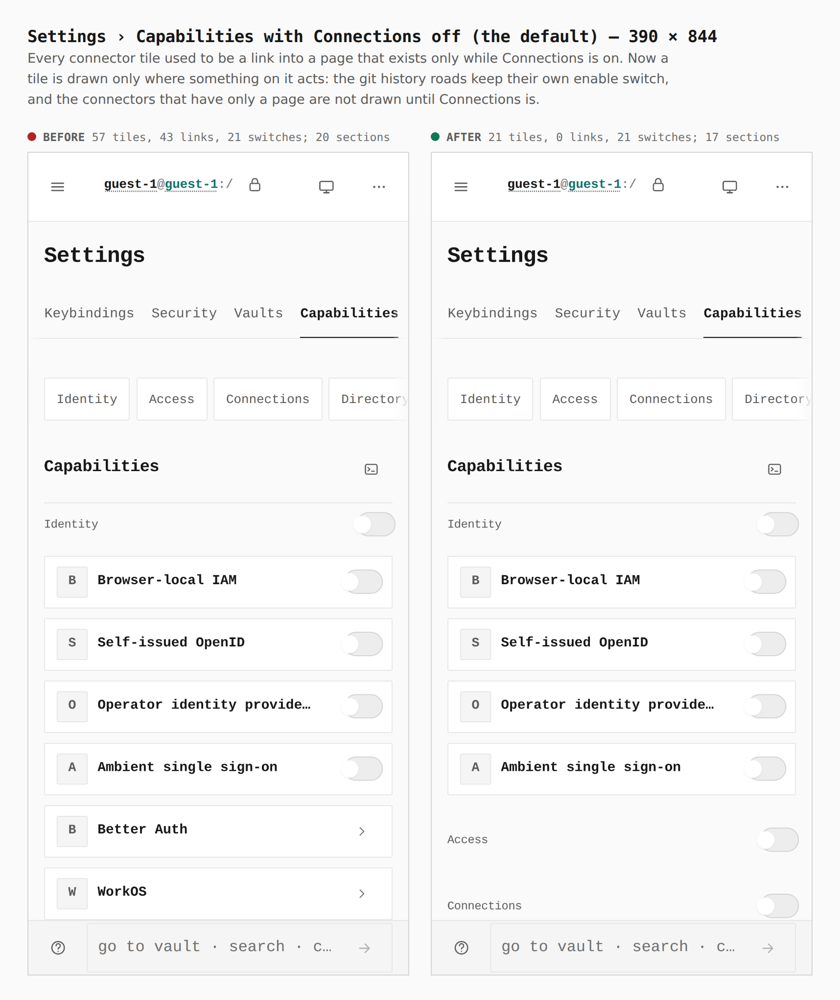
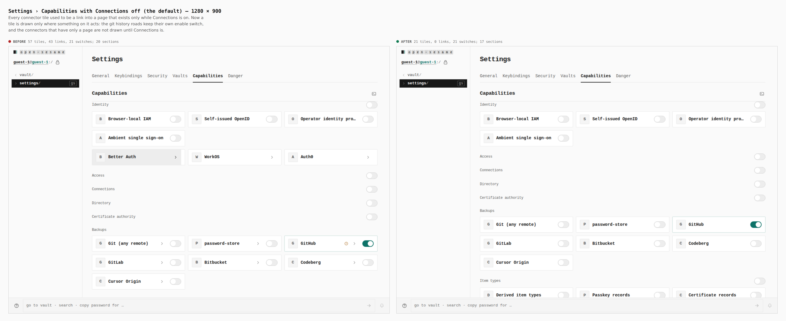

## Opening a tile with Connections off

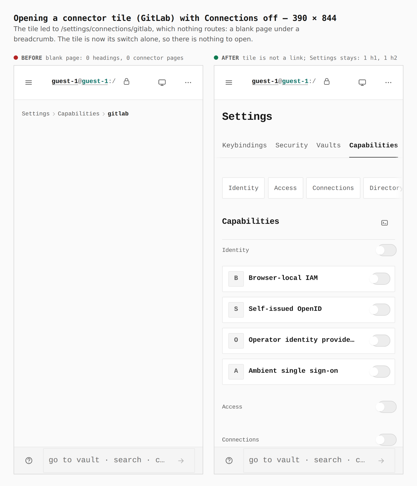
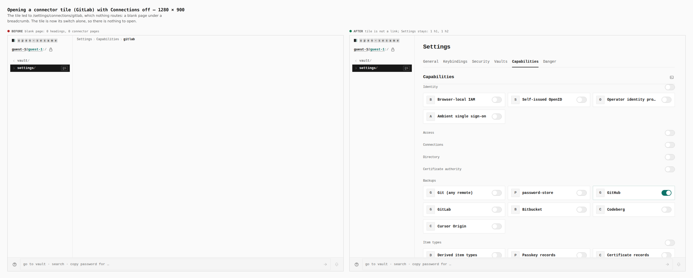

## Tiles with Connections on (control)

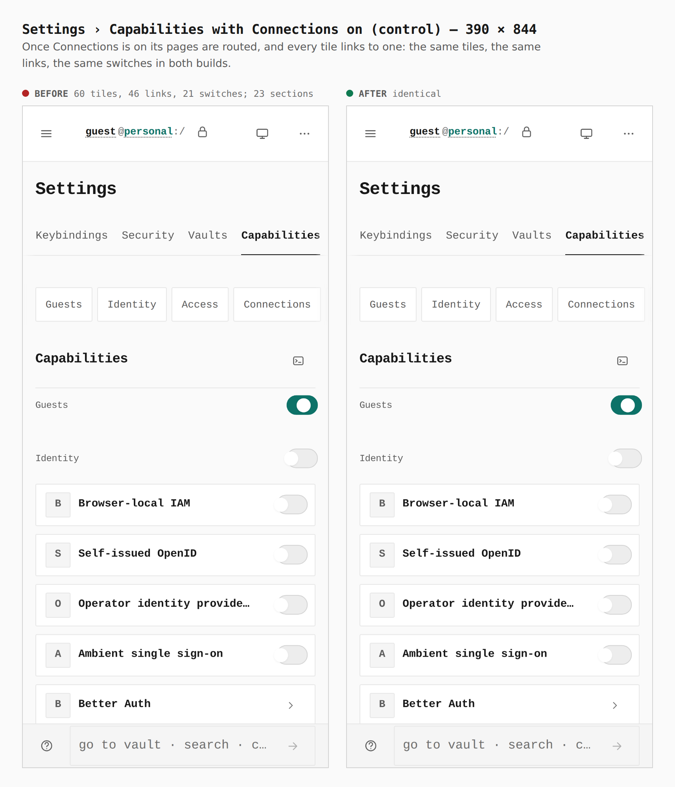
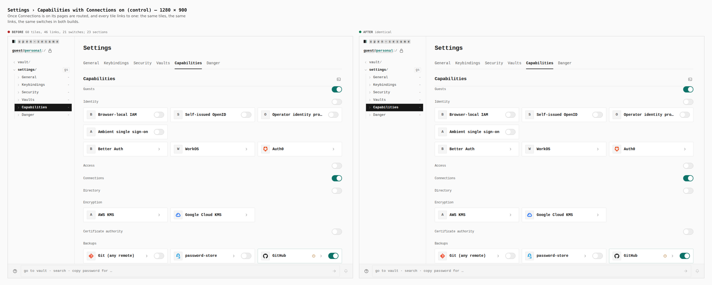

## The Custom connector key

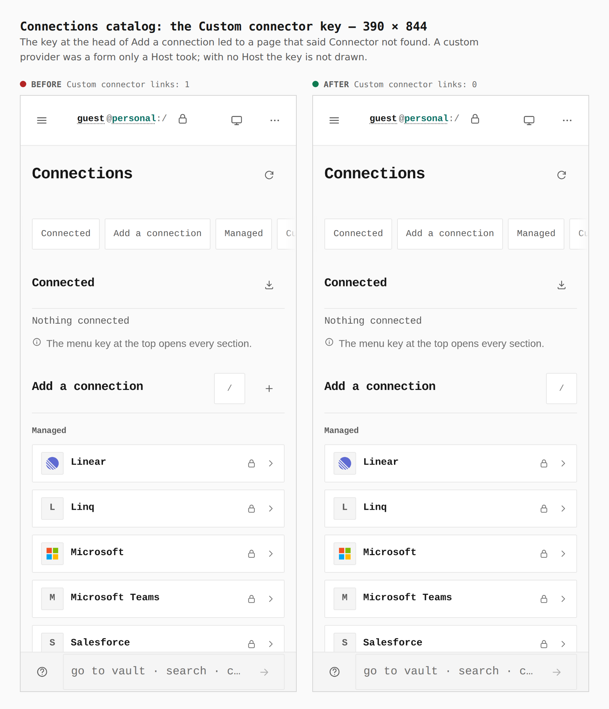
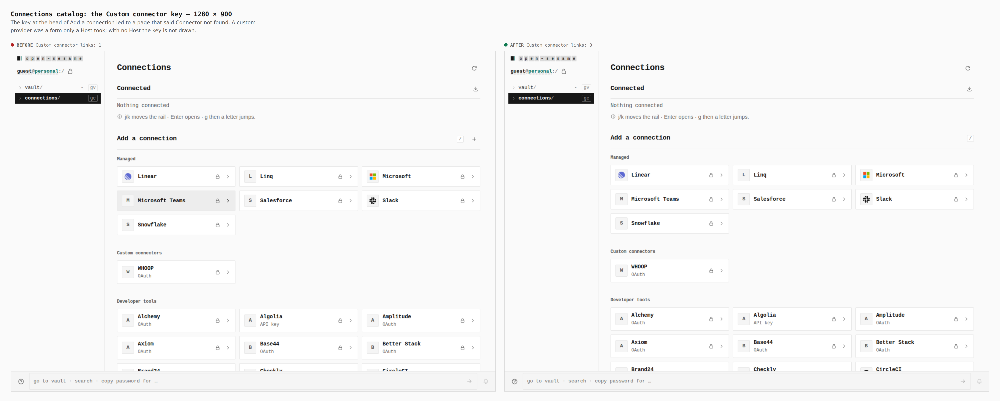

## Access › Connectors › Add

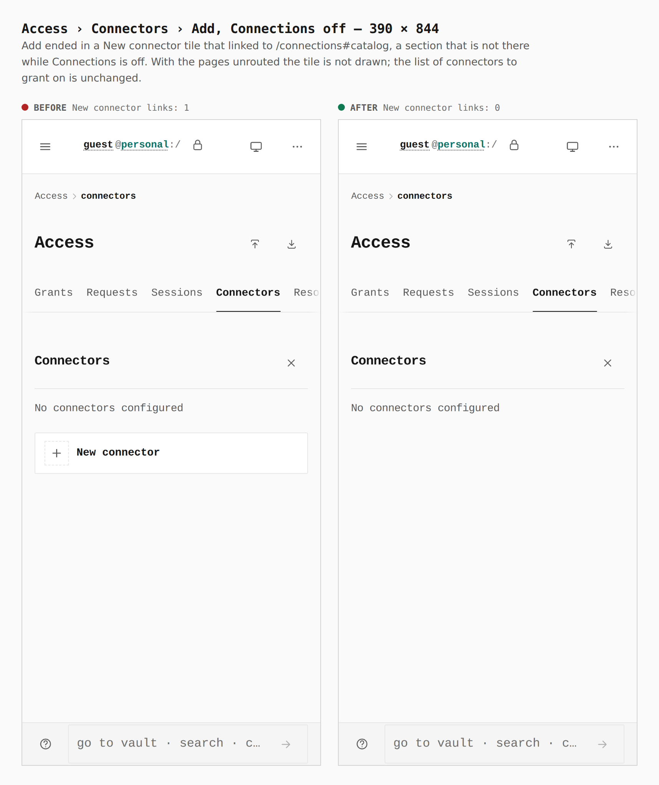
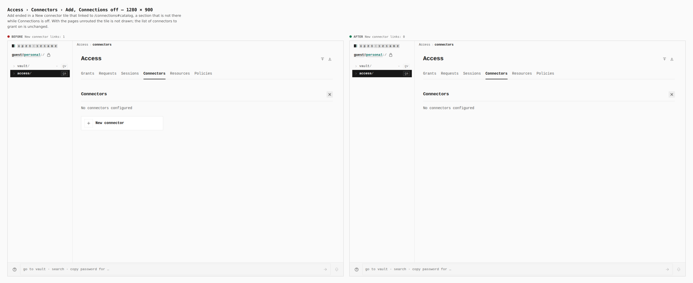

## An unlocked vault with Connections off

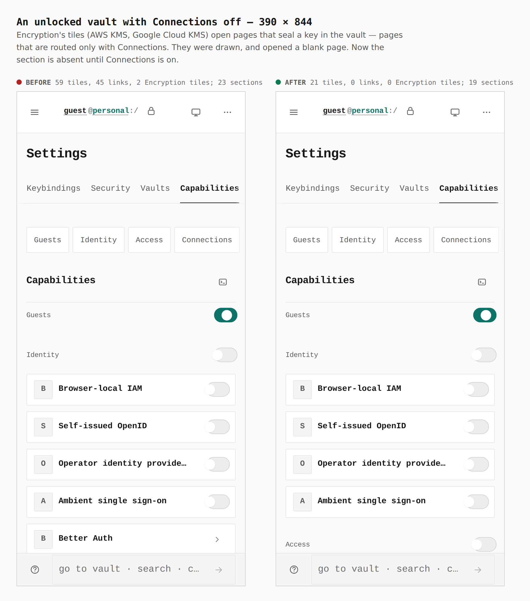
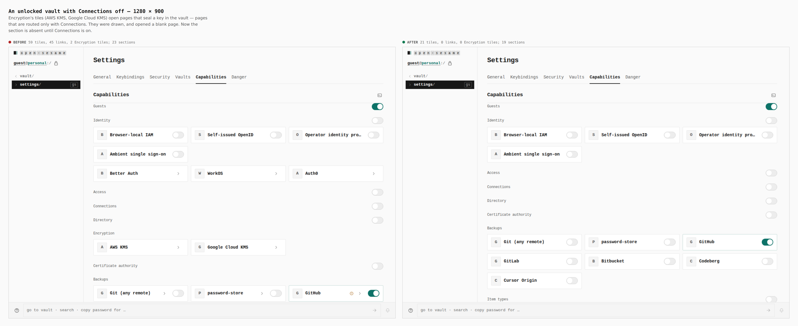
