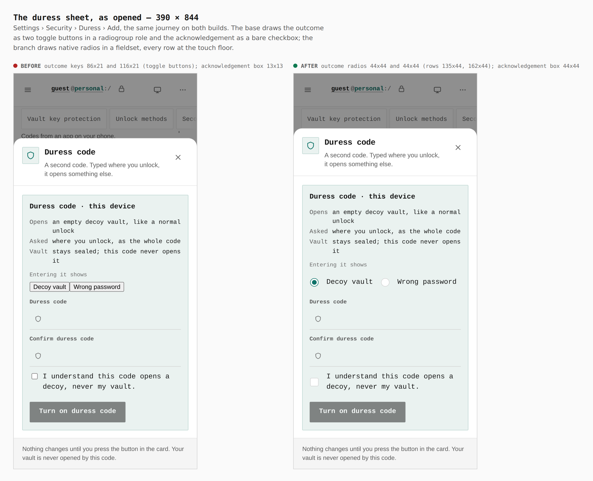
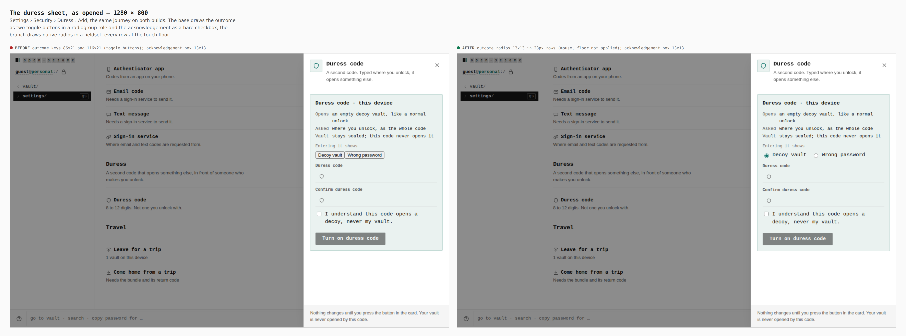
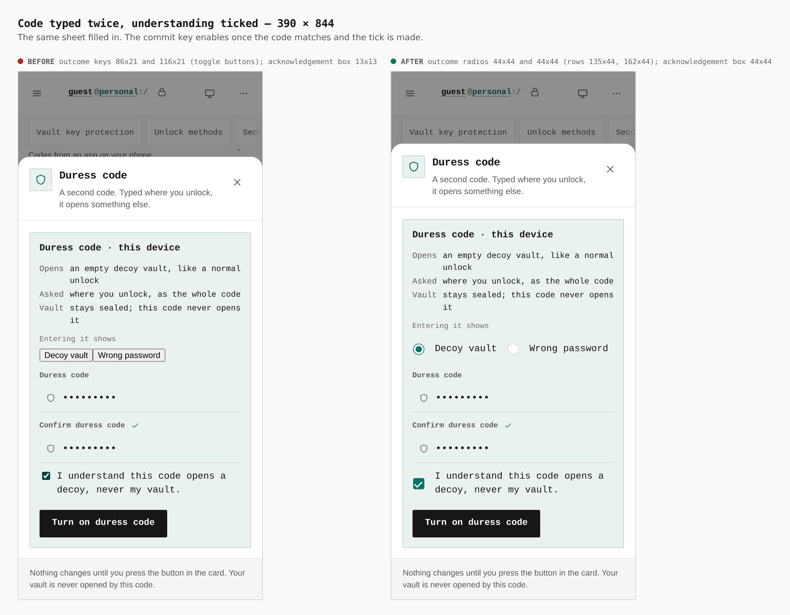
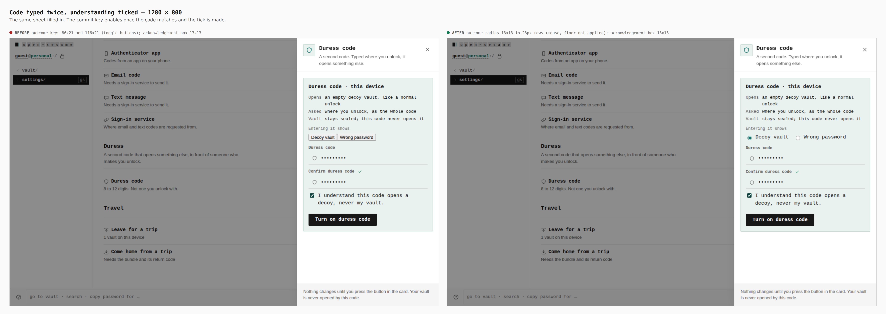

# Duress sheet hardening — visual evidence

Change: the duress code sheet (Settings › Security › Duress › Add) draws its
outcome choice as native radios in a fieldset and meets the 44px touch floor;
it also holds its close key while a write is in flight and takes back the
acknowledgement when the outcome changes.

Two real builds, walked the same way by `apps/pages/scripts/capture-evidence.mjs`
with [`journey.json`](journey.json):

- **before**: `origin/main` at `41679e13` (`apps/pages/src` and `packages/app-core/src` reverted to it)
- **after**: branch `claude/duress-sheet-hardening`

A password vault is sealed on an empty device, `settings/security` is opened,
Add is pressed on the Duress row, and the sheet is captured as opened and again
with the code typed twice and the acknowledgement ticked.

## As opened — 390 × 844 and 1280 × 800

Measured in the browser, not read from the CSS:

| | before | after |
|---|---|---|
| 390 outcome | keys 86×21, 116×21 | radios 44×44, 44×44 (rows 135×44, 162×44) |
| 390 acknowledgement | box 13×13 (row 322×45) | box 44×44 |
| 1280 outcome | keys 86×21, 116×21 | radios 13×13 in 23px rows |
| 1280 acknowledgement | box 13×13 | box 13×13 |

The 44px floor is the touch rule (`(pointer: coarse)` or width ≤ 900px), so the
desktop pair changes in shape (buttons in a radiogroup role → real radios), not
in size.

## Filled in

The same sheet with the code typed twice and the tick made.

## What these pictures do not show

Two behaviours cannot be shown by a still, and are covered by tests in
`DuressPanel.test.tsx` that fail against the old code: the close key, Escape and
the scrim are held while an arming write is in flight, and the acknowledgement is
taken back when the outcome changes or the sheet reopens.
