# Live sessions: the feature and the stack that followed it (ADR 0150)

Before/after from real builds of the production origin
(`https://tyler-r-kendrick.github.io/OpenSesame/`), each served out of its own
`dist/` and walked with the same steps at phone (390 wide) and desktop (1280 ×
900). Every number below was printed from the browser by
`capture-evidence.mjs` (`count`, `measure`, `report`, `marks`, `focused`,
`address`, `liveAsk`, `liveCatalog`), never read from the diff. A status mark is
a glyph by design, so its words are the accessible name the page gave it.

Two journeys, two bases, one AFTER (`f52d2952`, the tip of the six-PR stack):

| part | journey | BEFORE | what it answers |
|---|---|---|---|
| 1 | [`journey.json`](journey.json) | `cd1ede72`, the base #558 merged onto (`git rev-parse f55f50e7^`): no live sessions at all | what the whole feature is, against nothing |
| 2 | [`journey-vs-main.json`](journey-vs-main.json) | `f933226f`, main at the stack's base | what the stack's own pull requests changed |

How the builds were made: the AFTER build is this tree built with
`VITE_BASE=/OpenSesame/ pnpm exec turbo run build --filter=@opensesame/pages`.
Each BEFORE build is `git archive <sha>` extracted into its own directory (the
whole tree, so no package is newer than the base), installed with
`--frozen-lockfile` and built the same way; the capture ran from this tree's
harness with `EVIDENCE_DIST` pointing at that directory. No checkout was
swapped. The AFTER and `f933226f` builds print nine capability-graph errors
(`MIXED_CAPABILITY_CHUNK`, including `identity.local-iam`); they are main's own
and the build succeeds. The `cd1ede72` build prints none.

## Part 1: the feature against the real base of #558

Where the base has nothing, **absent is the measurement** and the number is
stated.

### 1.1 The front door on a fresh device

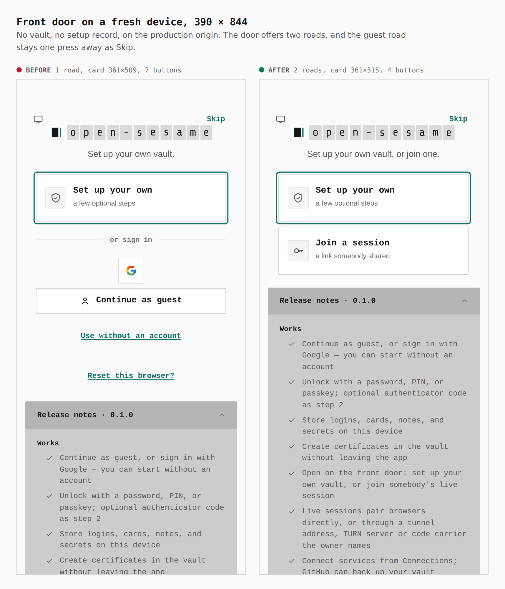
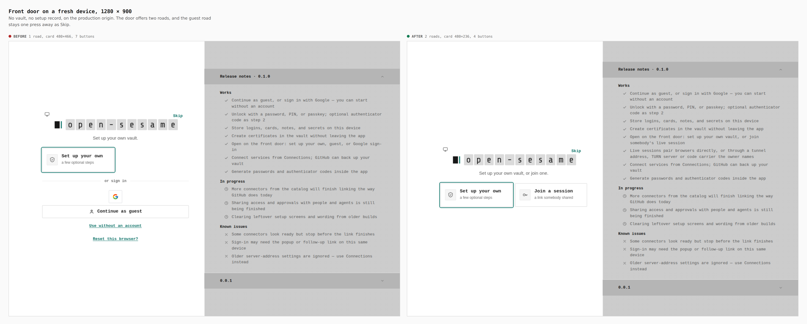

| | before (`cd1ede72`) | after |
|---|---|---|
| roads (`.road`), 390 | 1 (`.door__roads` 324×82) | 2 (324×172) |
| card, 390 | 361×509, 7 buttons, sign-in divider 1 | 361×315, 4 buttons, divider 0 |
| roads, 1280 | 1 (480×77) | 2 (480×77) |
| card, 1280 | 480×466 | 480×236 |
| guest Skip (`aria-label` "Skip sign-in and continue as guest") | 1 | 1 |

The guest road is present on both sides. The roads read "Set up your own" and
"Join a session".

### 1.2 Settings › Live sessions, with Routes

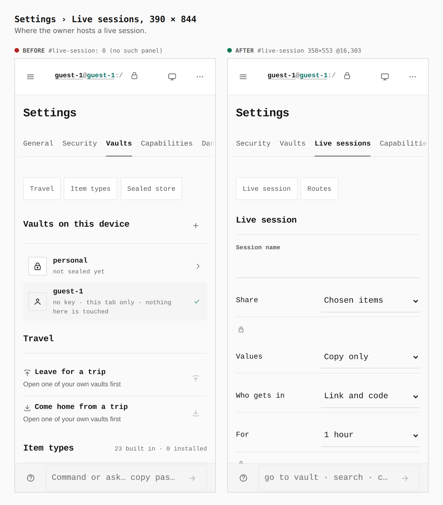
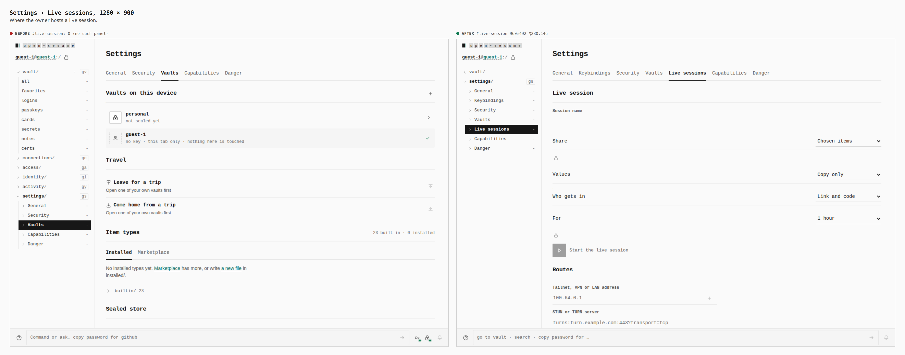
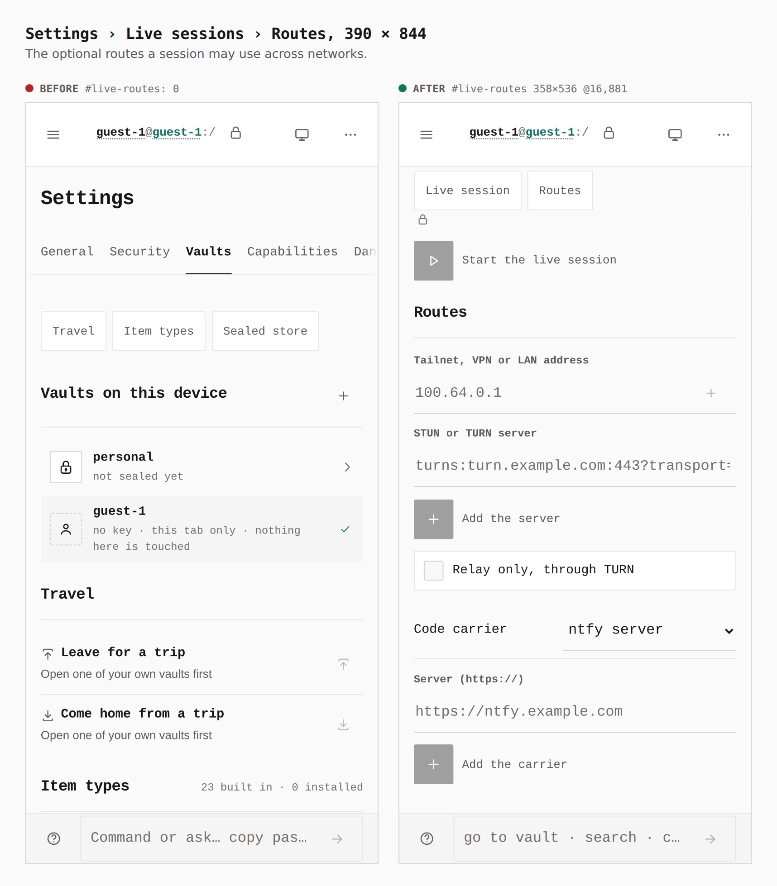
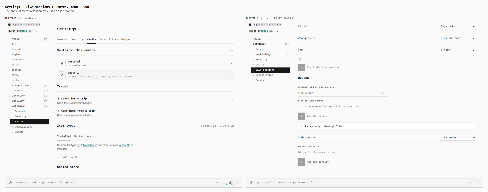

| | before | after |
|---|---|---|
| `#live-session`, 390 | 0 | 358×553 @16,303 |
| `#live-routes`, 390 | 0 | 358×536 @16,881 |
| `#live-session`, 1280 | 0 | 960×492 @280,146 |
| `#live-routes`, 1280 | 0 | 960×489 @280,663 |

### 1.3 A link that names routes: the host list, before any contact

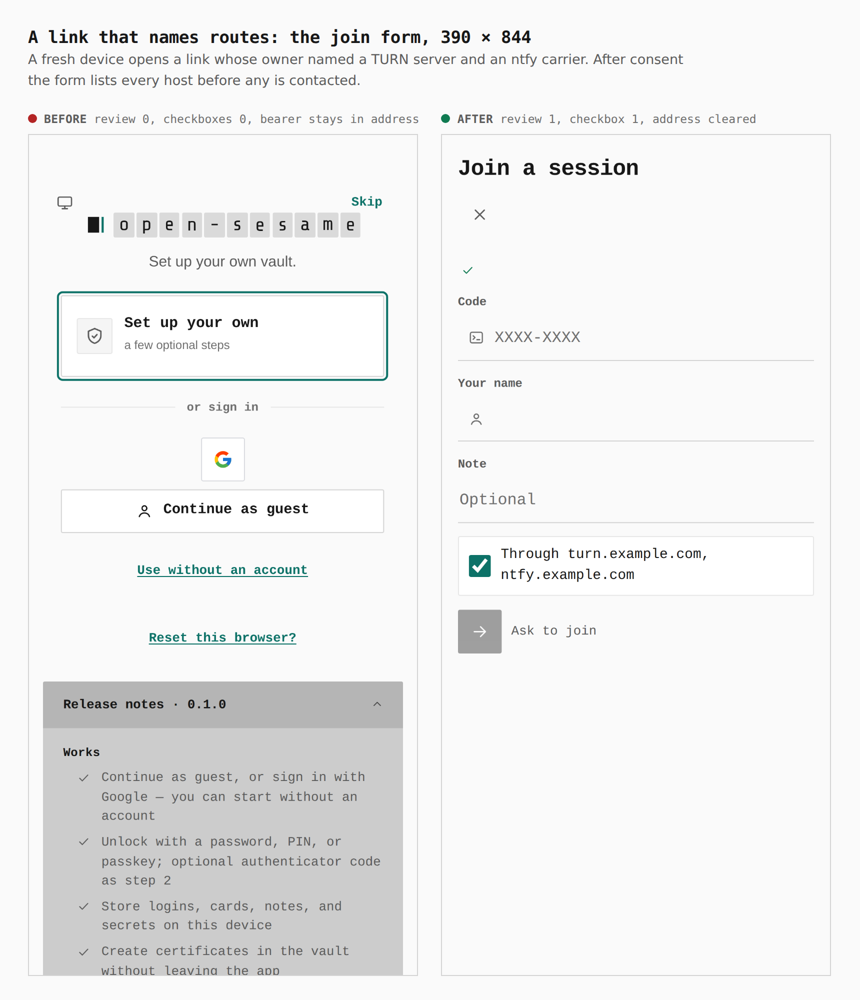
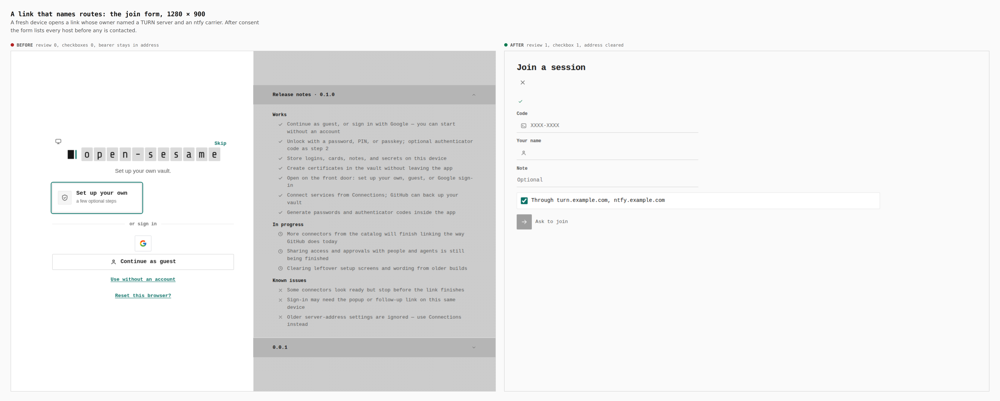

A fresh device opens a link whose owner named a TURN server and an ntfy
carrier. Before: not recognised: `.capreview` 0, checkboxes 0, and the bearer
stays in the address bar (`…/OpenSesame/#live=v1.i.BAEC…`). After: the address
is `…/OpenSesame/`, the consent review opens (1), and after consent one checked
box reads **Through turn.example.com, ntfy.example.com**.

### 1.4 Five wrong codes

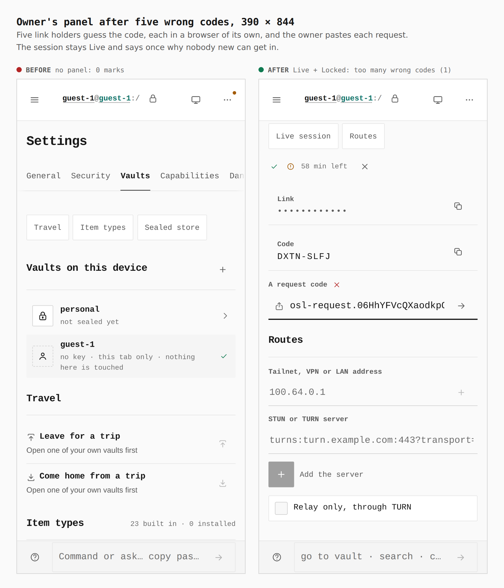
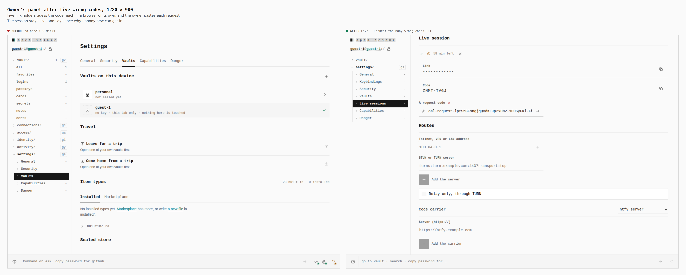

The owner starts an invite session; five link holders, each in a browser of its
own, open the link with a wrong code and the owner pastes each request. The
owner's answers read `Not for this session (1 of 5)` through `(5 of 5)`. Before:
no panel (`#live-session` 0, 0 marks). After, the panel's marks read `Live`,
`Locked: too many wrong codes` and the last answer; `[aria-label=Live]` is
still 1, so a locked session is not an ended one. `.live-status` is 358×44
@16,127 at 390 and 960×32 @280,56 at 1280.

### 1.5 A carrier this installation does not allow

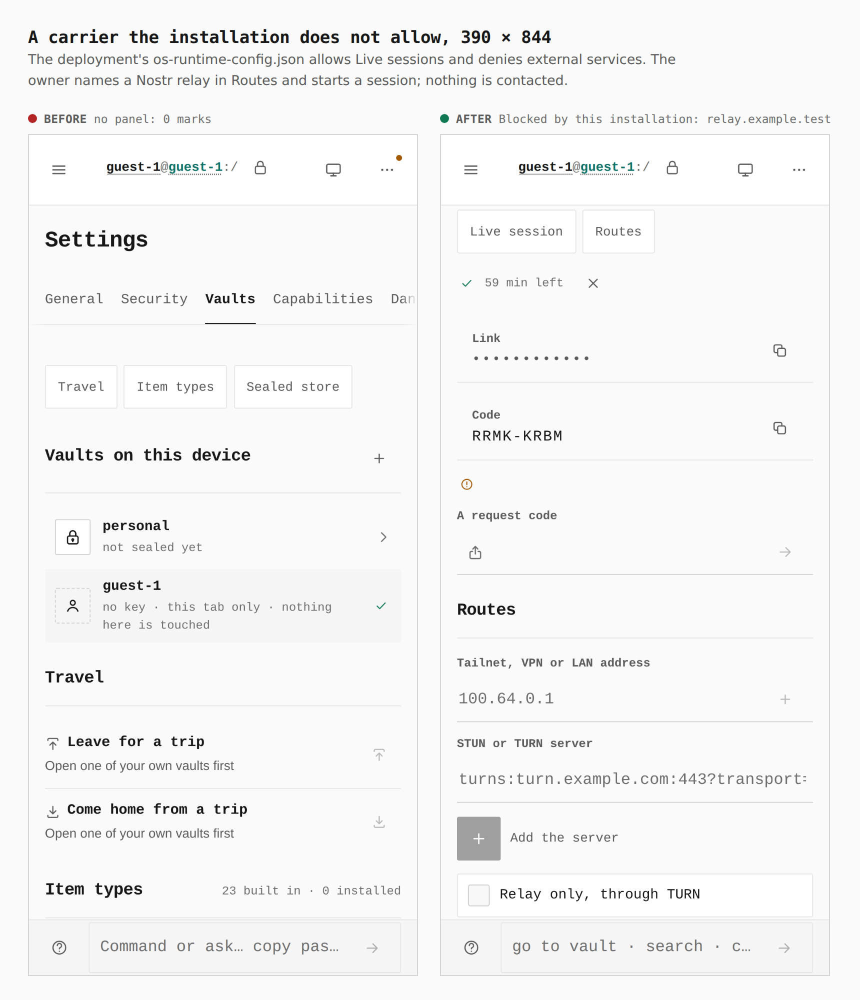
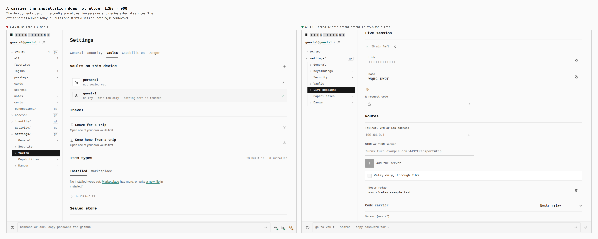

The journey serves this screen a deployment's own `os-runtime-config.json`
(Live sessions optional, `externalServices: "deny"`). The owner names
`wss://relay.example.test` as a Nostr carrier and starts a session. After, the
marks read `Live` and `Blocked by this installation: relay.example.test`;
nothing is contacted. Before: no panel (0 marks).

### 1.6 Keyboard focus after Start

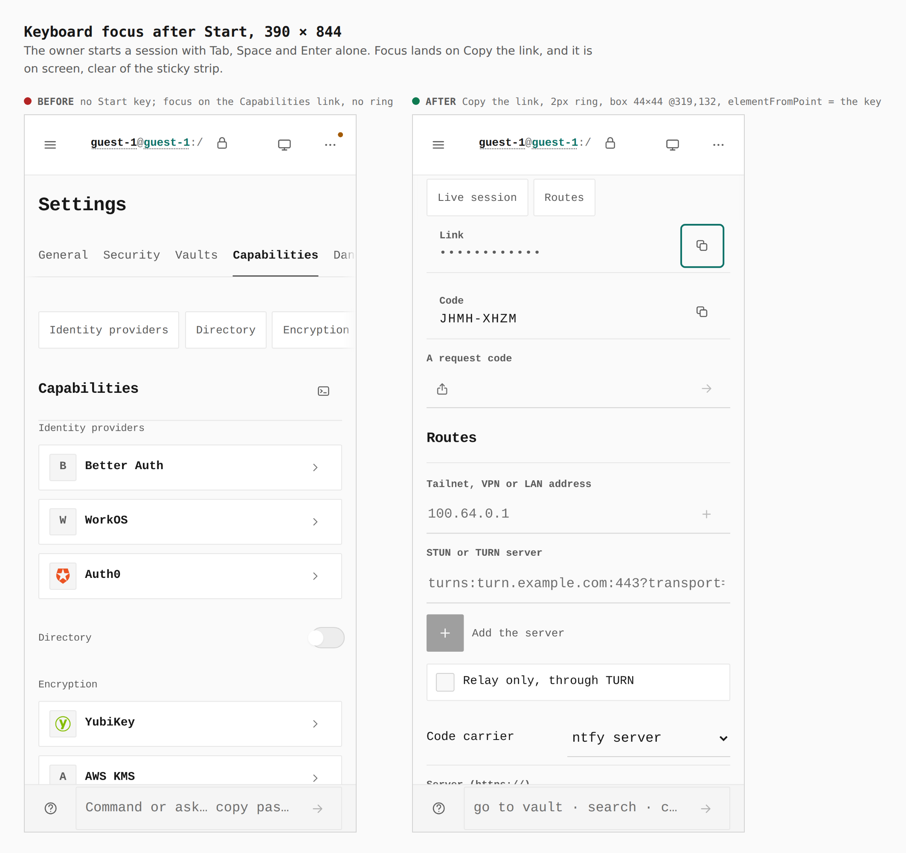
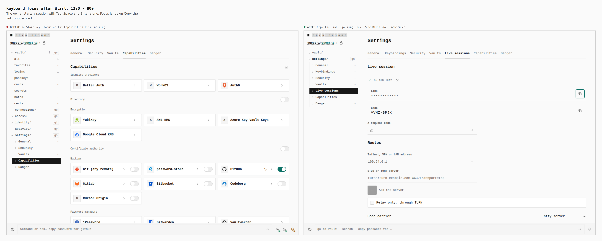

The owner names a session, ticks the login and presses Start with Tab, Space
and Enter alone. Before: there is no Start key, so focus stays on the
`Capabilities` link (`focus-visible=false`, no outline).

After, at 390 × 844: `BUTTON "Copy the link"`, `focus-visible=true`, outline
`solid 2px rgb(13, 114, 104)`, box 44×44 @319,**132**, inside the viewport, and
`elementFromPoint` at its centre is the key's own icon (`svg`, a descendant of
the key): **on screen and unobscured**. At 1280: the same key, 32×32 @1197,262,
unobscured.

The earlier gallery of this feature (`2026-10-03-live-sessions-vs-base` at
`804f8ce4`, taken at `48d18b8f`) recorded the same walk with the key at 44×44
@319,**-2**, under the sticky top bar, with `elementFromPoint` not the key. A
later commit, `f52d2952` (*a landed control is brought clear of the phone's
sticky strip*), fixed it: **-2 → 132**, and this sheet is taken on that build.
Part 2 measures the same fix against main.

## Part 2: what the stack's pull requests changed, against main

BEFORE is `f933226f`, which already has live sessions, so every pair here is a
difference between two builds that both have the panel.

### 2.1 A relay-only link that names no TURN server

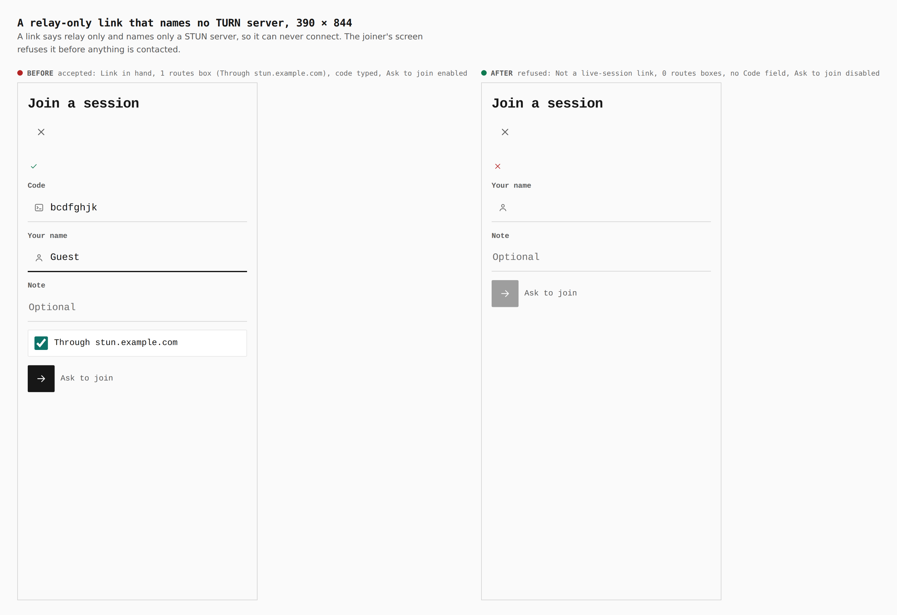
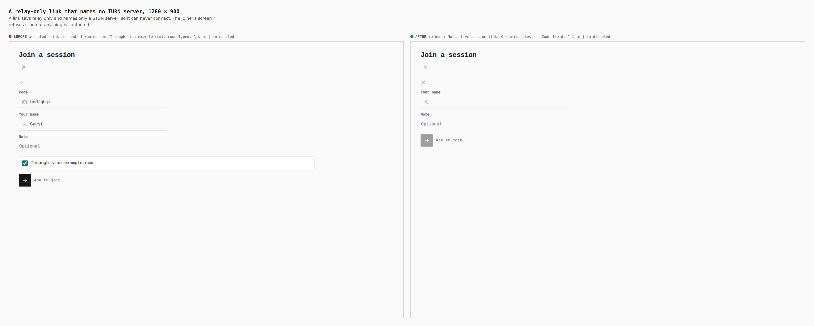

The link says `relay: true` and names only a STUN server, so it can never
connect. The journey opens it, takes the consent review, types the out-of-band
code (`bcdfghjk`) and a name, then reads the screen.

| | before (`f933226f`) | after |
|---|---|---|
| mark | `Link in hand` | `Not a live-session link` |
| routes box (`input[type=checkbox]`) | 1, **Through stun.example.com** | 0 |
| Code field | present, filled | none (the link was refused) |
| Ask to join | enabled (`button:enabled` 1, `:disabled` 0) | disabled (`:disabled` 1, `:enabled` 0) |
| consent review (`.capreview`) | 1 | 1 |

Identical at 390 and 1280. One correction to how this is usually said: before,
Ask to join is disabled until a code is typed, in both builds; the pair above
types one first, so the difference is the link's, not the empty form's.

### 2.2 Keyboard focus after Start, on a 640-high phone

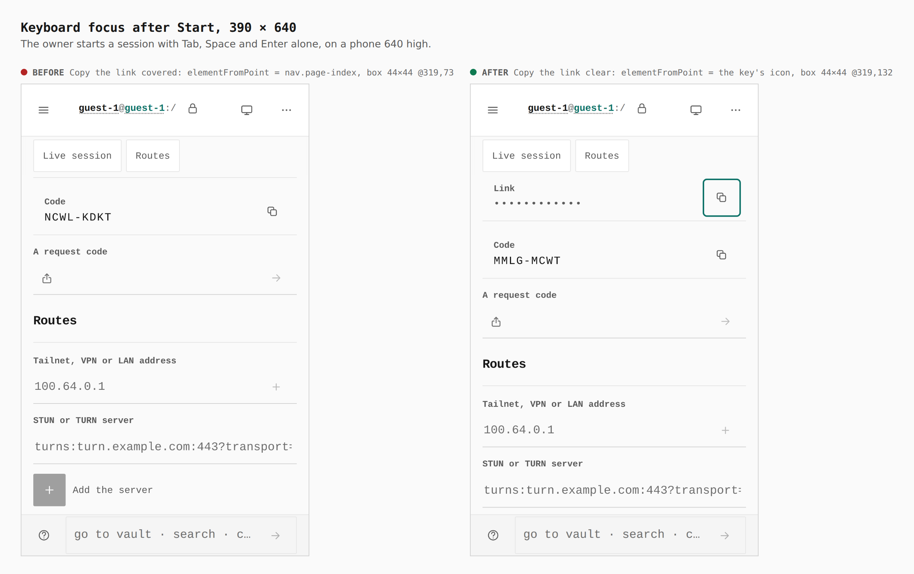
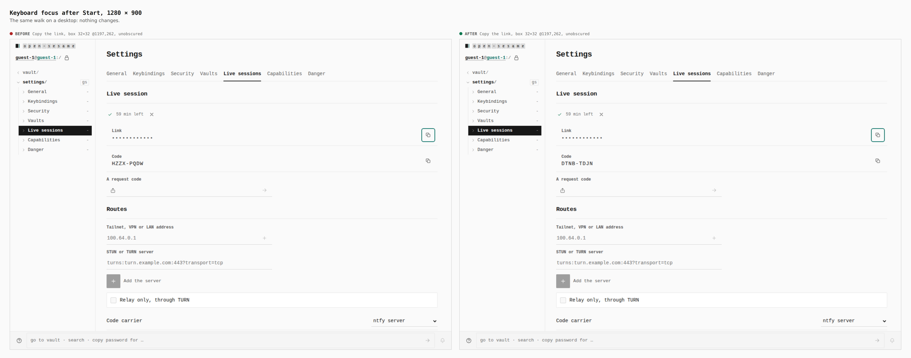

Same Start-by-keyboard walk as 1.6, with the phone 390 × 640.

| | before (`f933226f`) | after |
|---|---|---|
| `elementFromPoint` at the key's centre, 390 × 640 | `nav.page-index` (covered) | the key's icon (`svg`) |
| on screen and unobscured | **false** | **true** |
| box, 390 × 640 | 44×44 @319,**73** | 44×44 @319,**132** |
| focus ring | `solid 2px rgb(13, 114, 104)` | `solid 2px rgb(13, 114, 104)` |
| 1280 × 900 | 32×32 @1197,262, unobscured | 32×32 @1197,262, unobscured (identical) |

### 2.3 A carrier when the policy changes: not drivable mid-session

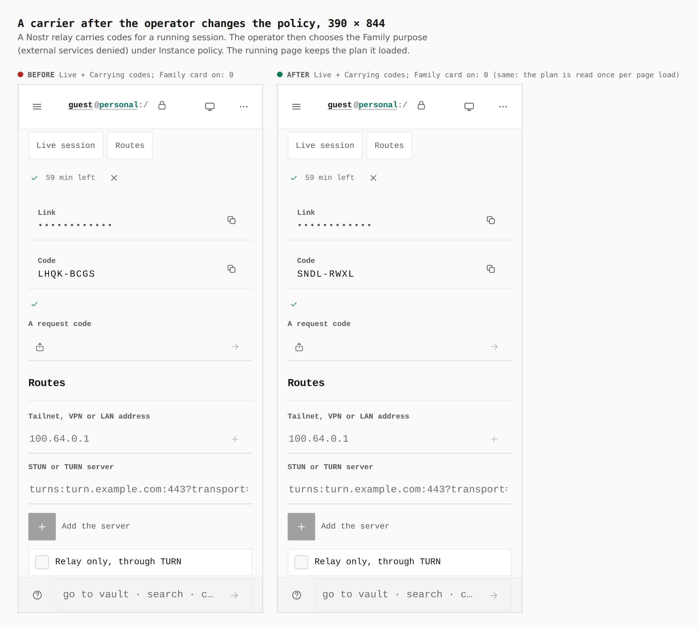
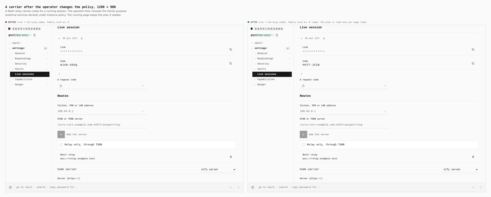
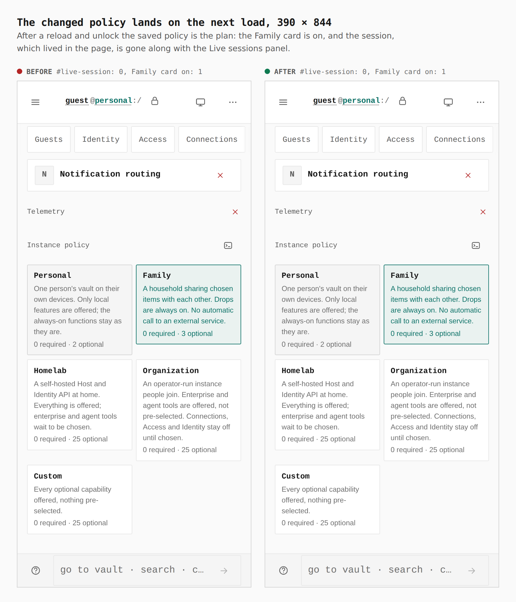
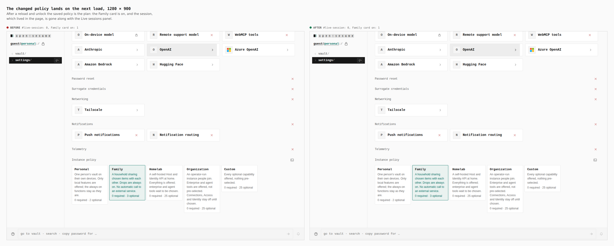

The change under test: a socket carrier shown `Carrying codes` is closed and
shown `Blocked by this installation` when a re-plan denies external services.
**It cannot be driven in a real browser**, and the captures say why.

- A real relay is stood in for: the screen's `relays` address is answered by a
  WebSocket server the harness runs, so the carrier really connects and the
  marks read `Live` and `Carrying codes: relay.example.test (nostr)` on both
  builds, at both widths.
- The operator then does the one thing a person can do to a personal-local
  installation's network policy: chooses the **Family** purpose (external
  services denied) under Settings › Capabilities › Instance policy, which
  writes `capabilities.policy.local.v1` and asks the store to re-plan. The
  marks stay `Live` | `Carrying codes` and the Family card reads **on: 0**:
  the running page still holds the plan it booted with. That is the code, not
  an accident of the harness: the instance policy is read in
  `CompositionStore.boot` (`packages/app-core/src/lib/capabilities/store.ts`
  via `readPolicy`), `boot` is called once per document
  (`apps/pages/src/bootstrap/boot.ts`), and `invalidate`, `revalidate` and
  `onVaultChange` re-resolve the policy already in memory. A deployment's
  `os-runtime-config.json` is read at the same moment.
- After a reload and unlock the saved policy is the plan: Family card **on: 1**,
  `#live-session` **0** (Family offers three optional capabilities and Live
  sessions is not one of them), `#instance-policy` 1. The session, which lived
  in that page, ended with it.

Both builds print the same numbers (marks, 0 → 1, 0), because the page cannot
re-plan its network under a running session in either, so there is no pair to
show for the change itself. What a person can do is on these sheets; what the
change does when a plan does change is verified by
`packages/app-core/src/lib/live/session-network.test.ts` ("closes a socket
carrier when external services are denied, and the session goes on", "closes
it when its origin leaves the operator's list", "closes only the carriers the
policy no longer allows", "leaves ntfy and BroadcastChannel to their own
gates"), `carrier-policy.test.ts` and `carriers/allowed.test.ts`. A dedicated
build (`build:live-dedicated`) was not needed: `relay.example.test` is not a
local address, so the shared origin reaches it, and a dedicated build changes
the origin, not when a policy is read.

### 2.4 A vault past the data channel's frame

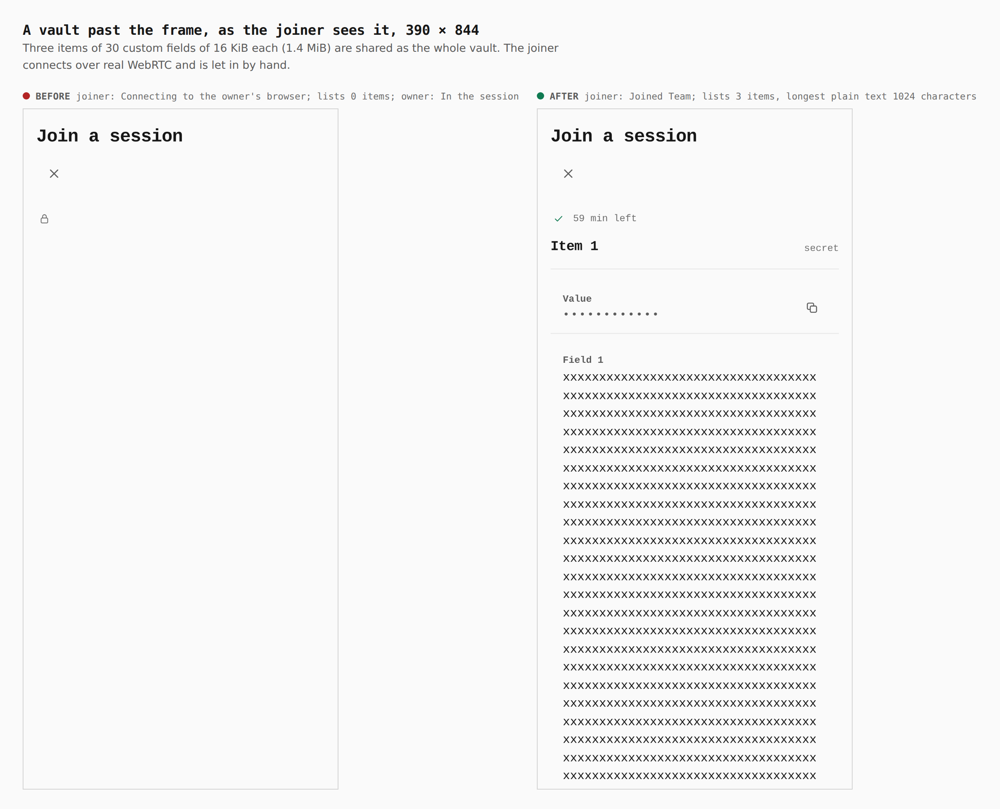
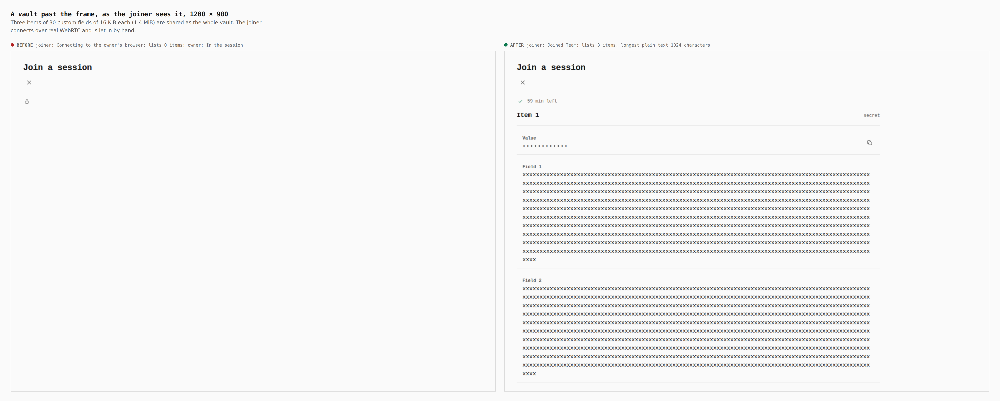

Captured on real builds. The owner, as a guest, keeps three items of 30 custom
fields of 16 KiB of plain text each (1.4 MiB; the channel's frame is 1 MiB),
filled in one field at a time through the editor, and shares **The whole
vault**. A joiner in a browser of its own opens the link, gives the code, is
let in by hand, takes the reply code and connects, over real WebRTC. The sheet
is the joiner's screen.

| | before (`f933226f`) | after |
|---|---|---|
| joiner's mark | `Connecting to the owner's browser` | `Joined Team` |
| items the joiner lists (`.live-items > li`) | **0** | **3** |
| longest plain text the joiner holds | 0 characters | 1024 characters (clipped from 16384) |
| owner's marks | `Live`, `In the session` | `Live`, `In the session` |

Before, the owner counts the joiner in while the joiner never receives the
catalog: the frame is over 1 MiB and `send()` drops it silently. After, the
catalog is cut to 900 KiB before it is sent (unconcealed text clipped to 1 KiB
here, every item still listed) and the joiner sees it. Identical at 390 and
1280. Not captured: the third state, a frame that still cannot go, which ends
the seat instead of counting the guest in; it needs names alone to exceed the
budget (about 200 items with long labels), too many fields to fill by hand.
It is covered by `packages/app-core/src/lib/live/catalog-fit.test.ts`
("leaves out the last items only when names alone do not fit", and "ends the
seat; the guest is never counted as joined").

## Reproducing

```bash
D=docs/evidence/2026-10-03-live-sessions-stack
# part 1: BEFORE = cd1ede72's dist, AFTER = this tree's dist (f52d2952)
EVIDENCE_DIST=<cd1ede72 dist> PLAYWRIGHT_CHROMIUM=/opt/pw-browsers/chromium \
  node apps/pages/scripts/capture-evidence.mjs capture before $D/journey.json
EVIDENCE_DIST=<f52d2952 dist> PLAYWRIGHT_CHROMIUM=/opt/pw-browsers/chromium \
  node apps/pages/scripts/capture-evidence.mjs capture after $D/journey.json
PLAYWRIGHT_CHROMIUM=/opt/pw-browsers/chromium \
  node apps/pages/scripts/capture-evidence.mjs compose $D/journey.json
# part 2: the same, BEFORE = f933226f's dist, with journey-vs-main.json
```

The harness gained, for this gallery: live-session verbs (an owner who starts a
session, joiners in browsers of their own, focus and status-mark readers), a
per-screen `runtimeConfig` and `relays`, `tab` by route, the operator's purpose
card, a joiner who goes the whole way and a `shot` that can photograph either
end (`scripts/lib/capture-live-steps.mjs`, `capture-live-policy-steps.mjs`,
`capture-live-join-steps.mjs`, `capture-tab-step.mjs`).
