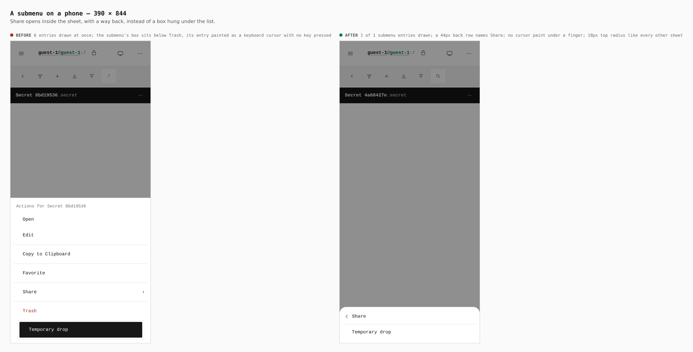
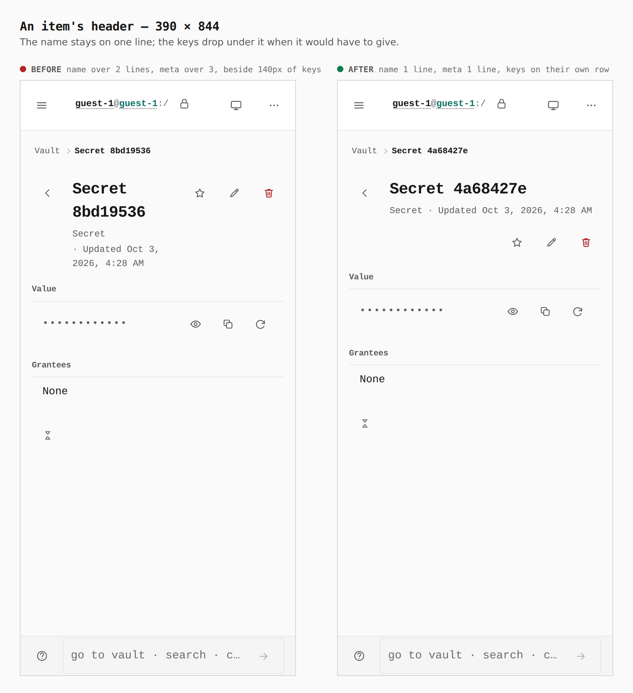
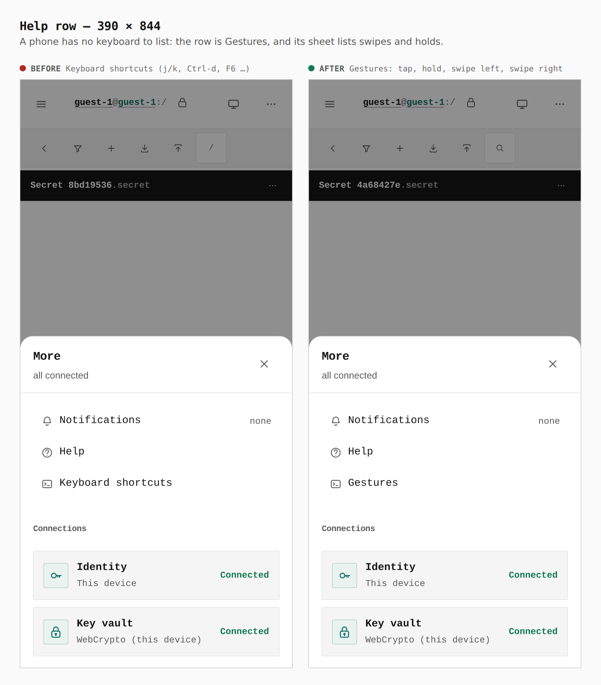

# Phone menus, and gestures where the keyboard was

Before/after from two real builds — the previous commit on this branch and
this one — same journey (`journey.json`), a touch context at 390 × 844.

Also measured by `verify:mobile` at 320, 390, 430 and landscape: the submenu
stop is audited against the whole touch contract (every entry ≥ 44px), only
the submenu's entries are drawn while it is open, a back row returns to the
list, and a row swiped left opens the same actions as a hold without also
opening the row.

## 1. A submenu — 390

## 2. An item's header — 390

## 3. The help row — 390

Also in this change, with no picture of their own: the list's search key draws
a magnifier instead of `/`, and the help sheet itself lists the gestures
(`lib/gesture-help.ts`) instead of keys.
