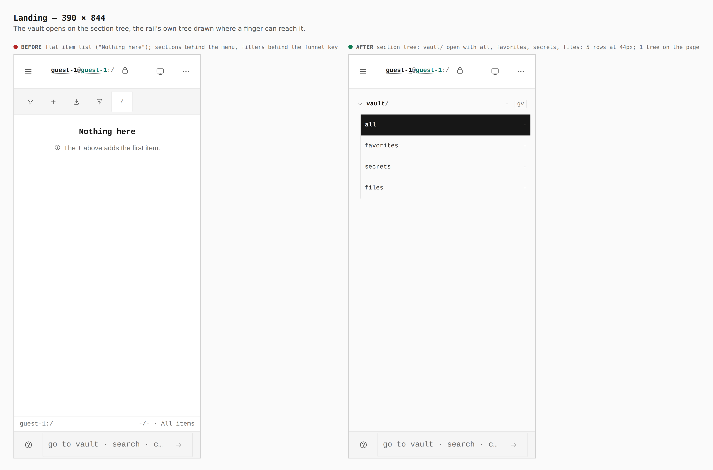
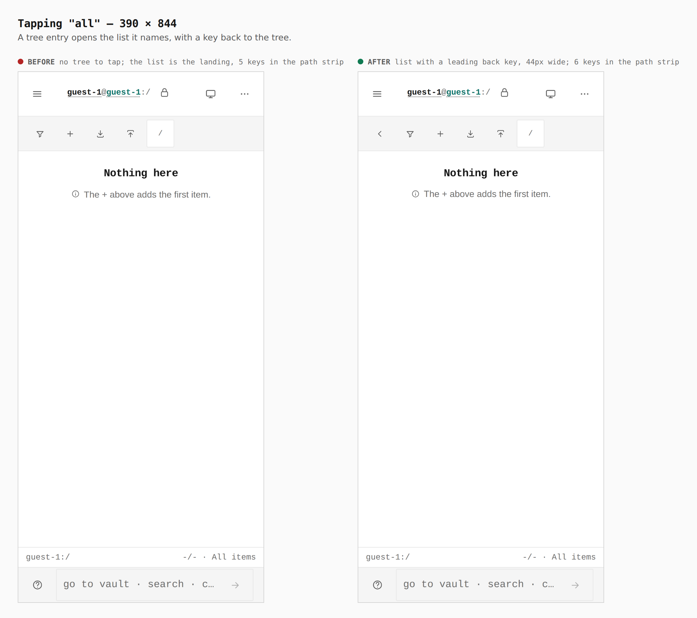
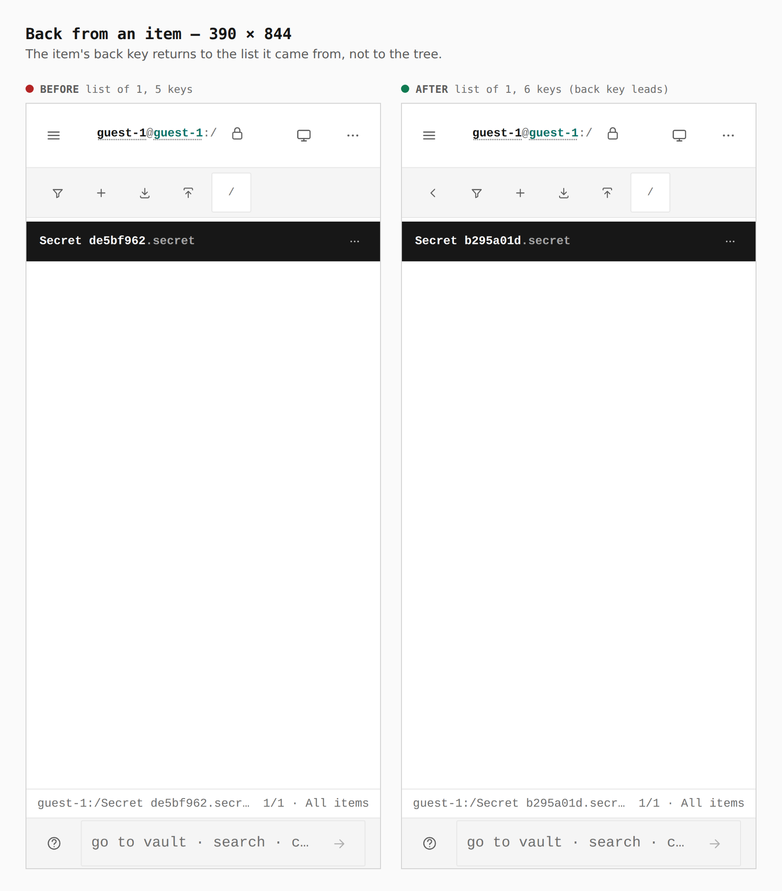
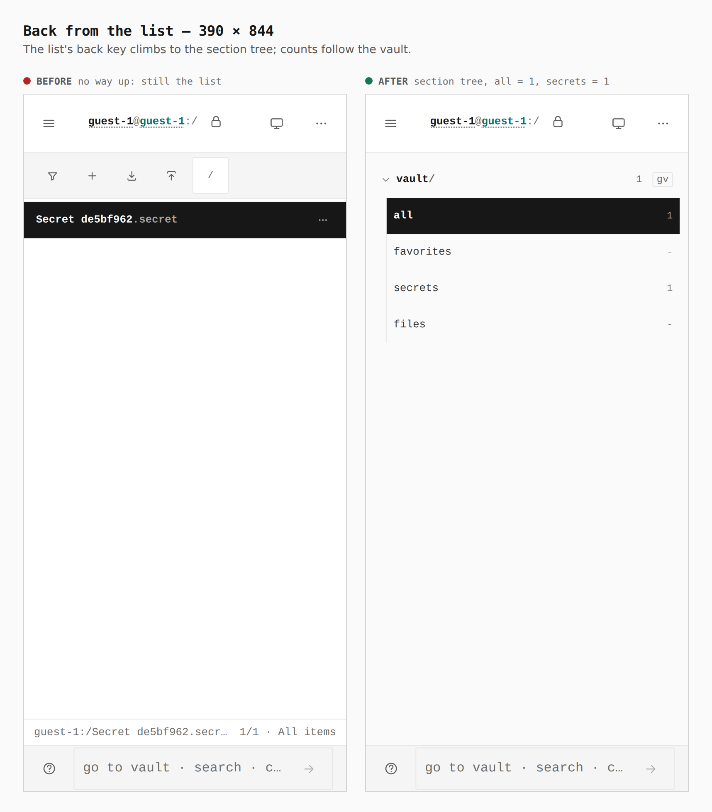
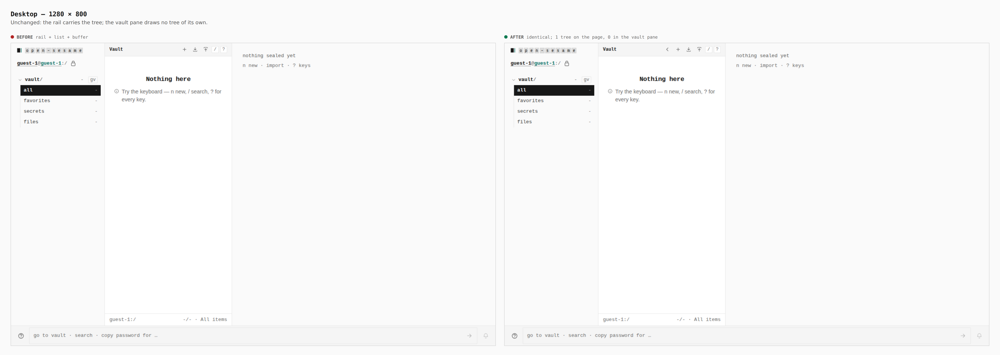

# Phone vault opens on the section tree

Before/after from two real builds — `main` (6294f68) and this branch — same
journey (`journey.json`), same steps, a touch context at 390 × 844 and a mouse
context at 1280 × 800. Item names differ between the sides only because the
ids are random per run.

Measured in the browser on the branch: at 390px the vault pane is
`data-pane="tree"`, one `role="tree"` is on the page, its five rows are 44px
tall, the list's back key is 44px wide, and `scrollWidth` equals the
viewport. At 1280px there is one tree (the rail) and none in the vault pane.

## 1. Landing — 390

Before: flat item list, sections behind the menu, filters behind the funnel.
After: the section tree, `vault/` open with `all`, `favorites`, `secrets`, `files`.

## 2. Tapping "all" — 390

The list gains a leading back key (5 → 6 keys in the path strip).

## 3. Back from an item — 390

An item's back key returns to the list it came from.

## 4. Back from the list — 390

Before there was no way up. After, the list's back key (or a rightward swipe)
returns to the tree, with live counts.

## 5. Desktop — 1280

Unchanged.
