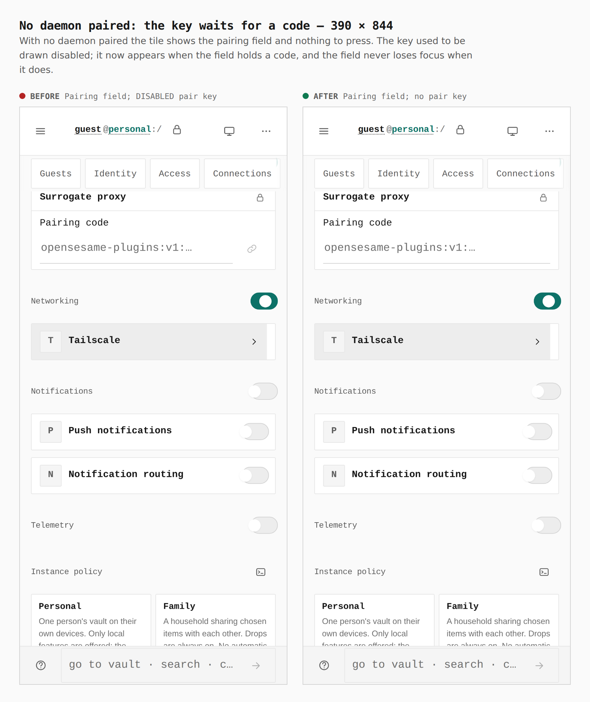
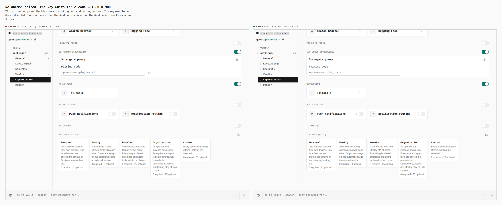
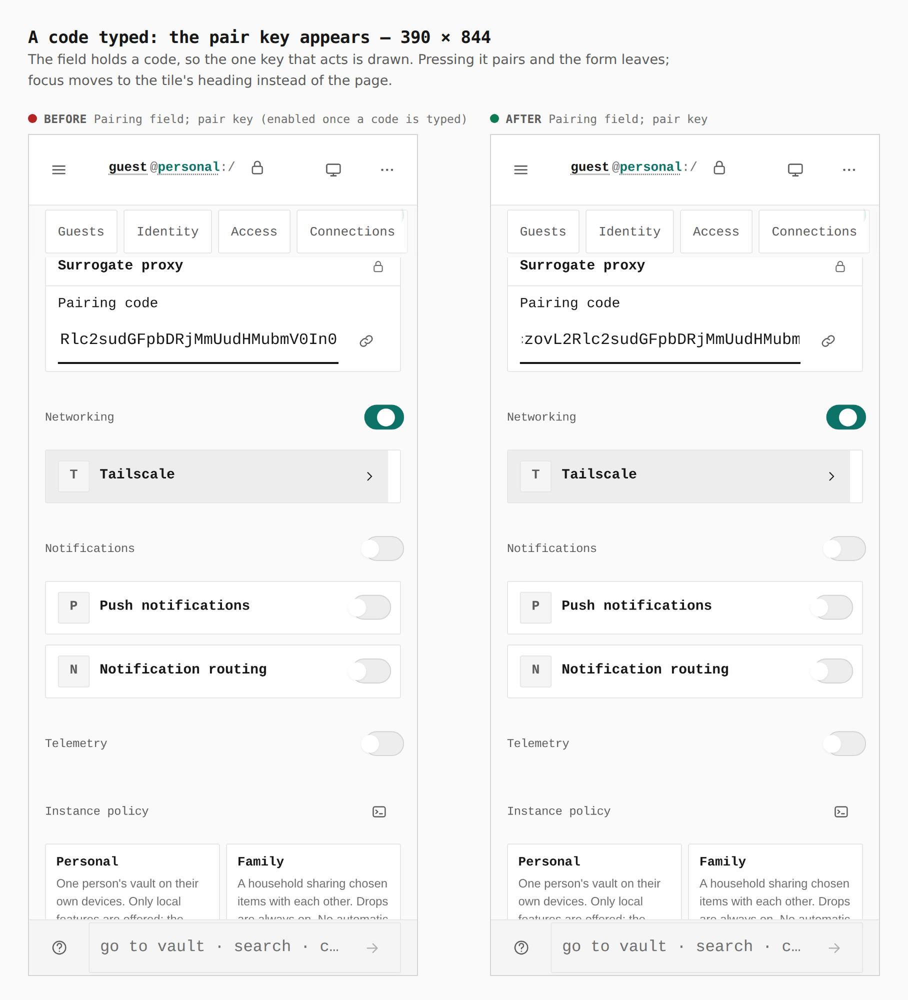
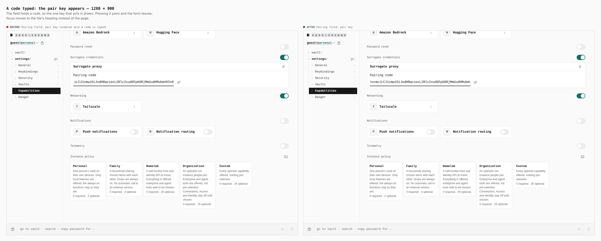
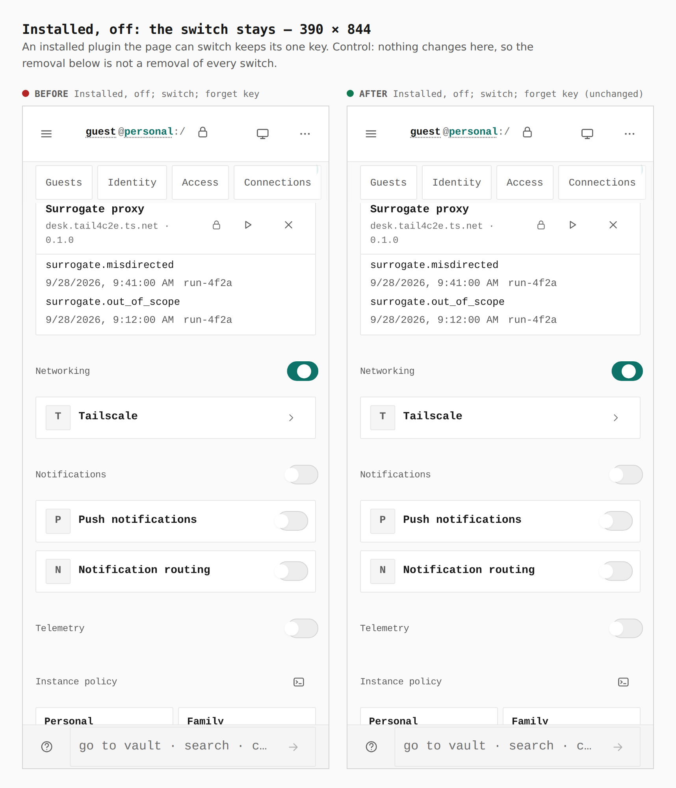
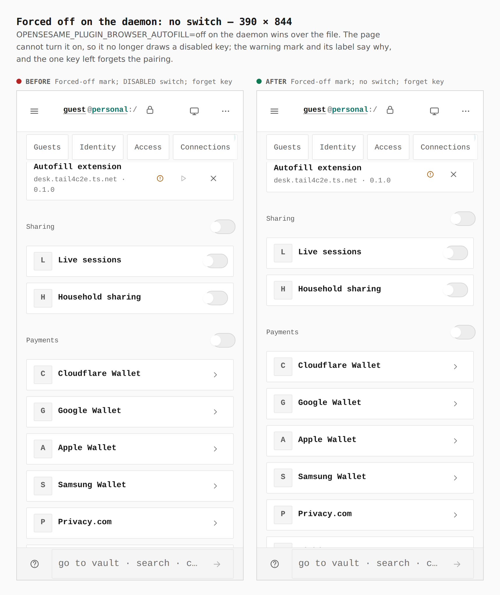
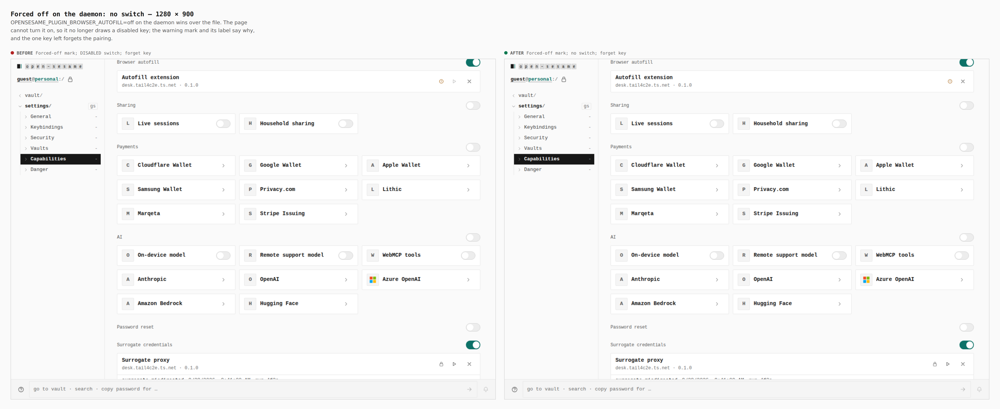
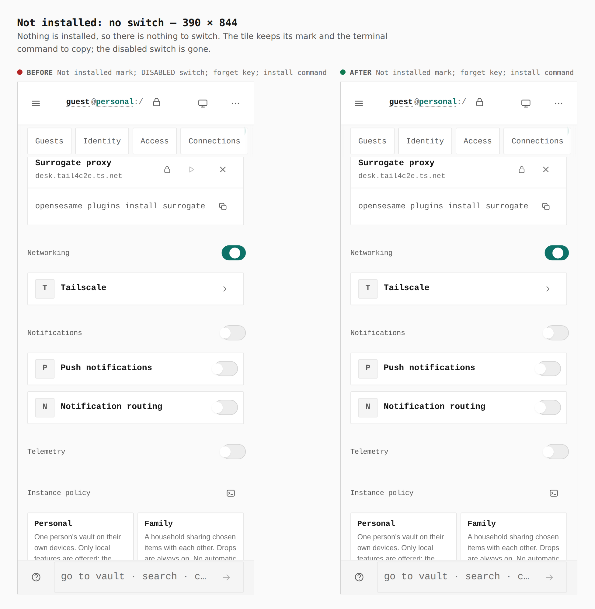

# Plugin tiles draw no switch they cannot act on (ADR 0150, settings rows act or are absent)

Before/after from two real builds of `apps/pages`: the base (`cedad352`, PR
#626's tip) and this branch, walked the same way by
`apps/pages/scripts/capture-evidence.mjs` with [`journey.json`](journey.json).
Counts and sizes are read from the browser by the journey's `count` and
`measure` steps (sizes are `width x height`; `#plugin-surrogate-proxy` and
`#plugin-browser-autofill` are the tiles).

Both builds are stamped as a dedicated deployment
(`PAGES_DEPLOYMENT_PROFILE=dedicated_origin`, `https://vault.example.org`,
`PAGES_HEADER_SECURITY=1`, built with `pnpm --filter @opensesame/pages build`)
so the pairing field is live. The daemon is the stub the journey serves
(`daemonStub`, `apps/pages/scripts/lib/capture-plugin-steps.mjs`); the pairing
code and key are made-up examples. Each walk seals a password vault, turns on
both plugin capabilities, reloads, unlocks, pairs, and opens Settings ›
Capabilities. The desktop walk reaches Settings with `visit` because the
desktop rail has no Settings row to click.

What changed: an uninstalled or forced-off plugin used to draw its switch
disabled, a key that can never act. It is now absent. The tile's mark (`Not
installed`, `Forced off on the daemon`) is unchanged and still says why; the
switch stays for a plugin the page can switch, and is `aria-busy` rather than
disabled while a switch is in flight, so focus is never on a key that went dead.
When the daemon's answer takes the switch (or the forget key, or the pairing
field) away while a person is on it, focus moves to the tile's heading instead
of falling to the page. The same rule reaches the pairing form: with no open
vault (a guest, a locked vault, a deployment that may not hold local authority)
it draws no field and no key, and with one it draws the field alone until a
code is typed, then the one key that sends it. The capture pairs through the
surrogate tile's own field and key (`#plugin-pair-surrogate-proxy`, `pressIn`),
because the base build's other tile still draws a stale disabled field after
unlock.

Measurements, all from the browser (`switches` = `[aria-pressed]` buttons in the
tile, `disabled` = of those, disabled):

| State | Width | Before | After |
|---|---|---|---|
| No daemon paired | 390 | field 282x44 + key 44x44, key disabled | field 332x44, no key |
| No daemon paired | 1280 | field 442x32 + key 32x32, key disabled | field 480x32, no key |
| Code typed | 390 | field 282x44 + key 44x44, key enabled | identical |
| Code typed | 1280 | field 442x32 + key 32x32, key enabled | identical |
| Installed, off (control) | 390 | switches 1, disabled 0; keys 44x44, 44x44; tile 358x179 | identical |
| Installed, off (control) | 1280 | switches 1, disabled 0; keys 32x32, 32x32; tile 960x114 | identical |
| Forced off | 390 | switches 1, disabled 1; keys 44x44, 44x44; tile 358x76 | switches 0; key 44x44 (forget); tile 358x62 |
| Forced off | 1280 | switches 1, disabled 1; keys 32x32, 32x32; tile 960x58 | switches 0; key 32x32 (forget); tile 960x58 |
| Not installed | 390 | switches 1, disabled 1; keys 44x44 x3 (switch, forget, copy); tile 358x123 | switches 0; keys 44x44 x2 (forget, copy); tile 358x123 |
| Not installed | 1280 | switches 1, disabled 1; keys 32x32 x3; tile 960x107 | switches 0; keys 32x32 x2; tile 960x107 |

The mark labels `Installed, off`, `Forced off on the daemon` and `Not
installed` each count 1 in both builds, so nothing the tile said was lost.

## No daemon paired: no dead key

## A code typed: the key that acts appears

## Installed, off: the switch stays (control)

## Forced off on the daemon: no switch

## Not installed: no switch

