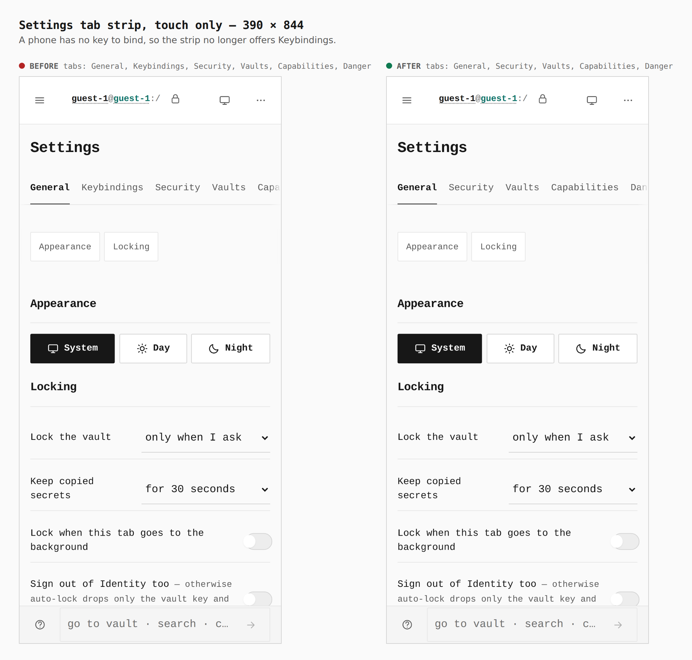
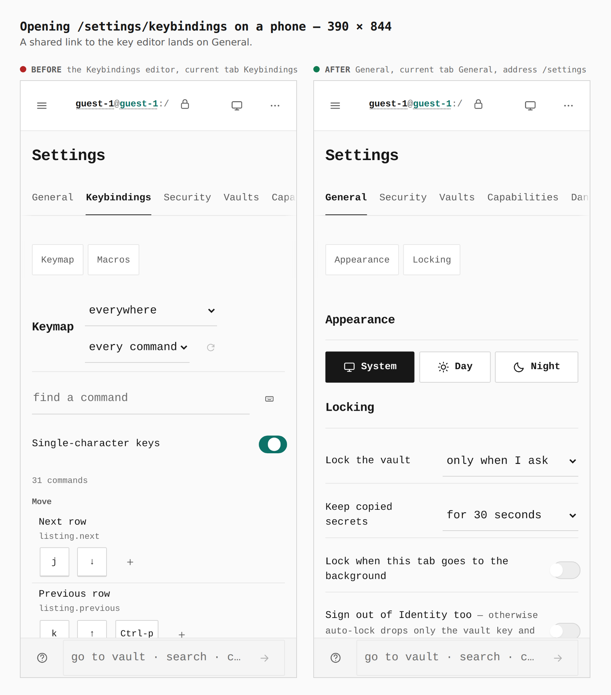
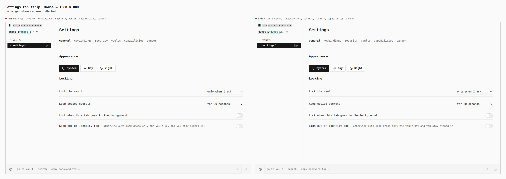

# Settings has no Keybindings tab on a touch-only device

Before/after from two real builds, walked with the same journey
(`journey.json`) as a guest: a touch context at 390 x 844 and a mouse context
at 1280 x 800. "Before" is the session branch tip `003c0e0`; the slices of this
stack are independent, so it is the honest base for this one. "After" is this
branch.

Measured in the browser (`report` on `.set__nav a`, `.set__nav a[aria-current]`,
`address`):

- 390 touch, before: tabs General, Keybindings, Security, Vaults, Capabilities,
  Danger. After: General, Security, Vaults, Capabilities, Danger.
- 390 touch, opening `/settings/keybindings`, before: address
  `/settings/keybindings`, current tab Keybindings. After: address `/settings`,
  current tab General.
- 1280 mouse, before and after: the same six tabs, Keybindings included.

## 1. Settings tab strip, touch only: 390

Before: Keybindings sits second in the strip. After: the strip is General,
Security, Vaults, Capabilities, Danger.

## 2. A link to the key editor: 390

Before: the editor opens. After: the link lands on General.

## 3. Desktop: 1280

Unchanged: a mouse is attached, so the tab is drawn.

Limitation: `(any-pointer: fine)` detects pointing devices, not keyboards, so a
phone with only a hardware keyboard also loses the tab (DESIGN.md Touch).
