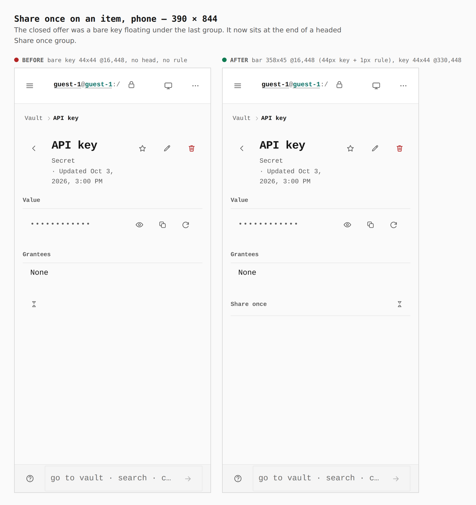
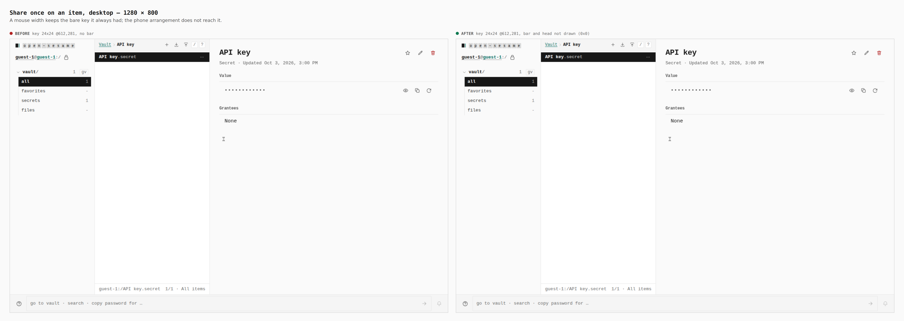
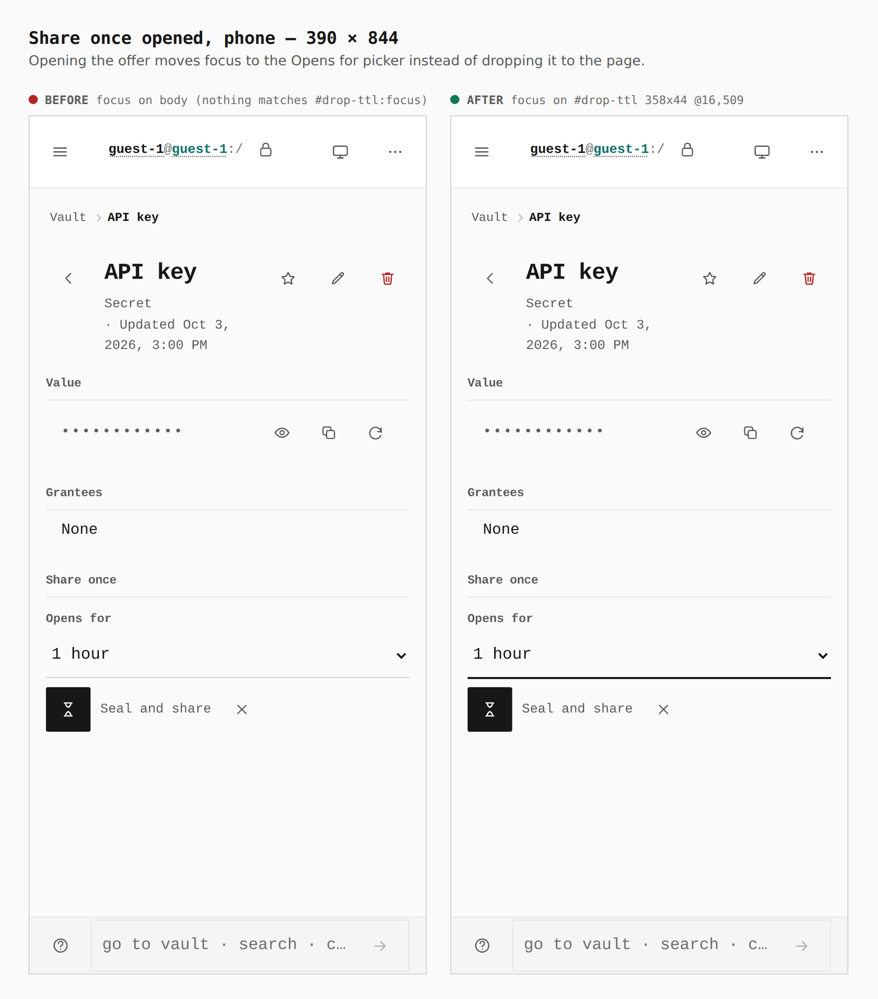
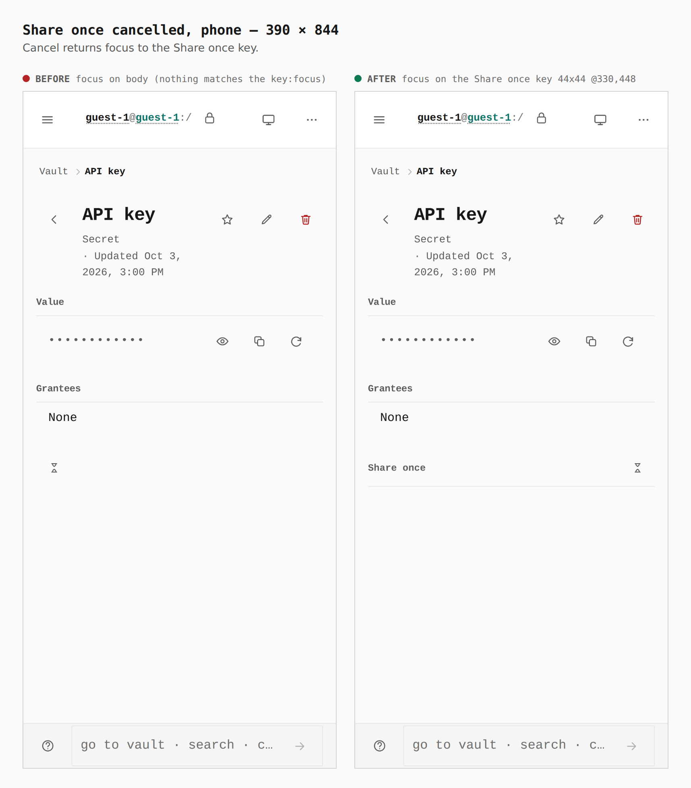

# Share once on an item's page, seated for the phone

The closed Share once offer was a bare key under the last group. On a phone it
now sits at the end of a headed Share once bar. A desktop is unchanged: the
group and bar draw no box there, the head is not drawn, and the DOM is the same
at every width. The head is an `aria-hidden` span, not a heading, so the page names the key once.
Focus follows the ceremony: to the Opens for picker on open, back to the key on
Cancel.

Both builds were walked the same way (guest vault, New item, Secret "API key",
Save item). "Before" is built from `f54a95f`, this slice's parent. The session
branch tip (`003c0e0`) also carries the phone-vault slices, which change the
item header at 390 and would have muddied the pair, so it is not the base here.
The 390 contexts are touch; the 1280 context is a mouse.

Phone rule gate: `@media (max-width: 900px), (pointer: coarse)`, the breakpoint
the surrounding detail-pane rules use.

## Closed offer, 390 x 844

| | before | after |
|---|---|---|
| Share once key | 44x44 @16,448, bare | 44x44 @330,448 |
| `.detail__groupbar` | none | 358x45 @16,448 |
| Hit area / bar height | 44px key | 44px key, bar 45px (44px key + 1px rule) |
| Group head | none | "Share once", 72x18 @16,461 |

## Closed offer, 1280 x 800 mouse: identical

| | before | after |
|---|---|---|
| Share once key | 24x24 @612,281 | 24x24 @612,281 |
| `.detail__groupbar` | none | 0x0 (`display: contents`) |
| Share once head | none | 0x0 (`display: none`) |
| Other group heads | 640x26 @612,99 and @612,194 | 640x26 @612,99 and @612,194 |

## Opened, 390 x 844: focus lands on the picker

`#drop-ttl:focus`: before none (focus fell to the page), after 358x44 @16,509.

## Cancelled, 390 x 844: focus returns to the key

`button[aria-label='Share once']:focus`: before none, after 44x44 @330,448.

Reproduce: `journey.json` beside this file.
