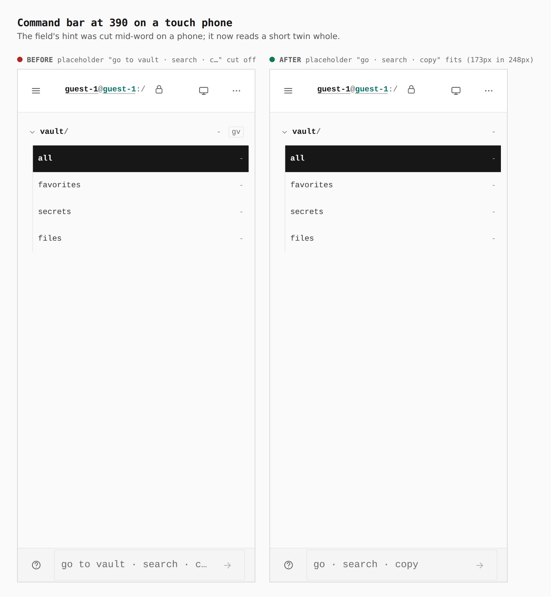
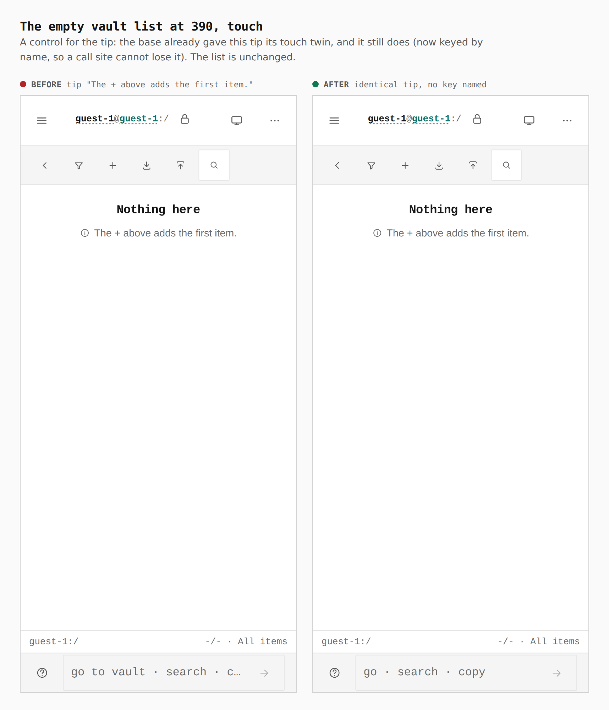
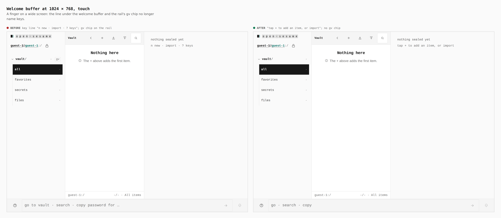
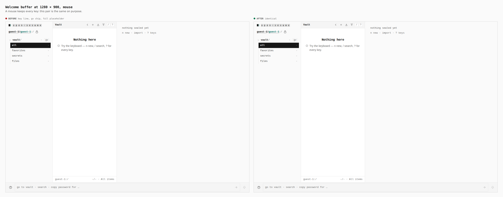

# Keyboard-only copy stands down under a finger — 2026-10-03

Before/after sheets from two real builds of `apps/pages`, walked by
`journey.json` with `apps/pages/scripts/capture-evidence.mjs`. The "before"
build is the session branch tip `003c0e0`, built in its own worktree and
captured with `EVIDENCE_DIST`. The slices of this stack are independent, so
that tip is the honest base for each. "After" is this branch. Every number
below was printed by the capture's `touchCopy` step from the browser, and
`verify:mobile` now asserts the same things at every stop.

## Command bar at 390, touch

| | Before | After |
|---|---|---|
| Placeholder | `go to vault · search · copy password for …` | `go · search · copy` |
| Text width vs field | 404px text in a 248px field, cut at `c…` | 173px text in a 248px field, whole |
| `gv` chip on the rail (`.railtree__jump`) drawn | 1 | 0 |

At 320 the field is 178px wide. The first twin written, `go to · search ·
copy`, measured 202px and failed the new `verify:mobile` assertion at every
320 stop, so it was shortened to 173px. Both numbers come from that gate.

## The empty list at 390, touch (control)

The base already gave this tip its touch twin, so the pair is the same:
`The + above adds the first item.` before and after, 0 keys-voice lines drawn
in both. It is kept to show the list did not regress.

## Welcome buffer at 1024 × 768, touch

| | Before | After |
|---|---|---|
| Line under "nothing sealed yet" | `n new · import · ? keys` | `tap + to add an item, or import` |
| `gv` chip drawn | 1 | 0 |
| Keys-voice lines drawn | 0 (the key line was a plain paragraph, so it was drawn unmeasured) | 0 |
| Placeholder | `go to vault · search · copy password for …` (fits, 404px in 830px) | `go · search · copy` |

## Welcome buffer at 1280 × 900, mouse

A mouse keeps every key. The before and after PNGs are byte-identical
(`cmp` reports no difference). Lines read, both builds: `Try the keyboard —
n new, / search, ? for every key.` and `n new · import · ? keys`; the `gv`
chip is drawn (1) in both; the placeholder is the full desktop line (328px in
1132px, fits). The `keys-voice lines drawn` counter reads 1 before and 2
after only because the tip and the key line each gained a class name for the
keys voice; the same two lines are on screen.

## Audit: every keyboard-only offender and its status

| Offender | Status |
|---|---|
| Command bar placeholder cut at 390 and 320 | Fixed: touch twin `go · search · copy`, asserted at 320, 390, 430, landscape and tablets by `verify:mobile` |
| `gv` chord chip on the rail (`.railtree__jump`) | Hidden under `(pointer: coarse)`; `verify:mobile` asserts zero drawn at every stop |
| Welcome buffer key line (`n new · import · ? keys`) | Fixed: keys voice and a touch twin (`WelcomeKeys`); no twin where nothing is to be done (empty trash) draws no key line on touch |
| `EmptyTip` tips: navigate, vaultMove, vaultEmpty, rail, keymap, escBack | Fixed: each has a touch twin, keyed by name; a source scan fails any call site without a tip key |
| Keymap tip twin named the Help row | Fixed: it now says `Gestures in the ⋯ menu lists every gesture.`, and a MoreMenu test checks that row exists under a coarse pointer and Help is not it |
| Voice notice `press Enter to run` | Fixed: `tap the arrow to run`, read from the same reactive hook as the placeholder |
| Non-reactive `isTouchPointer()` in `KeymapSheet`, `MoreMenu`, `page-menu`, `EditorTitle` | Not changed: each is read when its sheet or menu opens, so a pointer that changes later is picked up on the next open |
| Custom `<EmptyTip keys={false}>` | No call site uses it; a tip that is not about keys is kept as the escape hatch |
