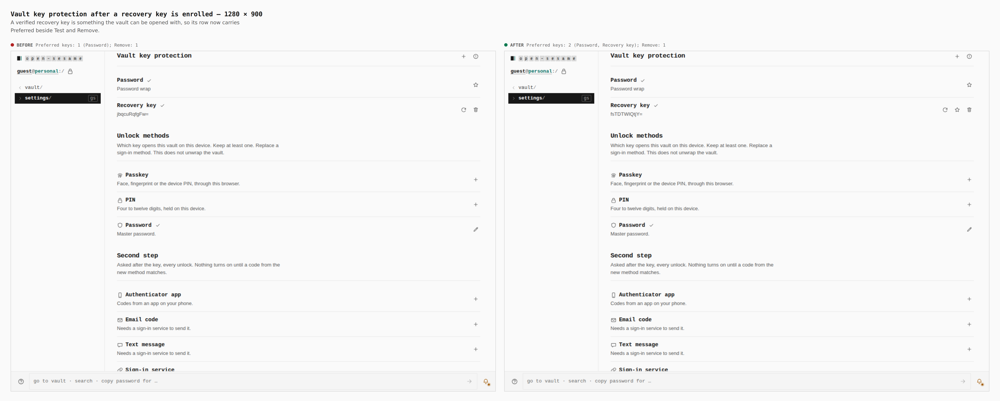
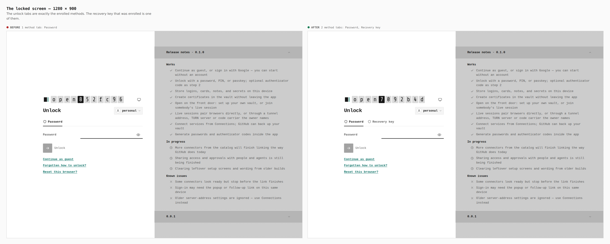
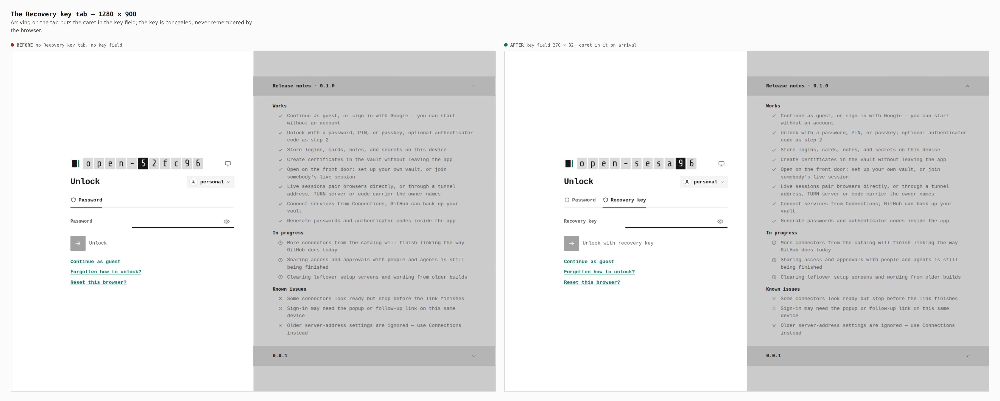
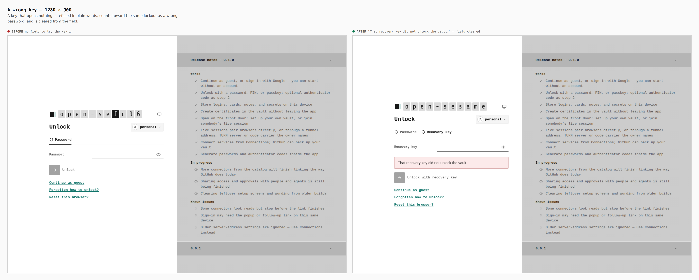
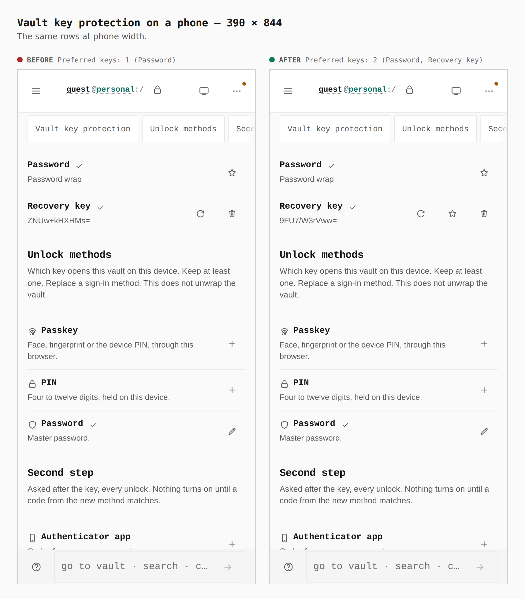
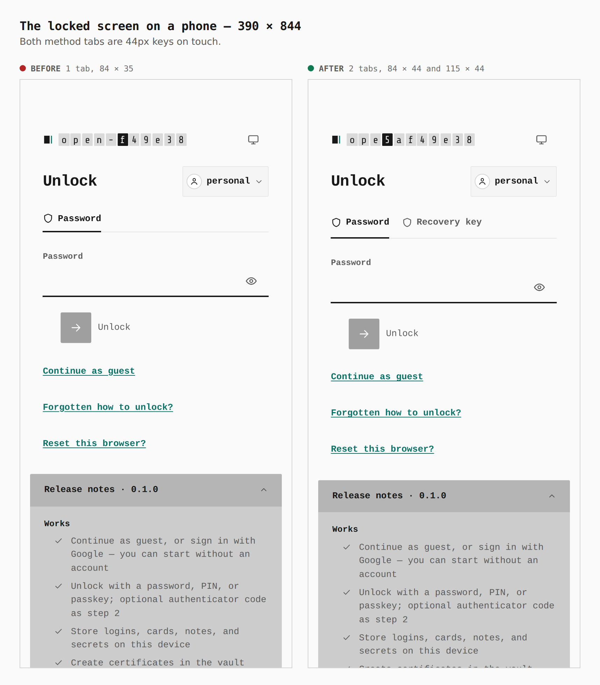
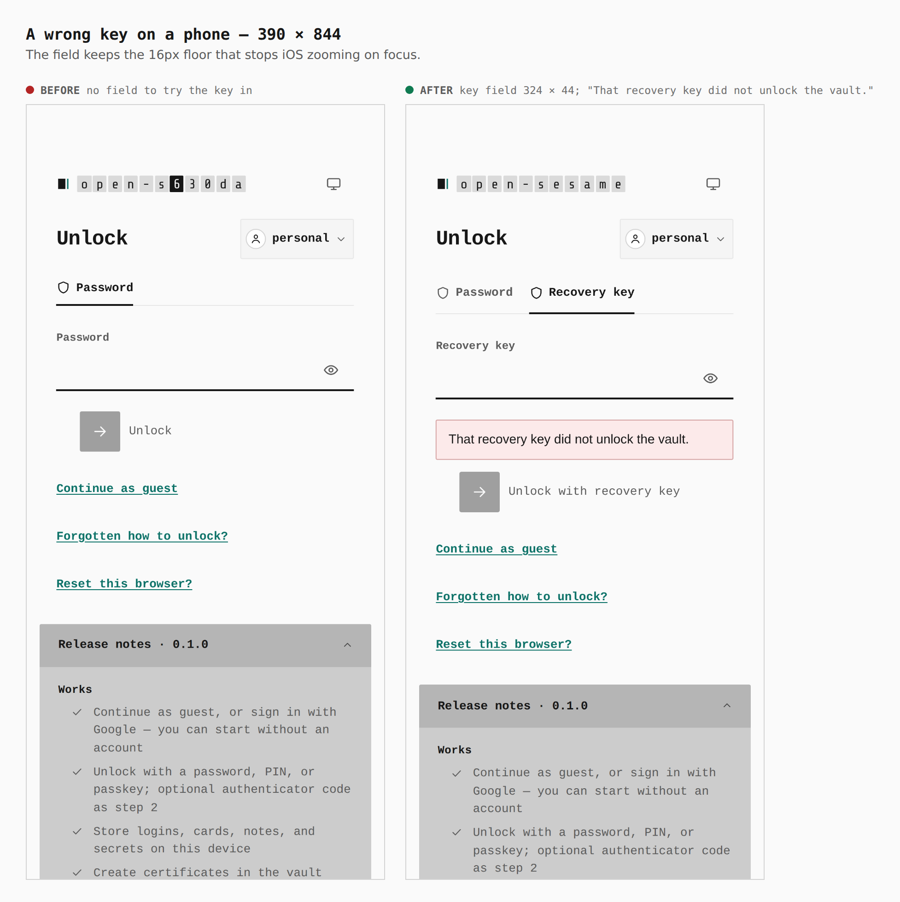

# Unlock from an enrolled protector — before and after

Two real builds, walked the same way: `main` at `41679e13` (built in its own
`git worktree`) and this branch. A password vault is sealed on the device, a
recovery key is enrolled from Settings › Security, and the vault is locked.
Journey and captions: [`journey.json`](journey.json). Every number below was
printed by the browser during the capture.

The recovery key was always enrollable; nothing at the unlock screen could use
it. The pairs show the row that now acts, and the tab that opens the vault.

## Vault key protection, 1280 × 900

`Preferred` keys: 1 → 2 (Password; now also Recovery key). `Remove` stays 1: a
header wrap is removed under Unlock methods, a capsule on its own row.

## The locked screen, 1280 × 900

Method tabs: 1 (`Password`) → 2 (`Password`, `Recovery key`). Exactly the
enrolled methods; no tab is drawn for a cloud KMS record, whose credential is
sealed in the vault it protects (ADR 0152).

## The Recovery key tab, 1280 × 900

Key field: none → 270 × 32, with the caret in it on arrival (the
`verify:auth` journey asserts `document.activeElement` is the field, after a
click and after a cold reload).

## A wrong key, 1280 × 900

No field → `That recovery key did not unlock the vault.`, the field cleared.

## Phone, 390 × 844

Method tabs on touch: 84 × 35 → 84 × 44 and 115 × 44. `verify:mobile` found the
tabs (Password and PIN included) under the 44px floor once it measured a
locked screen with more than one method; they now meet it. At 1280 the tabs
stay 35px: the floor hangs on a coarse pointer or width ≤ 900px.

Key field: none → 324 × 44, 16px type (the `verify:mobile` floor, asserted at
320, 390, 430 and landscape on the same screen).

## Not shown

The screen after a correct key is the vault itself. It is proved by
`verify:auth` journey 3 (right key opens, authenticator code still asked, wrong
code refused, preferred tab kept across a reload) rather than pictured.
