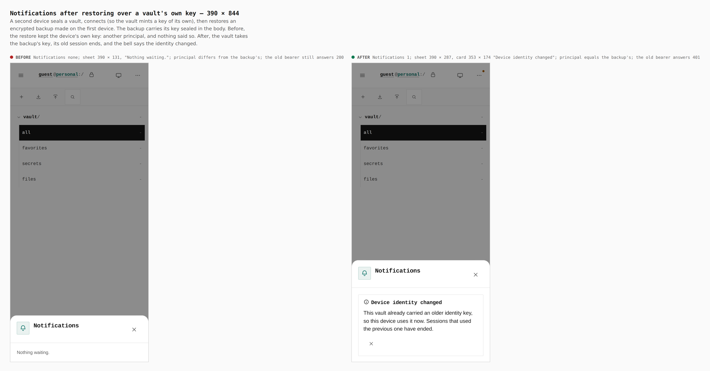
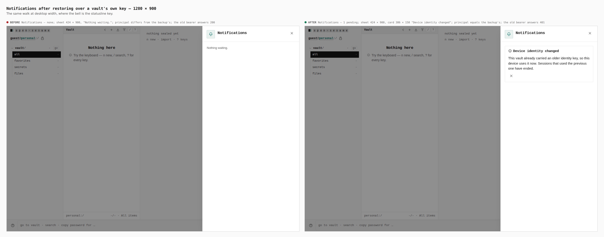
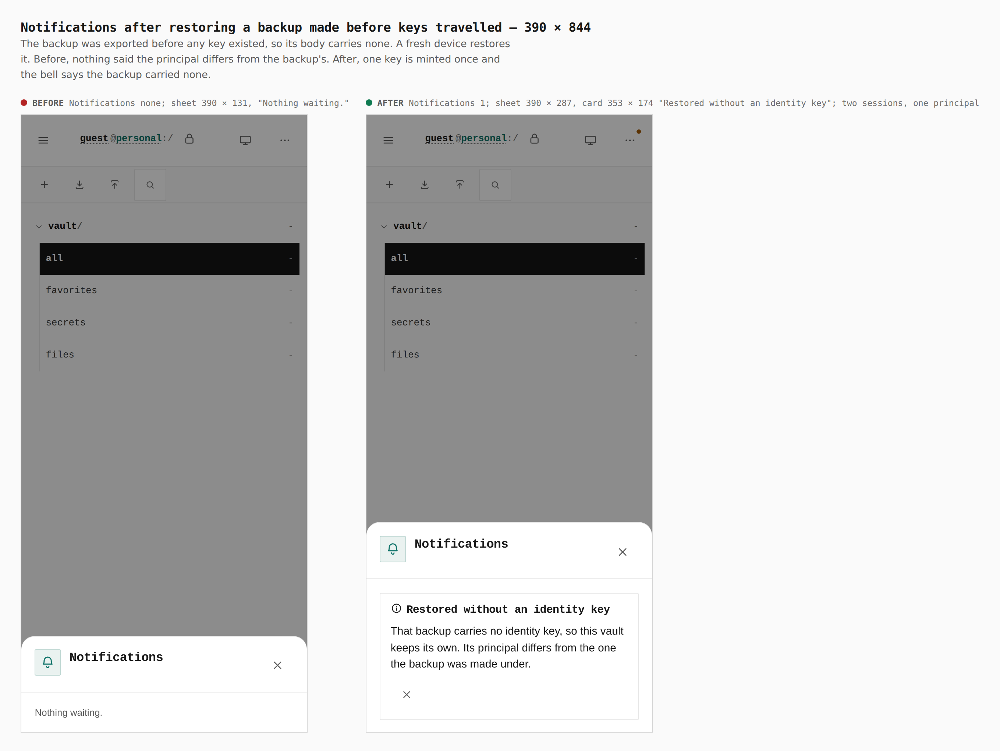
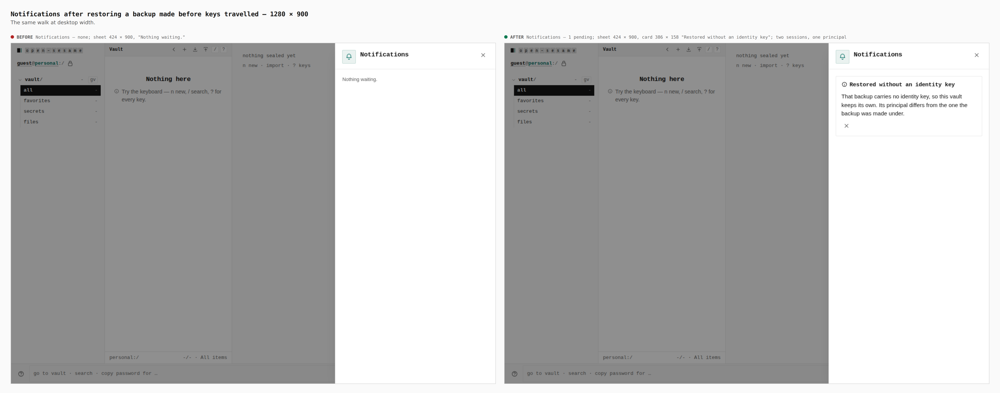

# The device identity key travels with the vault (ADR 0160 §5a) — before and after

The change shows on screen in two places, both bell notices raised when a
backup is restored. Before is `origin/main` (618b48e0), after is this branch
(built at f734b67a), each served from its own build of `apps/pages` under the
production origin and walked the same way at phone (390 × 844, touch) and
desktop (1280 × 900) width.

The walk is two devices, each its own browser context with its own storage and
vault, passing one file, and it uses the app's own keys: the Export key makes
an encrypted backup on a source device (desktop-sized, both builds); on the
device that is captured the Import key restores it and the bell is opened. A
phone draws no statusline, so there the bell is the Notifications row of the
More sheet. `apps/pages/scripts/capture-device-identity-notices.mjs` drives it
and writes the measurements below from the page (`measurements.json`, in the
temp directory beside the raw captures); `capture-evidence.mjs compose` only
lays the pairs out (`journey.json`).

```bash
EVIDENCE_DIST=<origin/main worktree>/apps/pages/dist \
  node apps/pages/scripts/capture-device-identity-notices.mjs before
node apps/pages/scripts/capture-device-identity-notices.mjs after
node apps/pages/scripts/capture-evidence.mjs compose \
  docs/evidence/2026-10-04-device-identity-carry/journey.json
```

## Restoring over a vault's own key — "Device identity changed"

The captured device sealed a vault and connected, so its vault minted a key of
its own, then restored a backup made on the first device.




| | bell | sheet | card | principal after restore | the device's old bearer |
|---|---|---|---|---|---|
| before, 390 | `Notifications none` | 390 × 131, "Nothing waiting." | none | differs from the backup's | answers 200 |
| after, 390 | `Notifications 1` | 390 × 287 | 353 × 174, "Device identity changed" | equals the backup's | answers 401 |
| before, 1280 | `Notifications — none` | 424 × 900, "Nothing waiting." | none | differs from the backup's | answers 200 |
| after, 1280 | `Notifications — 1 pending` | 424 × 900 | 386 × 158, "Device identity changed" | equals the backup's | answers 401 |

## Restoring a backup made before keys travelled — "Restored without an identity key"

The backup was exported before any key existed, so its body carries none. A
fresh device restored it.




| | bell | sheet | card |
|---|---|---|---|
| before, 390 | `Notifications none` | 390 × 131, "Nothing waiting." | none |
| after, 390 | `Notifications 1` | 390 × 287 | 353 × 174, "Restored without an identity key" |
| before, 1280 | `Notifications — none` | 424 × 900, "Nothing waiting." | none |
| after, 1280 | `Notifications — 1 pending` | 424 × 900 | 386 × 158, "Restored without an identity key" |

After the restore two sessions on the device share one principal (one key,
minted once), on both builds' walk; only the notice differs.

Nothing else on these screens changed: the cards are the existing status
notice card, with a title and a sentence and no new control.

## Gate

`pnpm --filter @opensesame/pages verify:device-identity` walks the same restore
flows with assertions (principal kept, loser's bearer ended, one key minted,
the notices in the bell). It fails 10 checks on the `origin/main` build and
passes on this branch.
