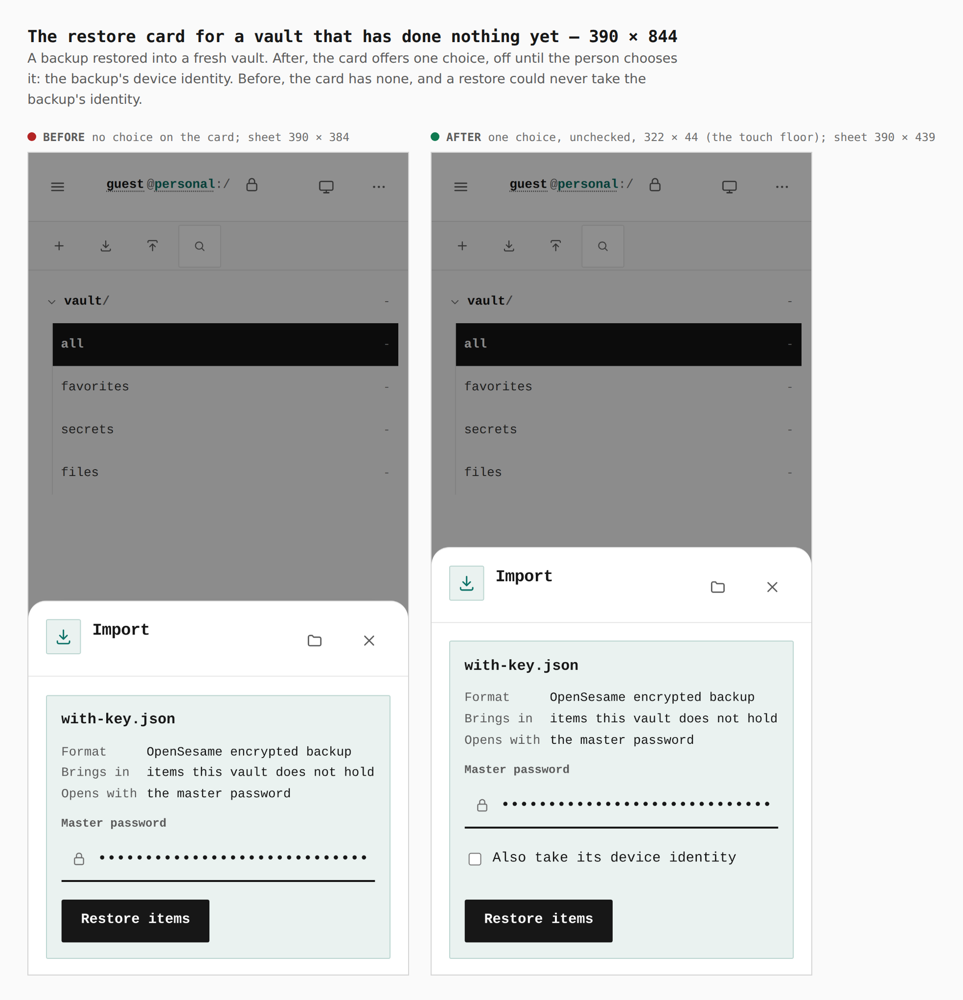
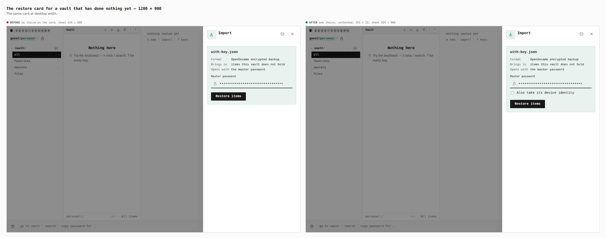

# The device identity key travels with the vault (ADR 0160 §5a) — before and after

The change shows on screen in two places, both bell notices raised when a
backup is restored. Before is `origin/main` (618b48e0), after is this branch
(built at the head named in the pull request, after the review fixes), each served from its own build of `apps/pages` under the
production origin and walked the same way at phone (390 × 844, touch) and
desktop (1280 × 900) width.

The walk is two devices, each its own browser context with its own storage and
vault, passing one file, and it uses the app's own keys: the Export key makes
an encrypted backup on a source device (desktop-sized, both builds); on the
device that is captured the Import key restores it, choosing "Also take its
device identity" on the restore card where the build offers that choice (it is
offered only to a vault that has done nothing yet, and is off until chosen; the
base build has no such choice), and the bell is opened. A
phone draws no statusline, so there the bell is the Notifications row of the
More sheet. `apps/pages/scripts/capture-device-identity-notices.mjs` drives it
and writes the measurements below from the page (`measurements.json`, in the
temp directory beside the raw captures); `capture-evidence.mjs compose` only
lays the pairs out (`journey.json`).

```bash
EVIDENCE_DIST=<origin/main worktree>/apps/pages/dist \
  node apps/pages/scripts/capture-device-identity-notices.mjs before
node apps/pages/scripts/capture-device-identity-notices.mjs after
node apps/pages/scripts/capture-evidence.mjs compose \
  docs/evidence/2026-10-04-device-identity-carry/journey.json
```

## The restore card — "Also take its device identity"

A backup restored into a vault that has done nothing yet. The card offers the
backup's device identity as one labelled check, off until the person chooses it.
It is offered only to such a vault; a vault with items or folders is shown no
choice and the backup's identity is ignored. It is also absent, not drawn and
dead, where a vault carries no key to take one into: a guest session, or a
browser with no Web Locks. The journey captured here is a sealed, non-guest vault
in a browser with Web Locks, so the pictures below are what that vault is shown;
a guest's card is the base build's card (no choice), and
`verify:device-identity` walks it and asserts the control is not in the page.




| | choices on the card | checked | choice size | sheet |
|---|---|---|---|---|
| before, 390 | 0 | n/a | n/a | 390 × 384 |
| after, 390 | 1 | no | 322 × 44 (the touch floor) | 390 × 439 |
| before, 1280 | 0 | n/a | n/a | 424 × 900 |
| after, 1280 | 1 | no | 355 × 22 | 424 × 900 |

## Restoring over a vault's own key — "Device identity changed"

The captured device sealed a vault and connected, so its vault minted a key of
its own, then restored a backup made on the first device, taking its identity on
the card. The notice says the person took the backup's key.


| | bell | sheet | card | principal after restore | the device's old bearer |
|---|---|---|---|---|---|
| before, 390 | `Notifications none` | 390 × 131, "Nothing waiting." | none | differs from the backup's | answers 200 |
| after, 390 | `Notifications 1` | 390 × 287 | 353 × 174, "Device identity changed" | equals the backup's | answers 401 |
| before, 1280 | `Notifications — none` | 424 × 900, "Nothing waiting." | none | differs from the backup's | answers 200 |
| after, 1280 | `Notifications — 1 pending` | 424 × 900 | 386 × 158, "Device identity changed" | equals the backup's | answers 401 |

## Restoring a backup made before keys travelled — "Restored without an identity key"

The backup was exported before any key existed, so its body carries none. A
fresh device restored it, choosing to take its identity.


| | bell | sheet | card |
|---|---|---|---|
| before, 390 | `Notifications none` | 390 × 131, "Nothing waiting." | none |
| after, 390 | `Notifications 1` | 390 × 287 | 353 × 174, "Restored without an identity key" |
| before, 1280 | `Notifications — none` | 424 × 900, "Nothing waiting." | none |
| after, 1280 | `Notifications — 1 pending` | 424 × 900 | 386 × 158, "Restored without an identity key" |

After the restore two sessions on the device share one principal (one key,
minted once), on both builds' walk; only the notice differs.

Nothing else on these screens changed: the cards are the existing status
notice card, with a title and a sentence and no new control.

One more notice exists and is not pictured. When the device's own key record
cannot be read, a restore that was asked to take the backup's key takes nothing
and the bell says "Identity key not taken", that this device's own record could
not be read. That state needs a corrupt tomb file, which the app cannot be
walked into from its own keys, so it is covered by
`vault/device-key-restore-guards.test.ts` (title, body, record untouched) and
`device-identity-carry.test.ts` (its words) instead of a capture. It is the same
status notice card as the two above.

## Gate

`pnpm --filter @opensesame/pages verify:device-identity` walks the same restore
flows with assertions (principal kept, replaced key's bearer ended, one key
minted, the notices in the bell, and a declined choice leaving the principal
alone and saying nothing, and a guest session's card drawing no choice). Its
restore and keyless walks fail on the `origin/main` build and pass on this
branch.
