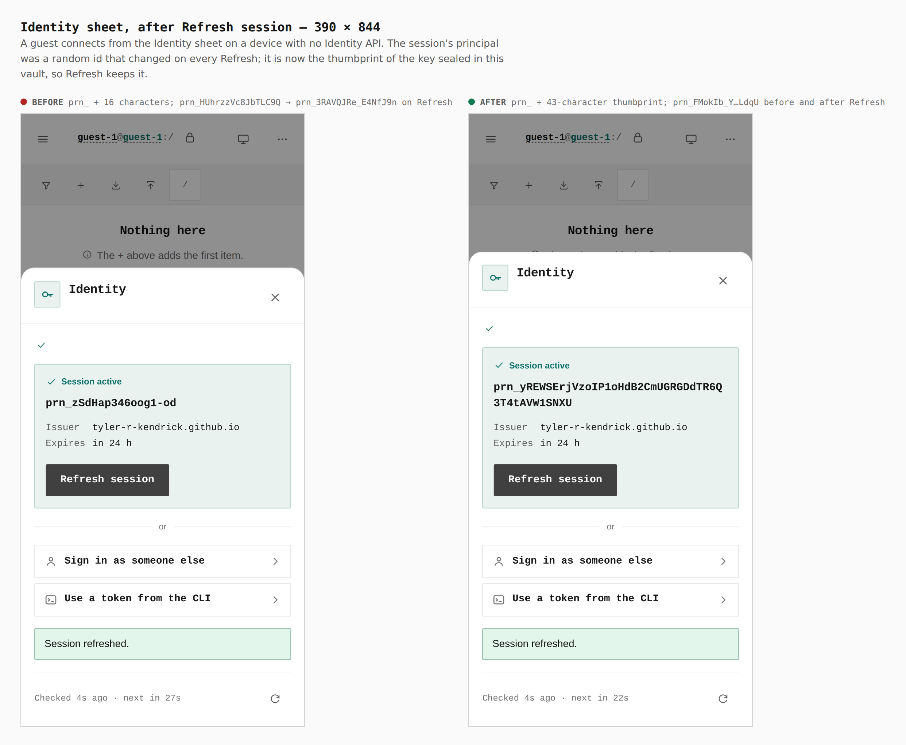
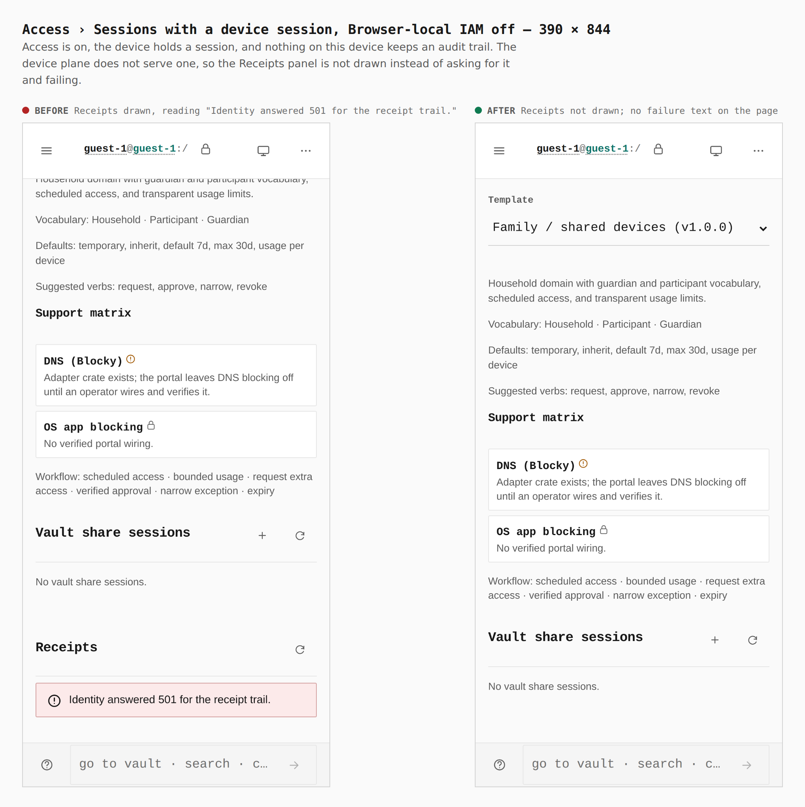
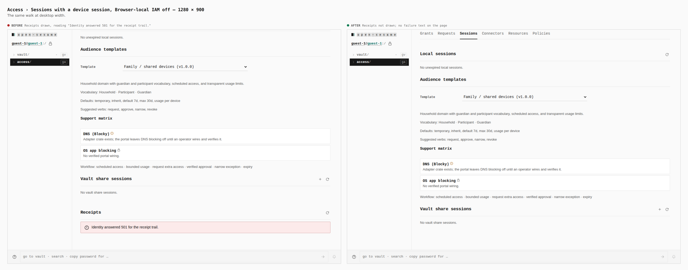
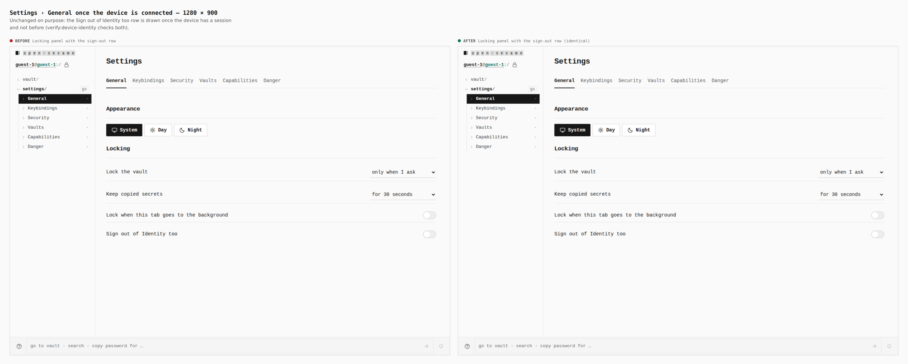

# The device is the Identity plane (ADR 0160) — before and after

A guest on a static build with no Identity API connects from the Identity
sheet. Before is `origin/main` (c5c9ab63), after is this branch, each built
from its own worktree and walked the same way (`journey.json`), at phone and
desktop width. Measurements are read from the page by the capture, not written
from memory. The Identity sheet belongs to the phone chrome (the top bar is
drawn below 901px), so only the phone walk shows it.

## Identity sheet after Refresh — 390 × 844

| | principal |
|---|---|
| before | `prn_` + 16 characters; `prn_HUhrzzVc8JbTLC9Q` became `prn_3RAVQJRe_E4NfJ9n` on Refresh |
| after | `prn_` + 43-character thumbprint of the vault's key; `prn_FMokIb_YWfj9ARRWHsSVd9jamKSM5vSAI3EJNQDLdqU` before and after Refresh |

## Access › Sessions, Browser-local IAM off — 390 × 844

| | Receipts |
|---|---|
| before | drawn, with the error box "Identity answered 501 for the receipt trail." |
| after | not drawn: the device plane serves no audit trail while nothing on the device keeps one |

## Access › Sessions, Browser-local IAM off — 1280 × 900

Same measurement as above: the error box is gone.

## Settings › General once connected — 1280 × 900

Unchanged on purpose. The Locking panel draws the "Sign out of Identity too"
row once the device has a session and not before; `verify:device-identity`
checks both sides at 1280 and 390.

## Gate

`pnpm --filter @opensesame/pages verify:device-identity` fails on the base
build (6 checks: the principal shape, its stability across Refresh, and
Receipts, at both widths) and passes on this branch.
