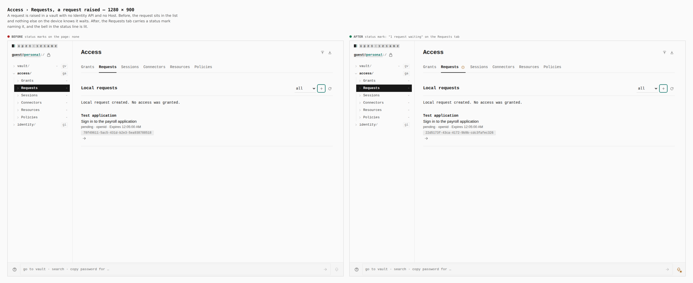
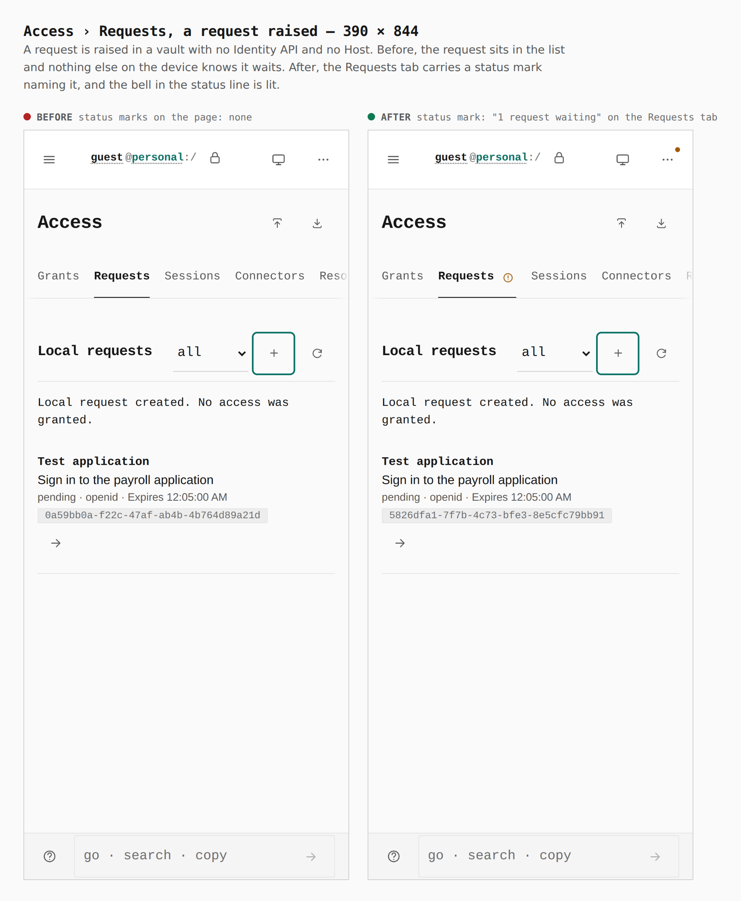
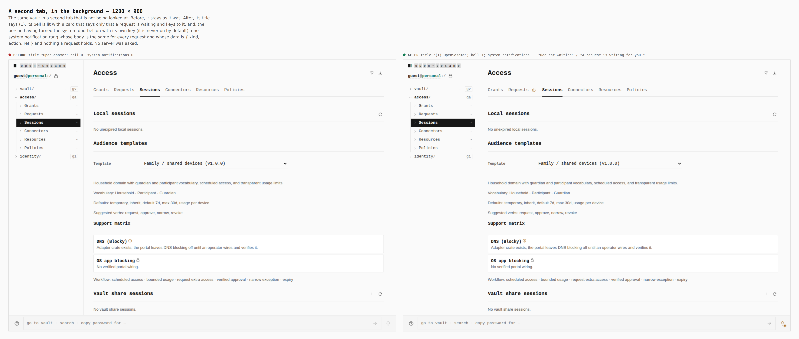
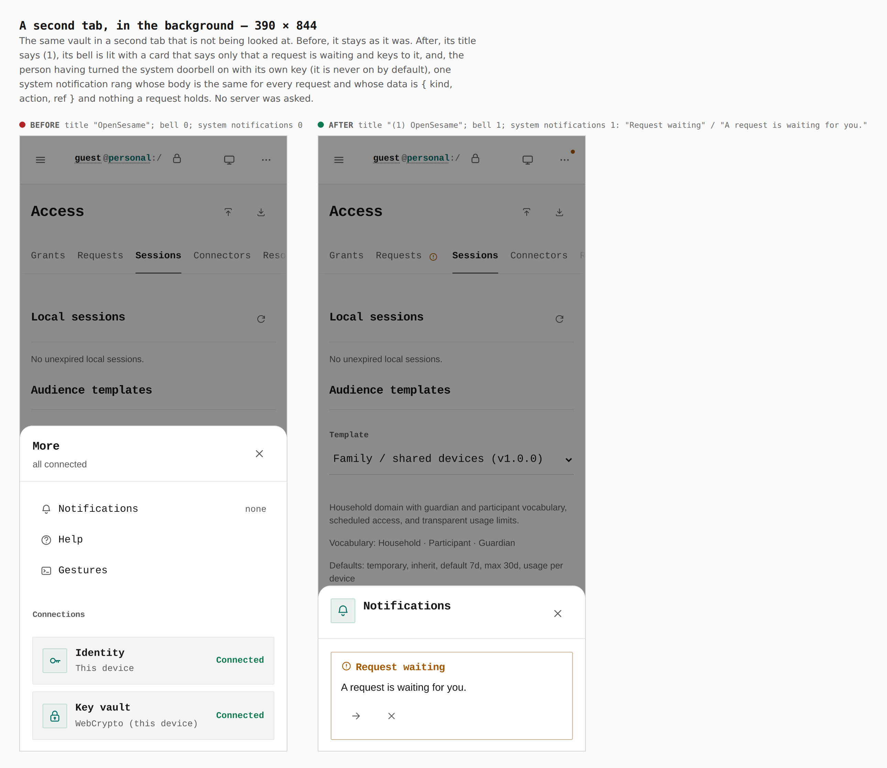
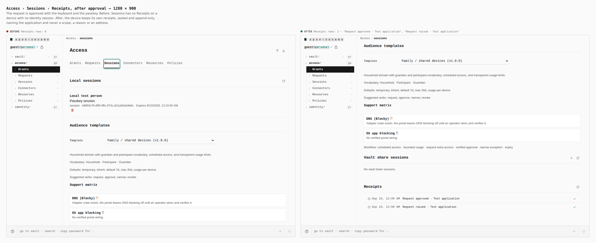
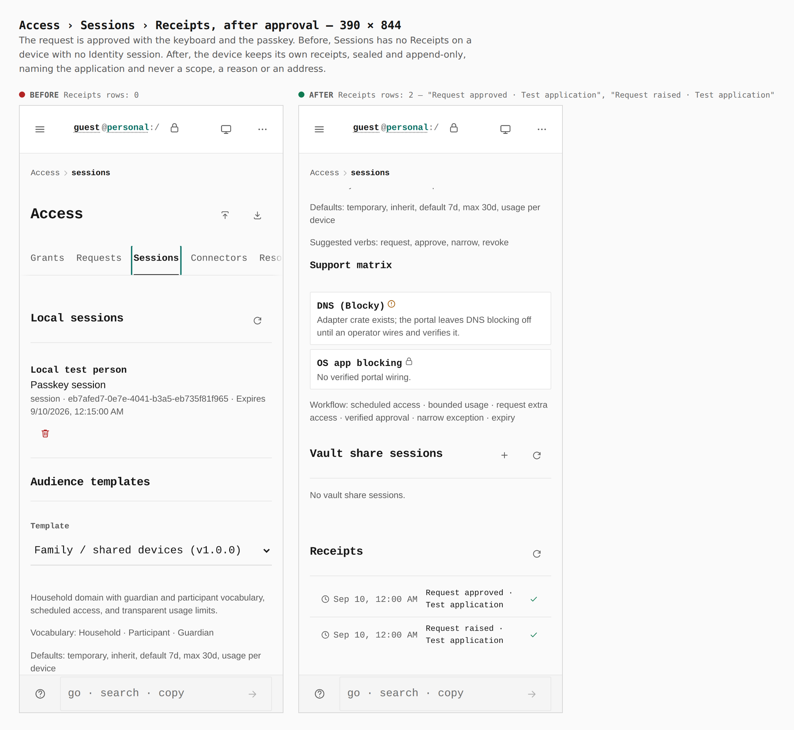
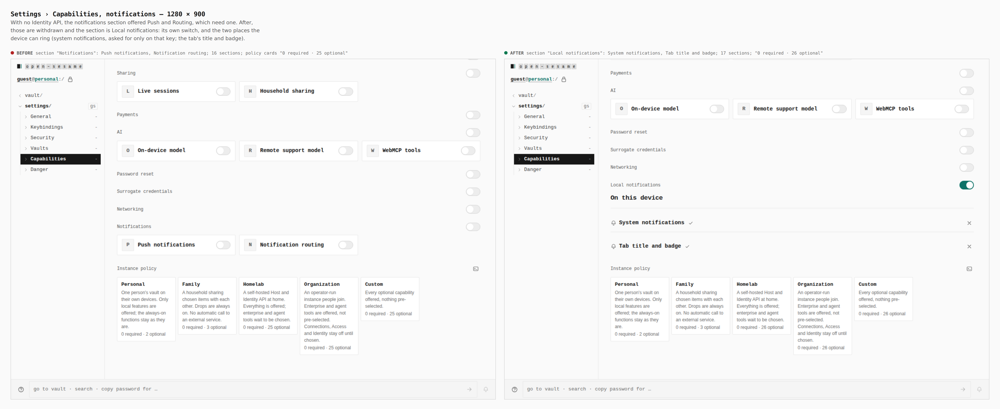
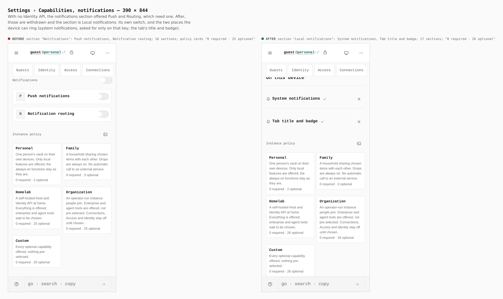

# Device-mode receipts, inbox and local notifications (ADR 0162) — before and after

Before/after sheets from two real builds of `apps/pages` (base: `origin/main`
at `618b48e0`, which holds ADR 0160; after: this branch), walked by
`journey.json` with `apps/pages/scripts/capture-evidence.mjs` at 1280 × 900 and
390 × 844. Every number below was printed by the capture from the browser
(`inboxReport`, `inboxCapabilities`). [ADR 0162](../../adr/0162-device-receipts-inbox-and-local-notifications.md)
records the decision.

The vault is password-sealed, has a person, an organization and a registered
application, and has **no Identity API and no Host**. Two tabs of one origin
do the work: the person's, in front, and a second one in the background. A
headless tab is never hidden, so the second is told it is (`document.hidden`
reads true there) and its `Notification` is recorded rather than shown; that
is the one thing the harness stands in for. In the after walk the person turns the
system doorbell on with the panel's own key before the request is raised, and the
browser's permission is granted at that press; the doorbell is never on by default. The wall clock is frozen so both
builds' timestamps read the same.

## A request is raised

| | Before | After |
|---|---|---|
| Status marks on the page | none | `1 request waiting` on the Requests tab |

## A second tab hears it

| | Before | After |
|---|---|---|
| Title | `OpenSesame` | `(1) OpenSesame` |
| Bell (phone: More key) | 0 | 1 |
| System notifications | 0 | 1: `Request waiting` / `A request is waiting for you.`, data `{ kind, action, ref }` |

## Approved with the keyboard, and the receipt

| | Before | After |
|---|---|---|
| Receipts rows | 0 | 2: `Request approved · Test application`, `Request raised · Test application` |
| Page scrolls sideways | no | no |

## Settings › Capabilities

| | Before | After |
|---|---|---|
| Notification section | `Notifications`: Push notifications, Notification routing (both need an Identity API) | `Local notifications`: System notifications, Tab title and badge |
| Sections drawn | 16 | 17 |
| Homelab policy card | 0 required · 25 optional | 0 required · 26 optional |

## What these sheets do not show

The deny path, the revocation receipt, the locked vault answering 423 and the
second tab's system notification at both widths are proved by
`pnpm --filter @opensesame/pages verify:device-inbox`, which asserts them in a
real browser rather than photographing them.

Regenerate with `skills/visual-evidence/SKILL.md`; the base build is the one
made from `git checkout "$(git merge-base HEAD origin/main)" -- apps/pages/src`.
