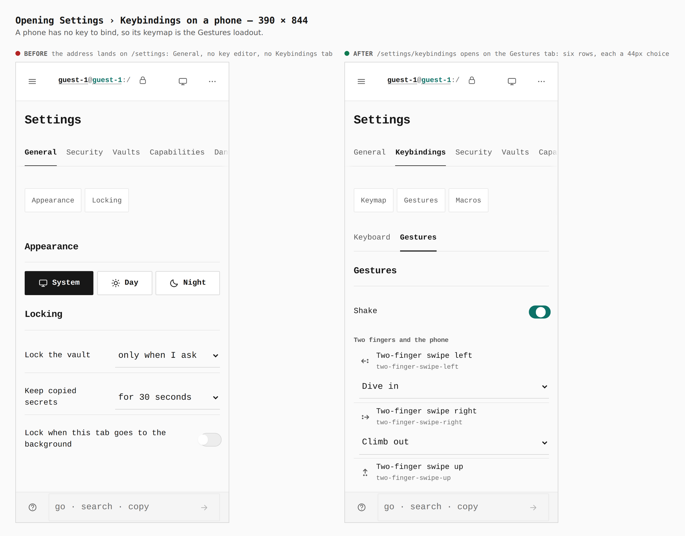
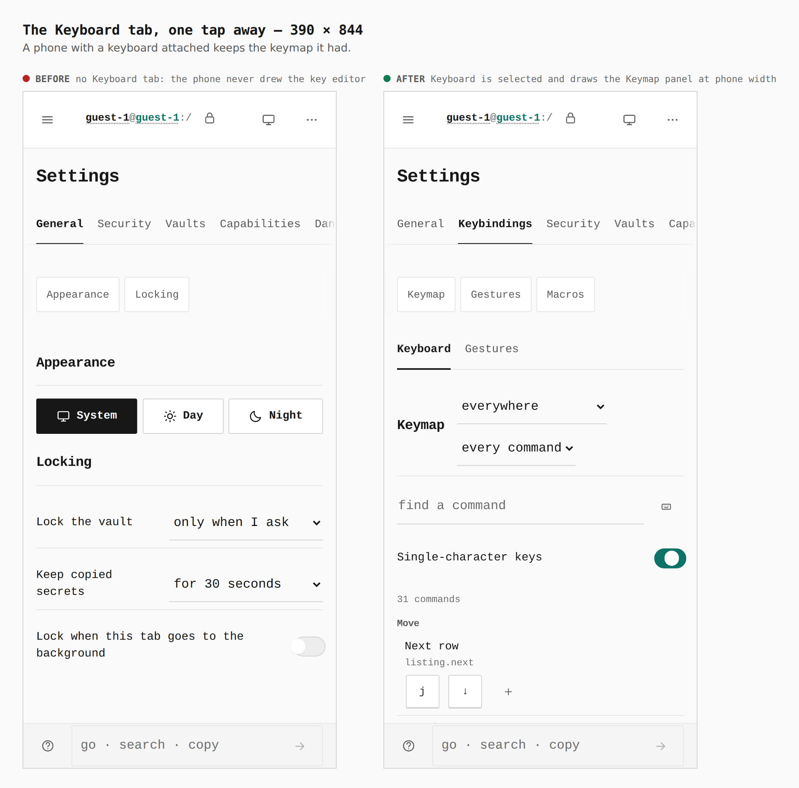
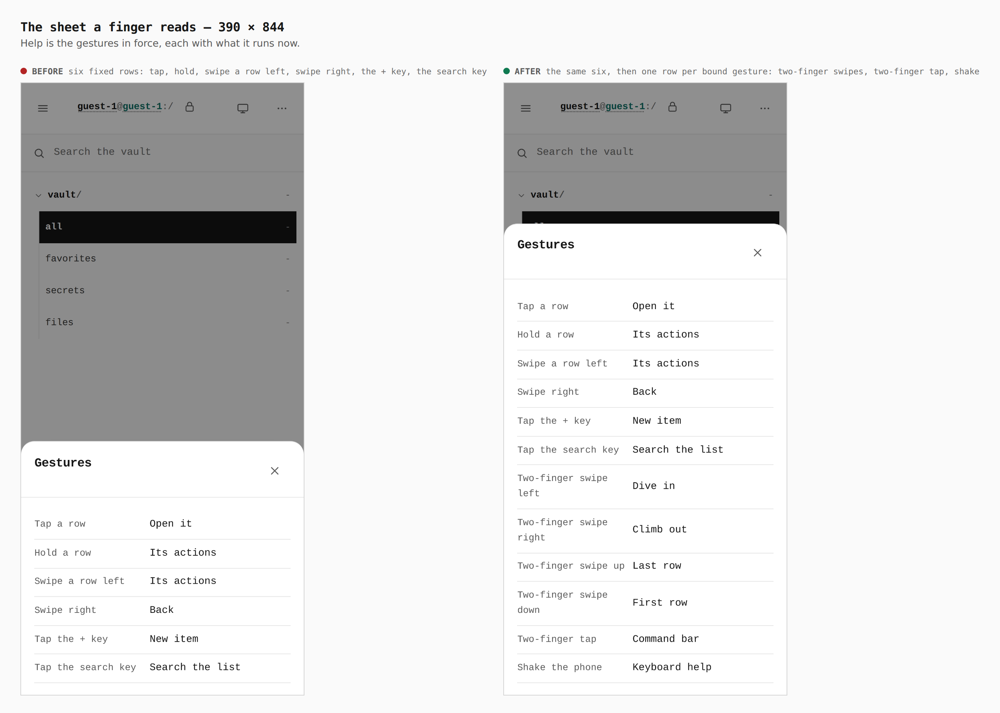
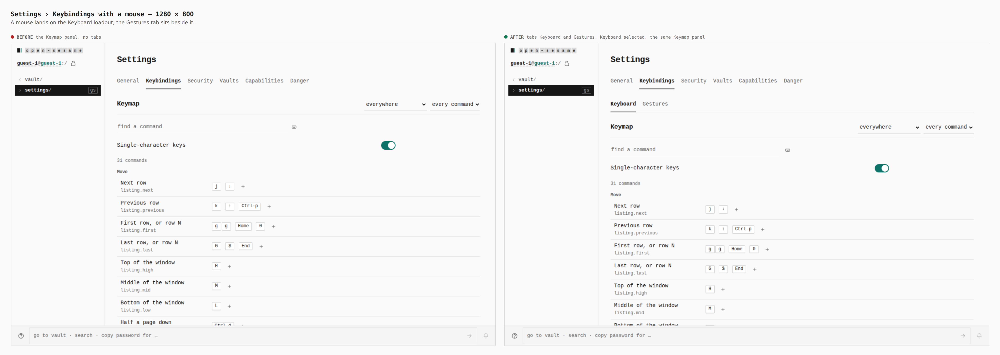
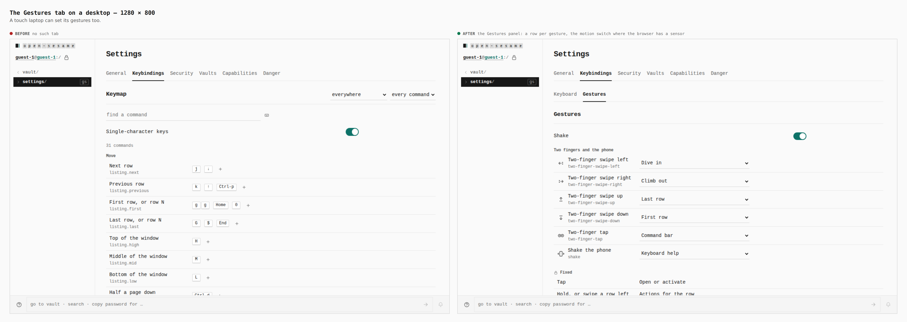

# The keymap has two loadouts, and a phone leads with gestures

Before/after from two real builds, walked with the same journey
(`journey.json`) as a guest. "Before" is `0d975968` (`main` when this branch
started), "after" is this branch's tip; each was built with
`VITE_BASE=/OpenSesame/` and captured with `EVIDENCE_DIST`. A touch context at
390 x 844 and a mouse context at 1280 x 800.

Measured in the browser (`report`, `measure` in the journey):

- 390 touch, opening `/settings/keybindings`, before: address `/settings`,
  current tab General, no `[role=tab]` anywhere. After: address
  `/settings/keybindings`, current tab Keybindings, tabs Keyboard and
  Gestures with Gestures selected; both tabs 67 x 44, the six gesture choices
  348 x 44 each.
- 390 touch, the Keyboard tab: selected and drawn after one tap; before there
  was no such tab.
- 390 touch, the sheet a finger reads, before: six rows (tap, hold, swipe a row
  left, swipe right, the + key, the search key). After: those six, then
  Two-finger swipe left → Dive in, right → Climb out, up → Last row, down →
  First row, Two-finger tap → Command bar, Shake the phone → Keyboard help.
- 1280 mouse, before: the Keymap panel, no tabs. After: tabs Keyboard and
  Gestures with Keyboard selected, the same Keymap panel; the Gestures tab is
  there for a touch laptop.

The gestures themselves are not a screenshot: `verify:mobile` makes a real
shake (`devicemotion`), a real two-finger tap and a real two-finger swipe with
CDP multi-touch at 320, 390, 430 and landscape, and checks the tabs and choices
for the 44px and 16px floors. `verify:keyboard` passes at 1280 and 390.

## 1. Settings › Keybindings on a phone: 390

## 2. The Keyboard tab, one tap away: 390

## 3. The sheet a finger reads: 390

## 4. Desktop: 1280

