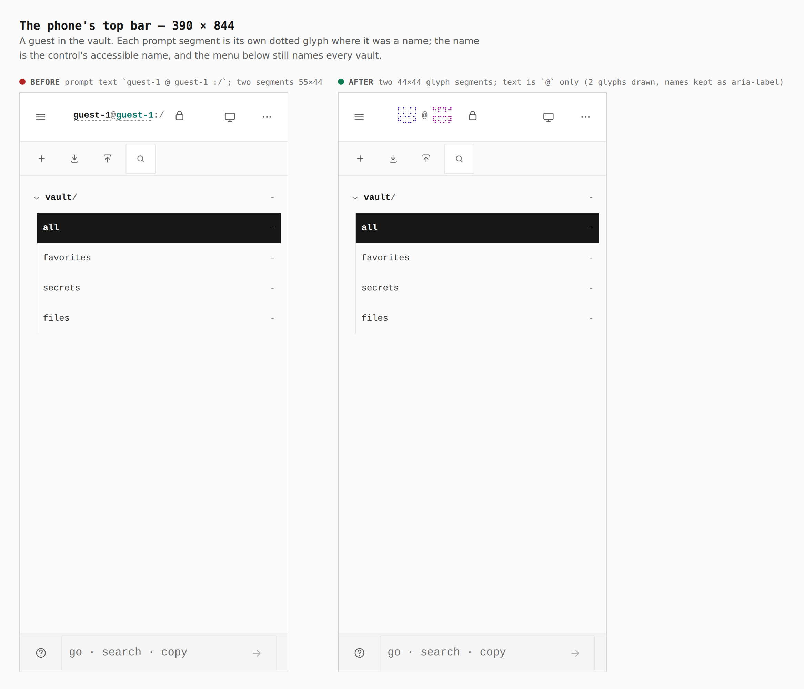
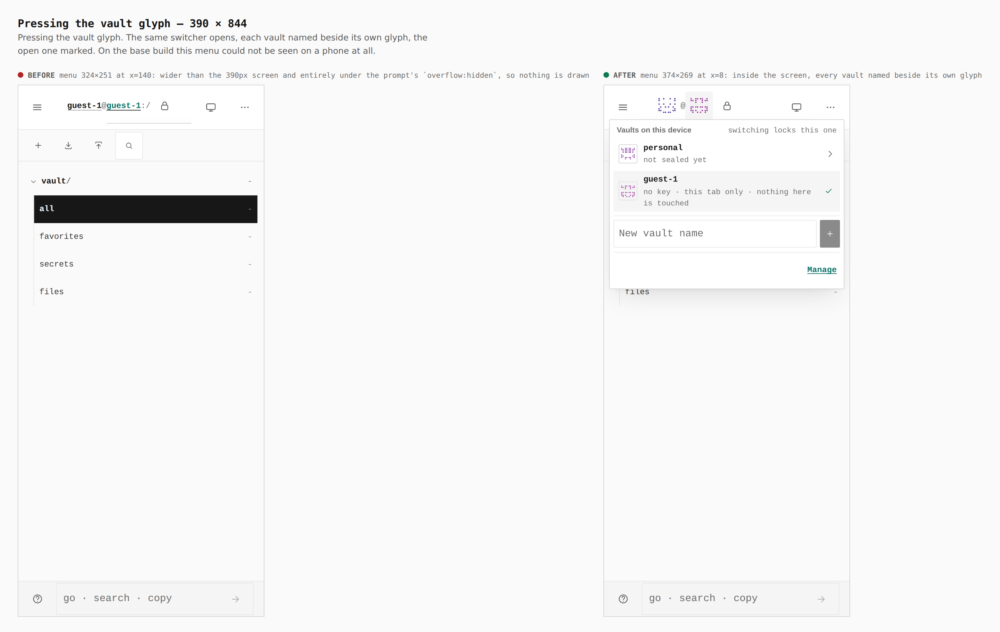
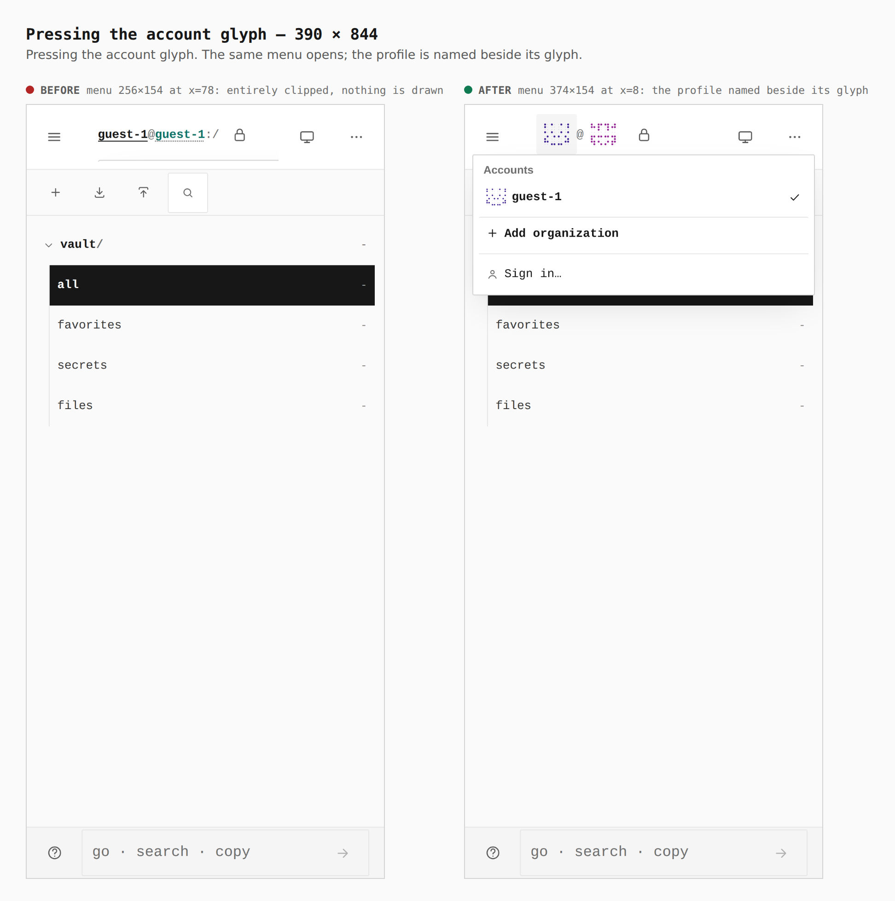
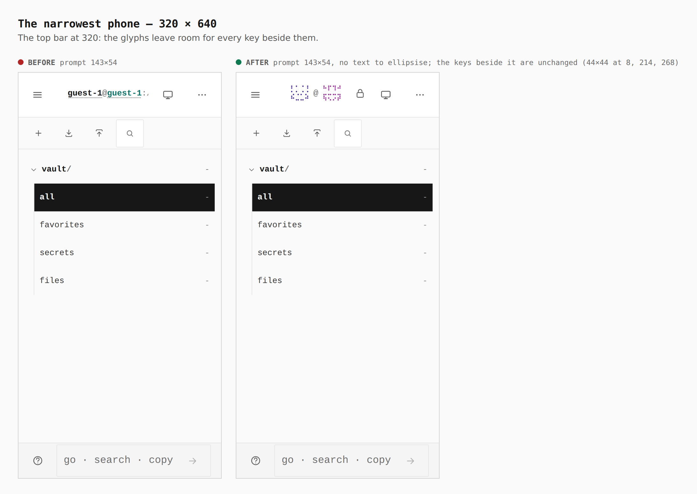
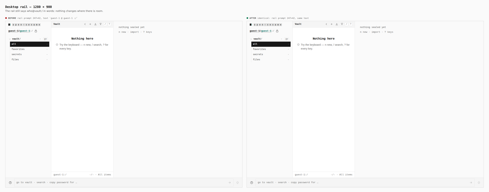

# Glyphs for vaults and people on a phone (ADR 0164)

Before/after from two real builds — `main` and this branch — walked the same
way (a guest in the vault), measured in the browser. The base build is on the
left of each sheet, this branch on the right.

## The phone's top bar — 390 × 844

Prompt text `guest-1 @ guest-1 :/` in two 55×44 segments → two 44×44 glyph
segments with `@` between them. The names stay as each control's accessible
name.

## Pressing the vault glyph — 390 × 844

Base: the menu is 324×251 at x=140 — wider than the screen and entirely
outside the top bar prompt's `overflow: hidden`, so pressing the vault drew
nothing. Branch: 374×269 at x=8, inside the screen, each vault named beside
its own glyph, the open one marked.

## Pressing the account glyph — 390 × 844

Base: 256×154 at x=78, entirely clipped. Branch: 374×154 at x=8, the profile
named beside its glyph.

## The narrowest phone — 320 × 640

The prompt is 143×54 either way; the keys beside it are unchanged.

## Desktop rail — 1280 × 900

Unchanged: the rail prompt is 247×42 and still says `guest-1 @ guest-1 :/`.
