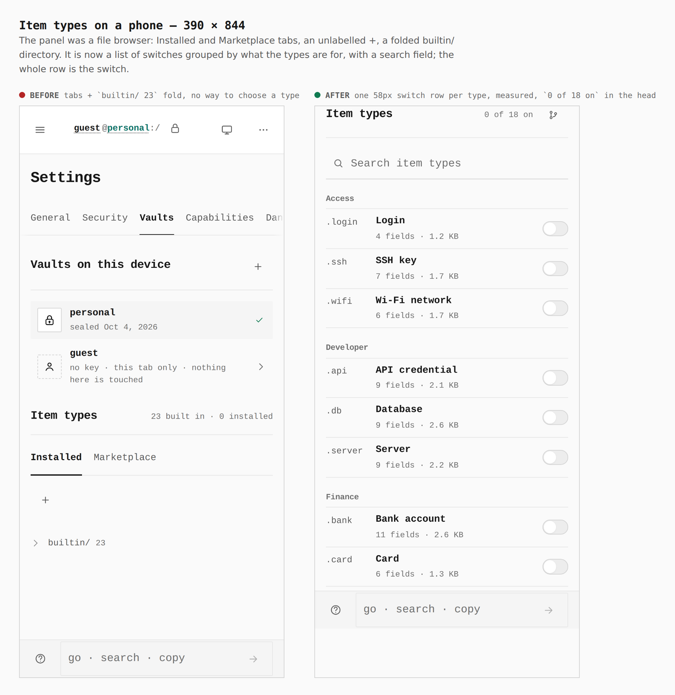
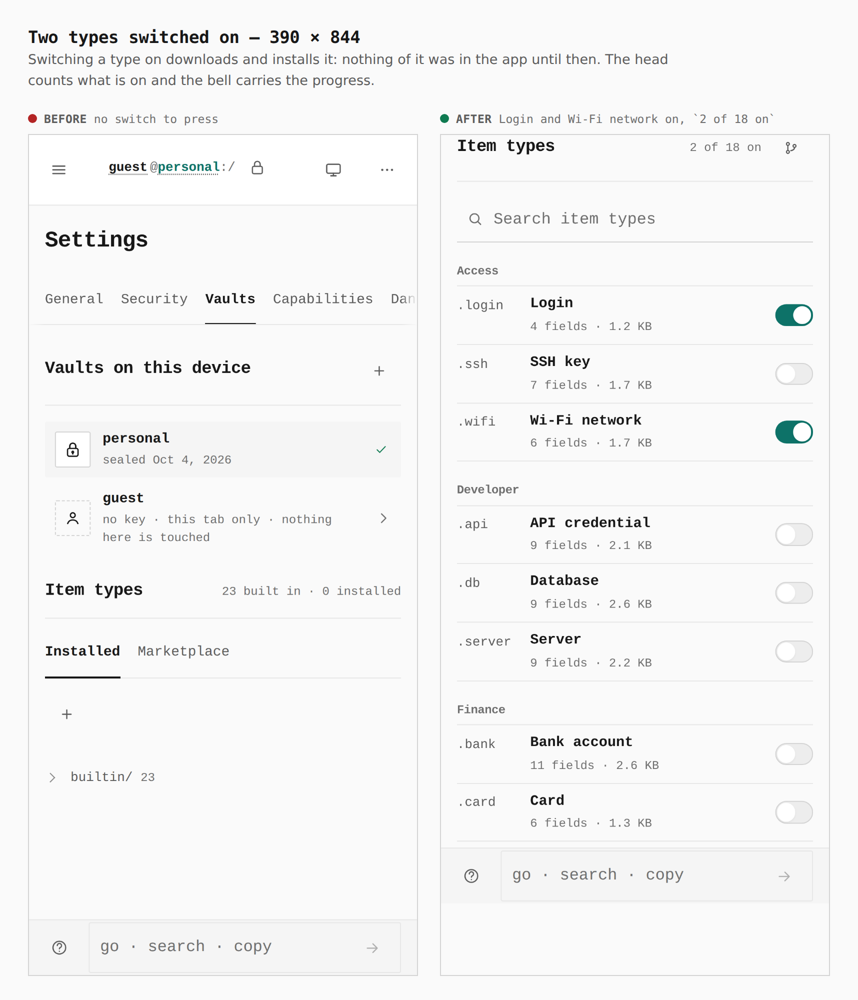
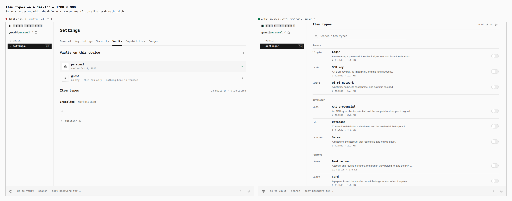
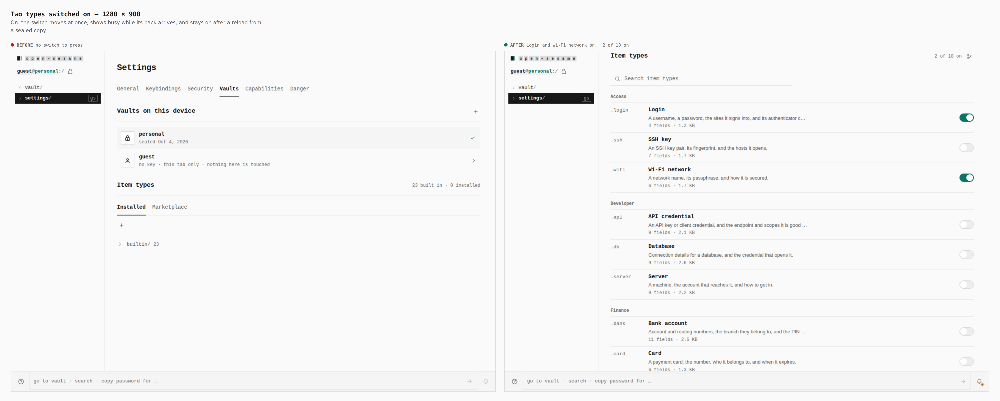

# Item types: a list of switches (ADR 0165)

Before/after from two real builds — `main` at `0d975968` and this branch —
walked the same way (`journey.json`): seal a local vault, Settings › Vaults,
scroll to Item types, switch Login and Wi-Fi network on.

Measured in the browser:

| | before → after |
|---|---|
| What the panel is | tabs (`Installed`, `Marketplace`), an unlabelled **+**, a folded `builtin/ 23` → 18 switches grouped Access / Developer / Finance / Identity / Documents, with a search field |
| Row height at 390 | file rows, no control to choose a type → **58px**, the whole row is the switch (44px floor) |
| Head | `23 built in · 0 installed` → `0 of 18 on` (`2 of 18 on` after two switches) |
| Entry chunk (`main`) | 831 KiB → 810 KiB; 18 definitions are 18 separate chunks (36 KB), none preloaded, none fetched until a switch is on |
| Requests at first load / on opening the panel | n/a → 0 pack requests; 1 request per switch pressed; 0 on reload (restored from the sealed copy) |

## Phone — 390 × 844

## Desktop — 1280 × 900

## Not captured

The downloading and installing states last a few milliseconds against a local
build, so no honest still shows them. They are covered by
`packages/app-core/src/lib/type-packs/installer.test.ts` (the phases in order,
the main thread handed back at every step, one pack at a time, cancel, retry)
and by `ItemTypesPanel.packs.test.tsx` (the switch is checked and busy while the
pack arrives; a failure is a mark on the row and a retry on the next press).
