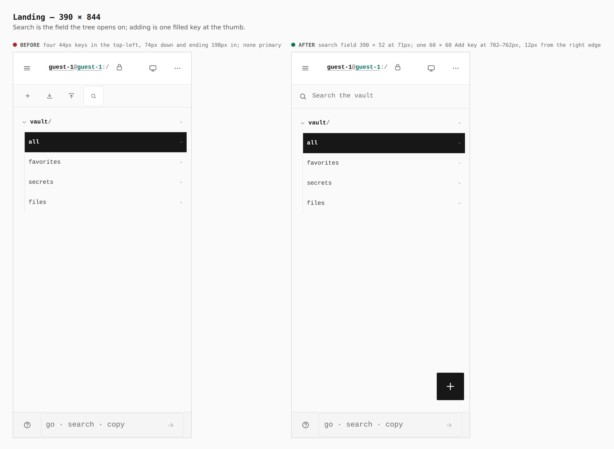
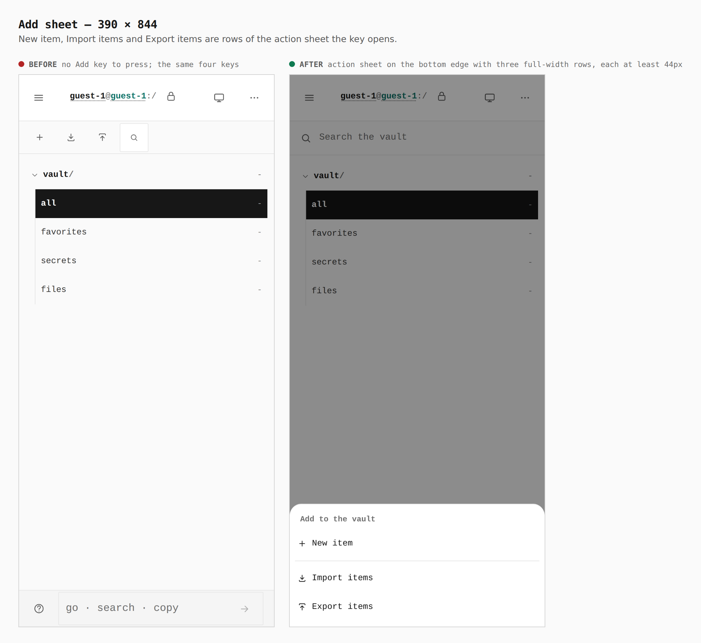
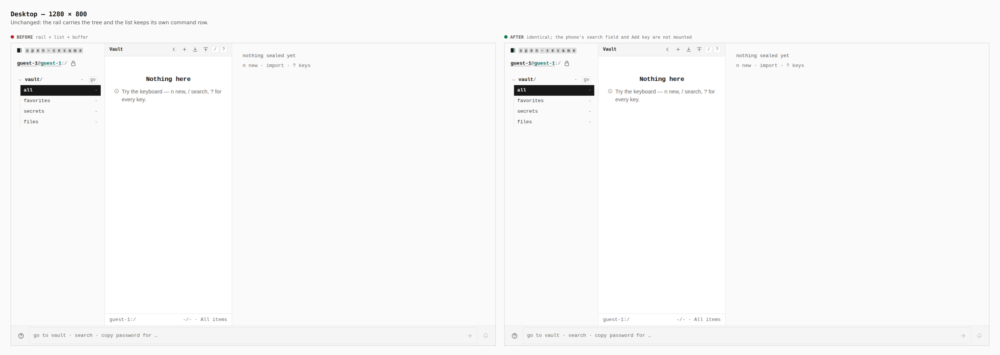

# The phone's section tree opens on a search field and one Add key

Before/after from two real builds — the base (`107ec5e1`) and this branch —
same journey (`journey.json`), a touch context at 390 × 844 and a mouse
context at 1280 × 800.

Measured in the browser (390 × 844, touch):

| | before | after |
| --- | --- | --- |
| search | a 44 × 44 key, 74px down, right edge 198px in | a field 390 × 52 at 71px, the full width |
| add | a 44 × 44 key beside three others, left half of the screen | one 60 × 60 key at 702–762px, 12px from the right edge, 82px above the foot |
| import, export | two more 44px keys in the same row | rows of the Add sheet |

`verify:mobile` (`tree-actions`, at 320, 390, 430 and landscape) holds the
field at 52px and the full width, the Add key at 56px or more, in the lower
half and within 24px of the right edge and clear of the statusline, no desktop
key drawn beside it, every sheet row at 44px and nearly the full width,
Escape closing the sheet, New item opening the editor and search landing on
the list with the `Search items` prompt focused.

## 1. Landing — 390

## 2. Add sheet — 390

## 3. Desktop — 1280

Unchanged.
