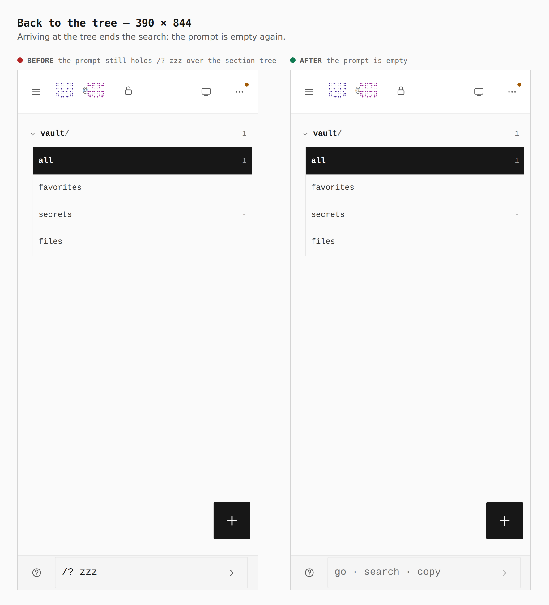

# A phone's search ends when the tree comes back

Before/after from two real builds — `main` (after the status-line search
landed) and this branch — same journey (`journey.json`), a touch context at
390 × 844. The vault holds one item; the walk searches the list for something
no item matches (`/? zzz` in the status-line prompt), goes back to the tree and
opens `all`.

Measured in the browser: before, the tree draws with the prompt still holding
`/? zzz`, and `all` opens on **0 rows** although the vault holds 1 item
(`-/1 · /zzz` in the status line). After, the prompt is empty on the tree and
the list shows **1 row** (`1/1 · All items`). The phone gate (`verify:mobile`,
`search-round-trip` stop) holds both.

## 1. The search itself — 390

Unchanged: a query that matches nothing draws no rows, as it should. An item
opened from a search still comes back to that same search; only the tree ends
it.

## 2. Back to the tree — 390

## 3. Then all — 390

